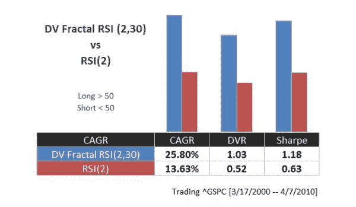
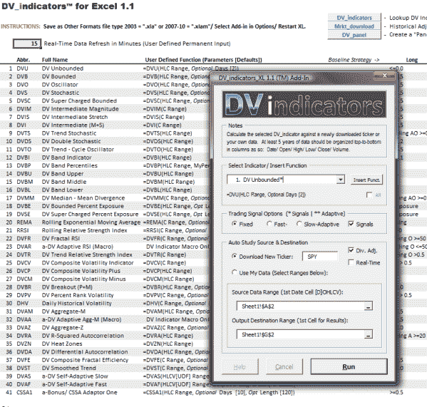
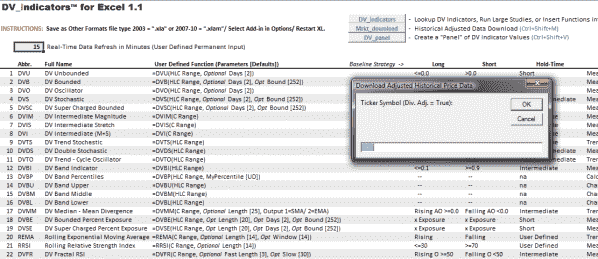
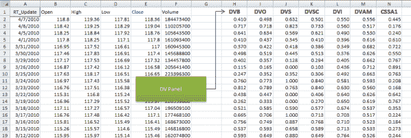
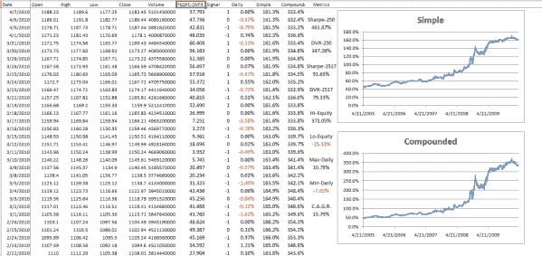

<!--yml
category: 未分类
date: 2024-05-12 18:32:04
-->

# Fractal RSI and DV Indicators Plug-In Sneak Peak Pics | CSSA

> 来源：[https://cssanalytics.wordpress.com/2010/04/07/fractal-rsi-and-dv-indicators-plug-in-sneak-peak-pics/#0001-01-01](https://cssanalytics.wordpress.com/2010/04/07/fractal-rsi-and-dv-indicators-plug-in-sneak-peak-pics/#0001-01-01)

Yesterday we looked at how shifting cycles can improve a simple follow-through strategy.  I thought that it might be a good opportunity to introduce a self-adapting indicator that does exactly that–the Fractal RSI. *This indicator is currently only available in the upcoming **DV Indicators Excel Plug-In** along with several different types of adaptive indicators (DVO, DV2, CSSA, Adaptive RSI, Adaptive Aggregate M and more) that each add a unique input within a  portfolio or a system.* The Fractal RSI dynamically adjusts the cycle length from 2 periods to 30 as a function of the “fracticality” of current market conditions. Unlike the previous post where we used a binary filter–the 50 day sma versus 200 sma, the Fractal RSI shifts its position each day as necessary. In effect it “self-adjusts” to current market conditions. It does not use percentrank in this case to make it comparable to the original RSI. The performance  below is displayed on the S&P500 index (^GSPC) and is nearly identical to the performance on the SPY.  As you can see the Fractal RSI is vastly superior in absolute and risk-adjusted returns to its counterpart the standard RSI2 trading using 50/50 levels for long and short entries. What is also cool is that you can vary the short and long periods you wish to use for varying the cycle. This makes for an even more flexible adaptive indicator. More on this to come…………

Screenshots from the plugin:

***This is a really neat feature— quickly create a “panel of experts” strategy using the DV Panel feature to line up several indicators very quickly. It also helps to make analysis a lot easier.***

***The pic below shows an output screen of the simple backtest feature using the Fractal RSI on the S&P500 index with different parameters (buy if the fractal rsi is rising or greater than 50 and reverse for shorts).***

