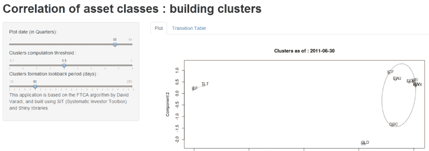

<!--yml
category: 未分类
date: 2024-05-12 17:56:05
-->

# Free Web-Based Cluster Application Using FTCA | CSSA

> 来源：[https://cssanalytics.wordpress.com/2013/12/17/free-web-based-cluster-application-using-ftca/#0001-01-01](https://cssanalytics.wordpress.com/2013/12/17/free-web-based-cluster-application-using-ftca/#0001-01-01)

One of the most useful ways to understand clusters is to work with a visual application and see different cluster groupings over time. In a previous post, I introduced the [Fast Threshold Clustering Algorithm](https://cssanalytics.wordpress.com/2013/11/26/fast-threshold-clustering-algorithm-ftca/ "Fast Threshold Clustering Algorithm (FTCA)")– FTCA-  as a simple and intuitive method of forming asset clusters.  A fellow quant researcher and long-time reader- Pierre Chretien- was kind enough to build an FTCA Shiny web application in collaboration with Michael Kapler of [Systematic Investor](http://systematicinvestor.wordpress.com/) in R. It shows the use of clustering with FTCA on a broad range of asset classes that have been back-extended using index data. Users can experiment with varying different parameters from the time period at cluster formation (plot date), the correlation threshold for cluster formation, and the lookback period for the correlation calculation.  Another useful output is the return and volatility for each asset at the time of cluster formation as well as a transition map of the historical cluster memberships for each asset. Two images of the application are presented below.  Very cool stuff and nice work!  I personally enjoyed using it to see the impact of different parameters and also the historical clusters over different time periods.

The link to the application can be found here:

[cluster web application](http://glimmer.rstudio.com/heuristica/clusters/)

