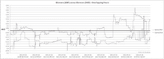

<!--yml
category: 未分类
date: 2024-05-12 23:36:01
-->

# Front-Run The Delta: Arbitraging the Arbitrageur: The Case of Glencore

> 来源：[https://frontrunthedelta.blogspot.com/2011/07/arbitraging-arbitrageur-case-of.html#0001-01-01](https://frontrunthedelta.blogspot.com/2011/07/arbitraging-arbitrageur-case-of.html#0001-01-01)

[Glencore](http://www.glencore.com/secure/shareholder-information.php)

is dual listed on the Hong Kong (

[805](http://www.hkex.com.hk/eng/invest/company/quote_page_e.asp?WidCoID=805&WidCoAbbName=&Month=1&langcode=e)

) and London (

[GLEN](http://www.londonstockexchange.com/exchange/prices-and-markets/stocks/summary/company-summary.html?fourWayKey=JE00B4T3BW64JEGBXSET0)

) stock exchanges.  The shares are listed in

[HKD](http://en.wikipedia.org/wiki/Hong_Kong_dollar)

 and

[GBP](http://en.wikipedia.org/wiki/Pound_sterling)

, respectively.  The stock is scheduled to be listed in the U.S. denominated in USD eventually under the ticker 

[GLNCY](http://www.otcmarkets.com/stock/GLNCY/quote)

, however these are currently unavailable for trading.

Due to the operating hours of each exchange, the two anchor stocks (805/GLEN) only overlap for one hour per day, from 2:00AM CT (U.S.) to 3:00AM CT.

This is the spread between LSE-listed shares converted to HKD and the actual HKD-denominated shares listed in Hong Kong.

Prices are from July 28, 2011.