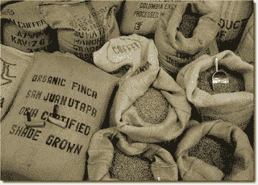

<!--yml
category: 未分类
date: 2024-05-12 23:27:46
-->

# Front-Run The Delta: Back to Microstructure: ETF Securities USD and EUR Coffee Offerings

> 来源：[https://frontrunthedelta.blogspot.com/2012/08/back-to-microstructure-etf-securities.html#0001-01-01](https://frontrunthedelta.blogspot.com/2012/08/back-to-microstructure-etf-securities.html#0001-01-01)

[ETF Securities](http://www.etfsecurities.com/)

(ETFS) offers a multitude of dual-listed commodity, currency, and index ETFs.  This is a brief study of three of those securities designed to track the

[DJ-UBS Coffee Sub-Index](http://finance.yahoo.com/echarts?s=%5EDJUBSKC+Interactive)

.  ETFS offers a German-listed, Euro-denominated security under the ticker

[OD7B](http://www.bloomberg.com/quote/OD7B:GR)

; an LSE-listed, US dollar-denominated security under the ticker

[COFF](http://www.bloomberg.com/quote/COFF:LN)

; and a French-listed, Euro-denominated security under the ticker

[COFFP](http://www.euronext.com/trader/summarizedmarket/stocks-8505-EN-GB00B15KXP72.html?selectedMep=1)

.

The cash EUR/USD was used for price discovery and all prices were recorded 5 July 2012\.  All times are CST.

The spread between the currency-adjusted OD7B shares versus the COFF shares:

The spread between the currency-adjusted COFFP shares versus the COFF shares:

Note the frequent liquidity-shocks absorbed by each spread uniquely.