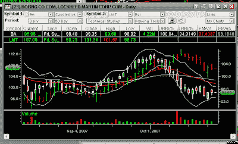

<!--yml
category: 未分类
date: 2024-05-12 23:42:25
-->

# Front-Run The Delta: Boeing / Lockheed Pairs Trade, Cont'd

> 来源：[https://frontrunthedelta.blogspot.com/2007/10/boeing-lockheed-pairs-trade-contd.html#0001-01-01](https://frontrunthedelta.blogspot.com/2007/10/boeing-lockheed-pairs-trade-contd.html#0001-01-01)

BA released earnings this morning not surprisingly showing strong growth over Q3 2006\. EPS beat the Street's estimates of $1.24, coming in at $1.44, a $0.55 gain over Q3 06\. Revenue for the quarter grew to $16.52B, a 12% increase over Q3 2006\. Showed conservative 2007 guidance of $5.05 - 5.15 EPS, vs. the Street's estimates of $5.06\. Lowered 2008 guidance slightly due to previously disclosed delays in delivery.

LMT also posted strong earnings, beating the Q3 07 estimates by $0.16, showing EPS of $1.80 vs. $1.46 for Q3 06\. Sales up 16%; Profit up 22%; Boosts 2007 EPS estimates.

In premarket trading, BA is trading $2 up around high $96; LMT relatively unchanged.

As in my original posts on this particular pairs trade (

[here](http://rogerenright.blogspot.com/2007/10/boeing-is-simply-better-value.html)

and

[here](http://rogerenright.blogspot.com/2007/10/boeing-pairs-trade-part-two.html)

), on 2 Oct BA began what ultimately became roughly a 12% correction, from a high of $106 down to $93/sh. LMT, on the other hand, continued in its trend up until 12 Oct, when it was trading around $111, when it began a steady fall over the next week, falling as low as mid-$103.

My original prediction on the direction of the two appeared to be coming to fruition, as evidenced by the 50-day chart below:

Support began to develop 10 Oct. when the volume increased significantly. Again, the smart money noticed a slight correction in Boeing, a solid, global firm, and saw a value play, so they began buying up. Coupled with the mutual funds, the Arbs began going long BA and shorting LMT, causing a convergence play.

I expect BA to be back in the low $100s by early Nov., while LMT will more than likely stay in a range of $107-111 until BA gains some ground.

FD: I have a position in BA.