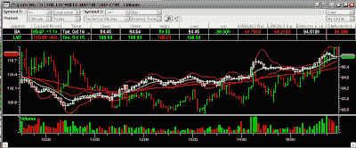

<!--yml
category: 未分类
date: 2024-05-12 23:43:26
-->

# Front-Run The Delta: Boeing/Lockheed Pairs Trade Part Two

> 来源：[https://frontrunthedelta.blogspot.com/2007/10/boeing-pairs-trade-part-two.html#0001-01-01](https://frontrunthedelta.blogspot.com/2007/10/boeing-pairs-trade-part-two.html#0001-01-01)

Boeing looks to be on the rebound today as it posted the largest gain since 25 September. As BA began moving into the $93 range this morning, it seemed to be finding a solid level of resistance. An hour after market open, the bulls moved in for the value. Throughout the day, news started coming over that there had been some major restructuring among BA's

[Overseas Operations and 787 Divisions](http://money.cnn.com/2007/10/16/news/companies/boeing_787.ap/index.htm?source=yahoo_quote)

.

Not surprisingly, as I watched the Market Depth ticker, offers continuously got lifted throughout the day - sometimes in small volume, others in large, as evidenced by two major moves during the afternoon seen below. Within 10 minutes, there was a move from $94.75 up to $95.70, almost a full point. That was surprising enough, considering the relatively flat trading of the prior 3 hours. Again, at 3:15PM, BA got another shock from some major buyers - again, offers were lifted and the market moved from a low of $94.97, to the day's high of $96.27.

Clearly there were some major funds moving in to take advantage of the statistical anomaly caused by the news of production delays. Specifically, as in

[my original post on this subject](http://rogerenright.blogspot.com/2007/10/boeing-is-simply-better-value.html)

, the spread between Boeing and Lockheed is clearly out of proportion relative to the risks associated with problems in management and delays in production.

As evidenced by the resent strength of Boeing and the relative weakness of Lockheed, it seems that the quants and their

[OMSs](http://en.wikipedia.org/wiki/Order_Management_System)

have been shorting LMT and going long BA as the spread begins to converge. I expect to see similar activity all the way up to the low $100s, and vice versa for LMT.

Technical Indicators that supports: (i) The 10-day RSI dipped below 25 yesterday, indicating an over-sold status, and (ii) trading closed below the lower Bollinger Band during yesterday's trading, indicating a possible move back to the opposite side near $105 or $110\.

FD: I am long the Nov 100 BA Call.