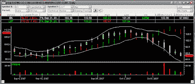

<!--yml
category: 未分类
date: 2024-05-12 23:44:34
-->

# Front-Run The Delta: Boeing is simply a better value

> 来源：[https://frontrunthedelta.blogspot.com/2007/10/boeing-is-simply-better-value.html#0001-01-01](https://frontrunthedelta.blogspot.com/2007/10/boeing-is-simply-better-value.html#0001-01-01)

The

[recent headlines](http://biz.yahoo.com/ap/071005/boeing_mover.html?.v=3)

regarding

[Boeing's](http://stockcharts.com/h-sc/ui?s=ba)

(BA) problems meeting their delivery deadlines have caused the stock to slide, as of this writing, to the low 95s, losing roughly 12% of its value during the previous two weeks. BA is still a solid company with good management, strong earnings, and good outlook. So, what could come of a 12-15% correction? Put simply, a wealth of opportunity.

Compare Boeing to

[Lockheed Martin](http://stockcharts.com/h-sc/ui?s=lmt)

(LMT) and you find two relatively similar, upward slanting, charts.

Many hedge funds utilize

[Statistical Arbitrage](http://en.wikipedia.org/wiki/Statistical_arbitrage)

in order to pinpoint statistical abnormalities such as this. The typical play here would be to go long BA while simultaneously going short LMT, expecting the two to converge once again, or at the very least, continue in their trend up, with the gains from going long BA outweighing the losses from going short LMT.

If this analysis is correct, which Friday's trading has led me to believe, BA should begin to level out this week, while LMT moves lower or sideways. Friday saw BA open at 96.11 and close at 96.69, the first substantial increase in 8 days. Today will see a close lower, but in a range smaller than Friday's.

Full disclosure: I am long the BA Nov Call.

