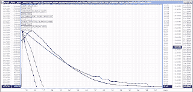
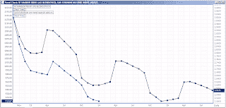

<!--yml
category: 未分类
date: 2024-05-12 23:27:29
-->

# Front-Run The Delta: Crude and Gasoline Forward Curves

> 来源：[https://frontrunthedelta.blogspot.com/2012/09/crude-and-gasoline-forward-curves.html#0001-01-01](https://frontrunthedelta.blogspot.com/2012/09/crude-and-gasoline-forward-curves.html#0001-01-01)

Global crude and gasoline benchmarks remain backwardated.

Being told this morning that NY Harbor cash gasoline is trading 42 cents above October RBOB futures. 

[I said in August](//www.google.com/url?sa=t&rct=j&q&esrc=s&source=newssearch&cd=1&cad=rja&ved=0CDIQFjAA&url=http://online.wsj.com/article/SB10000872396390443713704577601443789481110.html&ei=WoQzUI_3CYno2QWY_YA4&usg=AFQjCNFgk_QIIX5Vabs37FNthxxvJlP4Kg)

in the WSJ that supplies were expected to remain tight for the next few months. 

> "Anybody who needs to purchase gasoline over the next six months, they're locking in prices right now," said Jason Williams, an energy broker at Coquest, a brokerage firm in Dallas. "They are worried that the supply shortages might last for the next three months."

|  |
| Crude |

|  |
| Gasoline |