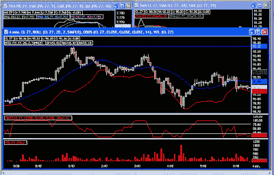

<!--yml
category: 未分类
date: 2024-05-12 23:42:12
-->

# Front-Run The Delta: Crude sets Another Record

> 来源：[https://frontrunthedelta.blogspot.com/2007/10/crude-sets-another-record.html#0001-01-01](https://frontrunthedelta.blogspot.com/2007/10/crude-sets-another-record.html#0001-01-01)

The Dec. NYMEX contract hit a new high of $92.22 at 1:30 this morning on very light volume. We may actually see $100 by the time the Dec. contract rolls over to Jan.

