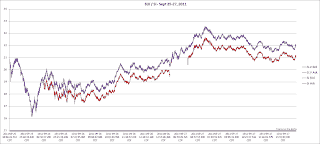
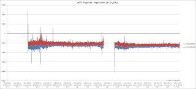
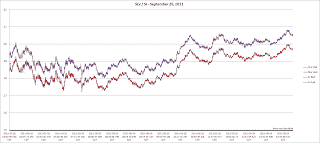
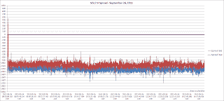
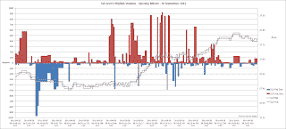
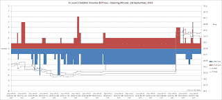
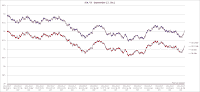
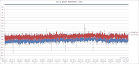

<!--yml
category: 未分类
date: 2024-05-12 23:32:31
-->

# Front-Run The Delta: ETF / Futures Arbitrage: SLV against CME's Silver (SI)

> 来源：[https://frontrunthedelta.blogspot.com/2011/10/etf-futures-arbitrage-slv-against-cmes.html#0001-01-01](https://frontrunthedelta.blogspot.com/2011/10/etf-futures-arbitrage-slv-against-cmes.html#0001-01-01)

This is the spread built from trading a block of iShare's Silver Trust (

[SLV](http://us.ishares.com/product_info/fund/overview/SLV.htm)

) shares against one CME-listed large Silver (

[SI](http://www.cmegroup.com/trading/metals/precious/silver_contract_specifications.html)

) contract.  The December, 2011 silver contract was recorded in this study due to the low bid/ask spread and subsequent liquidity.  The SI contract begins trading on Sunday evening, hours before liquidity is introduced to the SLV shares, visible on the left of Chart A.  The introduction of SLV liquidity allows for the construction of the spread.

September 26 - 27, 2011

|  |
| Chart A |   |

|  |
| Chart A.1 |

|  |
| Chart B |

|  |
| Chart B.1 |

**September 26 - Opening Minute**

There was a slight break that occurred during the opening minute of SLV, however the deviation appears to have been caused by halted quotes in the SI leg of the trade.  It remains to be seen whether this halt in SI was a error on my end on account of my taq data collection software or if the SI contract actually was halted at the exchange level for several seconds.  Below are the corresponding prices of SLV and SI (left) and the deviation in the spread (right). 

**Level 1 Volumes & Prices During the Opening Minute**

Below are the

[level 1](http://en.wikipedia.org/wiki/Financial_quote#Level_1_Access)

bid/ask prices and corresponding volumes for the two securities.  The offered volume on SLV (the red bars) began to increase as the prices of SLV rallied while the SI contract, for whatever reason, remained unchanged.  This appears to be evidence of high-frequency firms placing resting orders on the SLV offer in an attempt to capture this mispricing.  Around 08:30:53, prices in SI revert to 'normalcy' and the spread collapses.

|  |
| Chart C |

|  |
| Chart D |

Similar, although less severe, breaks did occur during both open markets (see Chart E.1), however these will be explored in forthcoming posts.  The volume of quote changes makes this amount of data very difficult and tedious to work through.  Excel becomes very unstable and unresponsive operating at the "

[zero bound](http://frontrunthedelta.blogspot.com/2011/09/last-row-of-excel.html)

".  If anyone has any recommendations on alleviating this issue,

[I am all ears](mailto:jwilliams@murphywilliams.com)

.

September 27, 2011

|  |
| Chart E |

|  |
| Chart E.1 |