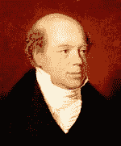

<!--yml
category: 未分类
date: 2024-05-12 23:30:55
-->

# Front-Run The Delta: Early Gold Arbitrage

> 来源：[https://frontrunthedelta.blogspot.com/2012/01/early-gold-arbitrage.html#0001-01-01](https://frontrunthedelta.blogspot.com/2012/01/early-gold-arbitrage.html#0001-01-01)

"When I was settled in London, the East India Company had

£

800,000 worth of gold to sell.  I went to the sale, and bought it all.  I knew the Duke of Wellington must have it.  I had bought a great many of his bills at a discount.  The Government sent for me and said they must have it.  When they got it, they did not know how to get it to Portugal.  I undertook all that and I sent it to France; and that was the best business I ever did."

Nathan Rothschild, ~1811