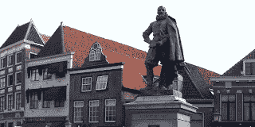

<!--yml
category: 未分类
date: 2024-05-12 23:35:49
-->

# Front-Run The Delta: Jan Pieterszoon Coen

> 来源：[https://frontrunthedelta.blogspot.com/2011/07/jan-pieterszoon-coen.html#0001-01-01](https://frontrunthedelta.blogspot.com/2011/07/jan-pieterszoon-coen.html#0001-01-01)

"Your Honors should know by experience that trade in Asia must be driven and maintained under the protection and favor of Your Honors' own weapons, and that the weapons must be paid for by the profits from the trade,

*so that we cannot carry on trade without war, nor war without trade*

."

[Jan Pieterszoon Coen](http://en.wikipedia.org/wiki/Jan_Pieterszoon_Coen)

, Senior Merchant, Dutch East India Company, 1612