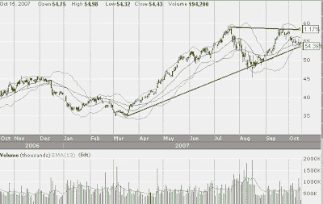

<!--yml
category: 未分类
date: 2024-05-12 23:44:20
-->

# Front-Run The Delta: Petro-Canada poised for Increase

> 来源：[https://frontrunthedelta.blogspot.com/2007/10/petro-canada-poised-for-increase.html#0001-01-01](https://frontrunthedelta.blogspot.com/2007/10/petro-canada-poised-for-increase.html#0001-01-01)

[Petro-Canada](http://stockcharts.com/h-sc/ui?s=pcz)

(PCZ), an integrated oil and gas company out of Calgary, Canada, is staging for what I believe will be a 5-10% increase before the 1st of November. The technical indicators alone indicate such a move, but what's more, the fundamentals continue to point to undervaluation and good performance forecasts.

Technical indicators aside, PCZ is forecasting a 68% increase in EPS for 2007 over 2006, from $3.52 to $5.14, and a 10% increase for 2008 or 2007\. PCZ is also ranked by Reuters, Rochdale Research, and Sabriet as a "Buy"