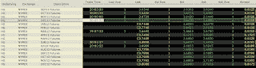

<!--yml
category: 未分类
date: 2024-05-12 23:33:35
-->

# Front-Run The Delta: Price Discovery: NYMEX Copper futures spread to Freeport McMoRan

> 来源：[https://frontrunthedelta.blogspot.com/2011/09/price-discovery-nymex-copper-futures.html#0001-01-01](https://frontrunthedelta.blogspot.com/2011/09/price-discovery-nymex-copper-futures.html#0001-01-01)

|  |
| NYMEX HG Forward Curve [**edit with new**] |

This was an interesting one.  Below is the spread built

from trading a block of USD-denominated 

[FCX](http://www.fcx.com/)

 shares (additional spreads can be built from the EUR-denominated) against the large (

[HG](http://www.cmegroup.com/trading/metals/base/copper_contract_specifications.html)

) NYMEX Copper futures.  A mini contract is available (QC) equal to half the size of the HG contract but suffers from a significant lack of liquidity relative to the HG contract.

The December contract was used in this study because it is the most liquid and maintains the tightest bid/ask spread as evidenced by the above forward curve.  Because the bid/ask spread is a

[function](http://polymer.bu.edu/hes/articles/pgs05.pdf)

 [pdf] of a market-maker's perceived risk, it is interesting to note the relative liquidity of different contracts on the curve.

Notice on the right of the chart when markets begin to perform the zeroing-in function once again.  Unfortunately, due to the large number of quote changes,

[Excel ran out of rows](http://frontrunthedelta.blogspot.com/2011/09/last-row-of-excel.html)

.  This appears to be a consistent problem.