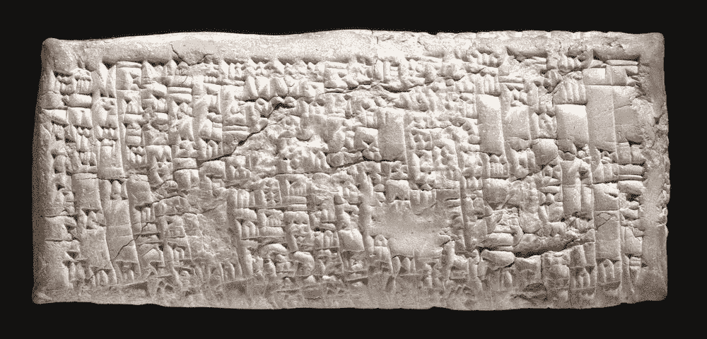

<!--yml
category: 未分类
date: 2024-05-12 23:34:19
-->

# Front-Run The Delta: The Origination of Credit Risk

> 来源：[https://frontrunthedelta.blogspot.com/2011/09/original-otc-market.html#0001-01-01](https://frontrunthedelta.blogspot.com/2011/09/original-otc-market.html#0001-01-01)

"You said, 'I will give good

[ingots](http://en.wikipedia.org/wiki/Ingot)

to Gimil-Sin.' That is what you said, but you have not done so; you offered bad ingots to my messenger saying '

[Take it or leave it](http://www.cmegroup.com/rulebook/NYMEX/1/5.pdf)

.' Who am I that you should treat me so? Are we not both gentlemen?"

Inscription on clay tablet from copper merchant

[Ea-nasir](http://www.britishmuseum.org/research/search_the_collection_database/search_object_details.aspx?objectid=277770&partid=1&output=Terms%2f%21%21%2fOR%2f%21%21%2f15673%2f%21%2f%2f%21%2fOld+Babylonian%2f%21%2f%2f%21%21%2f%2f%21%21%21%2f&orig=%2fresearch%2fsearch_the_collection_database%2fadvanced_search.aspx&currentPage=10&numpages=10)

, circa 1750 BC