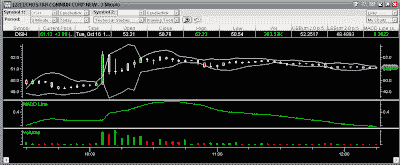

<!--yml
category: 未分类
date: 2024-05-12 23:43:36
-->

# Front-Run The Delta: The Power of CNBC

> 来源：[https://frontrunthedelta.blogspot.com/2007/10/power-of-cnbc.html#0001-01-01](https://frontrunthedelta.blogspot.com/2007/10/power-of-cnbc.html#0001-01-01)

[Notable Calls](http://notablecalls.blogspot.com/)

made a post this morning at 7:38AM highlighting an alert issued by Citigroup on

[EchoStar (DISH)](http://stockcharts.com/h-sc/ui?s=dish)

"saying the shares have been very strong over the last few weeks with most of the run occuring after EchoStar put out a press release suggesting it was contemplating a tax-free spin of some of the non-core assets. They think some of the run-up stems from investors that believe the spin is related to a possible tie-up with

AT&T (NYSE:T).

Firm suggests the likelihood is fairly high that the SpinCo announcement is linked to an AT&T acquisition of EchoStar."

> Notablecalls: What can I say, grab all the DISH stock you can in the $1-$2 buck range from yesterday's close. It's not every day you see a firm coming out saying there's a 65% chance of a co being acquired with a close to 40% premium. That's bound the generate interest!

I started watching DISH this morning after reading NC's post. Oddly enough, the market opened higher, however quickly began to trade down. That is, until, shortly after 10AM, CNBC came on the air and said DISH was a possible take-over target. Then, this happened:

