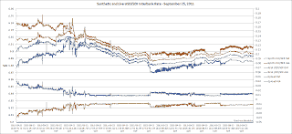

<!--yml
category: 未分类
date: 2024-05-12 23:33:05
-->

# Front-Run The Delta: Triangular Arbitrage during the Interbank Open: USD, SEK, and NOK

> 来源：[https://frontrunthedelta.blogspot.com/2011/09/triangular-arbitrage-during-interbank.html#0001-01-01](https://frontrunthedelta.blogspot.com/2011/09/triangular-arbitrage-during-interbank.html#0001-01-01)

|  |
| 4:06pm - 6:27pm, Sept. 25, 2011 |

This is the opening of the interbank currency market just after 4pm CST, Sunday, September 25, 2011\.  This is a brief preview of another forthcoming post on triangular arbitrage in the currency markets.  This study looks at the USD/

[SEK](http://en.wikipedia.org/wiki/Swedish_krona)

, USD/

[NOK](http://en.wikipedia.org/wiki/Norwegian_krone)

, and NOK/SEK pairs.  To the right is the opening of the real USD/SEK rate spread against the synthetic USD/SEK rate developed from the other two pairs.  Notice how the synthetic rate (red/blue) keys off the movements of the live rate (orange/light blue), narrowing with each passing minute.

This is the first time I have captured the Sunday opening of the FX markets.