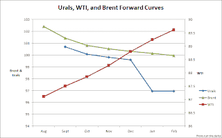

<!--yml
category: 未分类
date: 2024-05-12 23:28:16
-->

# Front-Run The Delta: Urals Blend Arbitrage Continues From Novorossiysk

> 来源：[https://frontrunthedelta.blogspot.com/2012/07/urals-blend-arbitrage-continues-from.html#0001-01-01](https://frontrunthedelta.blogspot.com/2012/07/urals-blend-arbitrage-continues-from.html#0001-01-01)

The Urals arbitrage looks to be strengthening relative to the 

[REBCO curve on Thursday](http://frontrunthedelta.blogspot.com/2012/07/urals-blend-arbitrage-on-strong-med.html)

.  Urals is a blend of light and heavy crude oils from West Siberia, the Ural Mountains in Russia, and flow from fields in the Caspian,

[an area rich in oil history](http://www.amazon.com/gp/product/0375506144/ref=as_li_tf_tl?ie=UTF8&tag=frorunthedel-20&linkCode=as2&camp=217145&creative=399369&creativeASIN=0375506144)

.

Following an

[export suspension after a flood last week](http://www.bbc.co.uk/news/world-europe-18751198)

, Novorossiysk  is once again busy, adding 2 tankers between

[yesterday](https://blogger.googleusercontent.com/img/b/R29vZ2xl/AVvXsEiXp5xImPDRJ08rXJkumml-tQuxFx3WeZjozNEBQR5O5XLyX5_lnOoXM8BasTPeVSaBvYN3oPUmMcPU5OAAgLn6_uNG8ht-iwcNFhBcb_Di-Siw2_r2MztKBzNcw1UMB9wn3krVNZY2T3o/s1600/Novorossiysk.png)

and today. 

Green icons are bulk traffic: wheat, coal, iron ore.  Red icons are chemical, crude, and gas tankers.  

[Live marine traffic data available here](http://marinetraffic.com/ais)

.

Several were stuck in rotation waiting for space through the passage at Istanbul, one of several major choke-points along the way.  Below is a picture of the congestion at 10:00pm Istanbul time.

And a closer look at the actual channel:

via

[Reuters](http://www.reuters.com/article/2012/07/13/markets-mediterranean-crude-idUSL6E8IDDJ020120713)

,

> Urals differentials in the south were still said to be strong on the back of tight supplies. The July programme is largely sold out with only part cargoes left.

> "It's all sold out. It's part cargoes changing hands at ridiculously high levels," said one trader.     One Italian refiner has started taking Urals cargoes from North West Europe to the Mediterranean in a rare arbitrage movement, taking advantage of the north/south price gap, a trader said.

Immediate tanker (red icon) traffic at Primorsk, the main export terminal for Urals in the Baltic, remains surprisingly dry.