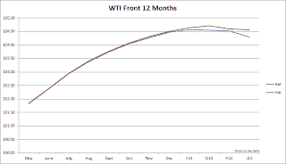
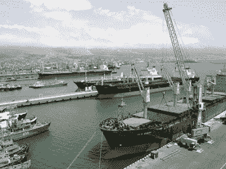

<!--yml
category: 未分类
date: 2024-05-12 23:29:35
-->

# Front-Run The Delta: WTI Forward Curve: Where Abundant Supply Meets Geopolitical Uncertainty

> 来源：[https://frontrunthedelta.blogspot.com/2012/04/wti-forward-curve-where-abundant-supply.html#0001-01-01](https://frontrunthedelta.blogspot.com/2012/04/wti-forward-curve-where-abundant-supply.html#0001-01-01)

Several of the spreads on the front of the curve are nearing very compelling levels.  And if you're interested in a longer term play on WTI, consider the sloping severity of the back of the curve. 

via 4 Apr

[Reuters](http://www.reuters.com/article/2012/04/04/markets-oil-westafrica-idUSL6E8F4CCK20120404)

,

> 
> 
> Traders said between 20-30 cargoes of Nigerian crude oil were still unsold from the April-May programmes.
> 
> "Flow to the States is minimal. Light, sweet is plentiful in the U.S. so there is limited W. African demand," said a West African crude oil trader.

via 4 Apr

[Reuters](http://www.reuters.com/article/2012/04/04/us-oil-supply-idUSBRE8330NA20120404)

,

> "There is certainly a discrepancy between futures and cash crude markets," said Olivier Jakob from Petromatrix consultancy. "**There is no shortage in the physical market, but there is a lot of uncertainty regarding Iran. If you want to hedge Iranian risk, you do it on the futures market.**"
>  "The reality today is that the market is well **oversupplied**. OPEC production has been rising consistently since September and will probably continue rising further," said Colin Smith, energy strategist at VTB Capital.
> 
> "At some point - as happened in 2008 - the markets will take note, perhaps before it shows up in the inventories but certainly as and when it does show up in the inventories," said Smith, whose bank is a top lender to the Russian oil industry.

via 3 Apr

[Reuters](http://www.reuters.com/article/2012/04/03/idUSL6E8F3ACP20120403)

,

|  |
| Novorossiisk Port |

> Delays at Russia's main Black Sea port of Novorossiisk due to bad weather continued to crimp supplies in the Mediterranean in contrast with well supplied markets in the Baltic, where Russia opened a new export outlet of Ust-Luga last month.
> 
> "The arb between the Baltic and the Med is well open now... Some 300,000 tonnes might have already sailed," a trader with a major said, referring to arbitrage shipments from northern Europe to the Mediterranean where prices are around $1 per barrel higher.
> 
> "Everybody is waiting to see if the U.S. and EU will release strategic stocks," said a trader. "Nobody is buying."

> Nabiullina said that Urals blend URL-E crude price forecasts for the following two years have been left unchanged at $97 and $101 respectively, **adding that the ministry expects oil prices to decline from current levels**.

> "**Supply is really ample here.** You can see any kind of crude oil you can think of. West African, Caribbean, North Sea and so on," a trader with an oil refiner said.

> "Urals is typically depressed around April-May due to the spring maintenance season. This year you also have extra volumes from Ust-Luga," he added referring to a new Russian Baltic Sea port, which was launched earlier this month.
> 
> In the Platts window, Litasco offered a rare 60,000-tonne Siberian Light cargo at dated Brent minus 25 cents loading from port of Tuapse in mid-April, more than $1 per barrel weaker than previous price indications, **but could find no buyers**.  "A couple of other cargoes are still available and are being offered," one trader said.  Socar offered Azeri Light a dated Brent plus $3.50, slightly weaker than previous price estimates, **but found no buyers**, traders said.

> Traders estimated that Glencore, the world's largest
> 
> [publicly listed trader](http://frontrunthedelta.blogspot.com/2011/07/arbitraging-arbitrageur-case-of.html)
> 
> , was set to market up to 10 Urals cargoes in the Baltic in April, a number not seen for many years while the market for Russian crude was dominated by other players. "Glencore is definitely coming back big," one trader with a major oil company said. "I would say they are now sharing leading positions with Shell and Statoil."