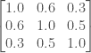

<!--yml
category: 未分类
date: 2024-05-18 08:06:58
-->

# Generating correlated random numbers with Python | Quant Corner

> 来源：[https://quantcorner.wordpress.com/2018/02/09/generation-of-correlated-random-numbers-using-python/#0001-01-01](https://quantcorner.wordpress.com/2018/02/09/generation-of-correlated-random-numbers-using-python/#0001-01-01)

(Below is kinda note-to-self.  This is the re-write of an old blog entry, based on [Generating correlated random numbers](http://www.sitmo.com/article/generating-correlated-random-numbers/#comment-325 "Generating Correlated Random Numbers") by Thijs van den Berg)

Say I want to generate 3 series of random numbers correlated according to the following correlation matrix:



```
from scipy.linalg import cholesky

# Correlation matrix
corr_mat= np.array([[1.0, 0.6, 0.3],
                    [0.6, 1.0, 0.5],
                    [0.3, 0.5, 1.0]])

# Compute the (upper) Cholesky decomposition matrix
upper_chol = cholesky(corr_mat)

# Generate 3 series of normally distributed (Gaussian) numbers
rnd = np.random.normal(0.0, 1.0, size=(10**7, 3))

# Finally, compute the inner product of upper_chol and rnd
ans = rnd @ upper_chol

```

Now, one can check results are consistent:

```
# One can check results are consistent
from scipy.stats import pearsonr

corr_0_1 , _ = pearsonr(ans[:,0], ans[:,1])
#corr_0_1
#0.60013025775533102

corr_0_2 , _ = pearsonr(ans[:,0], ans[:,2])
#corr_0_2
#0.30049740204791148

corr_1_2 , _ = pearsonr(ans[:,1], ans[:,2])
#corr_1_2
#0.50026641543258898

```