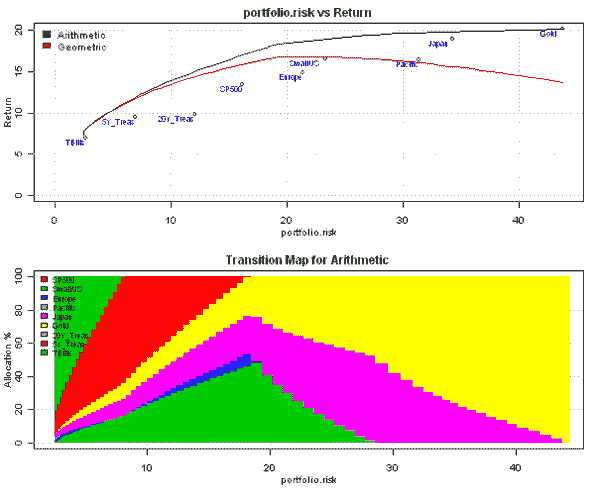
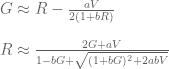
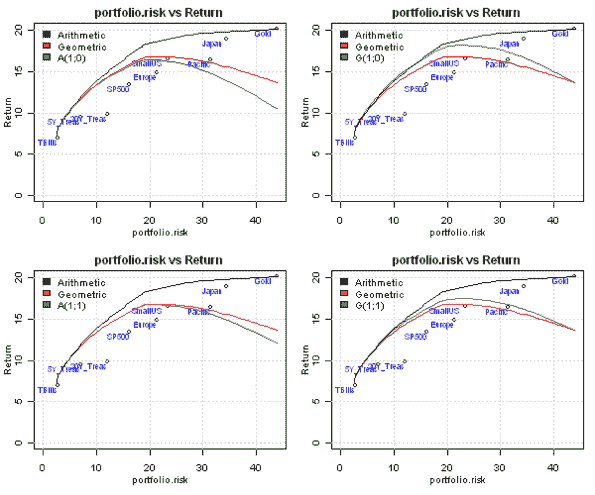
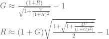
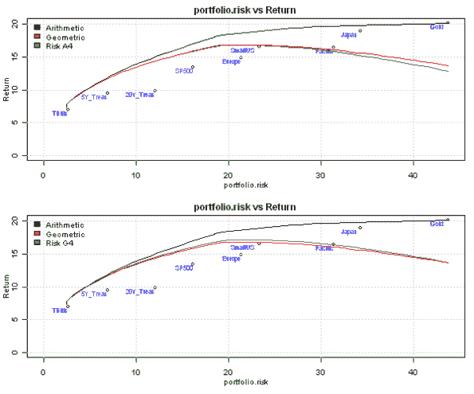
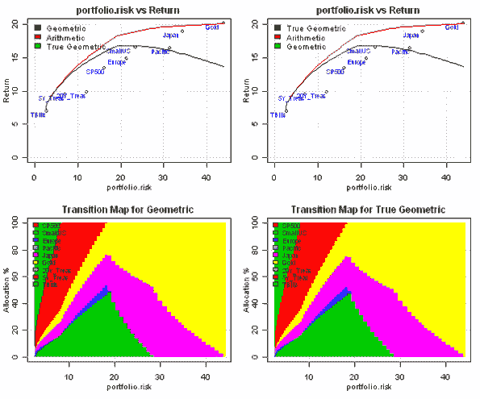
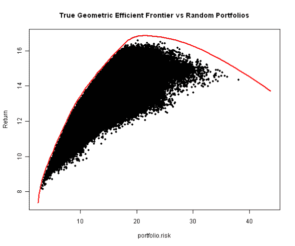

<!--yml
category: 未分类
date: 2024-05-18 14:47:22
-->

# Geometric Efficient Frontier | Systematic Investor

> 来源：[https://systematicinvestor.wordpress.com/2011/11/09/geometric-efficient-frontier/#0001-01-01](https://systematicinvestor.wordpress.com/2011/11/09/geometric-efficient-frontier/#0001-01-01)

What is important for an investor? The rate of return is at the top of the list. Does the expected rate of return shown on the mean-variance efficient frontier paints the full picture? If investor’s investment horizon is longer than one period, for example 5 years, than the true measure of portfolio performance is [Geometric return](http://en.wikipedia.org/wiki/Rate_of_return), which is always less then or equal to the [Arithmetic return](http://en.wikipedia.org/wiki/Rate_of_return) plotted on the Y axis of the mean-variance efficient frontier.

There is a good discussion of Arithmetic vs Geometric returns in [A tale of two returns](http://www.portfolioprobe.com/2010/10/04/a-tale-of-two-returns/) blog post by Pat Burns and another good post [Why Log Returns](http://quantivity.wordpress.com/2011/02/21/why-log-returns/) by Quantivity.

I will use example and methods presented in [DIVERSIFICATION, REBALANCING, AND THE GEOMETRIC MEAN FRONTIER by W. Bernstein and D. Wilkinson (1997)](http://www.effisols.com/basics/rebal.pdf) paper to create Geometric Efficient Frontier.

Let’s first examine portfolios on the mean-variance efficient frontier and compute their historical geometrical returns:

```

# load Systematic Investor Toolbox
setInternet2(TRUE)
source(gzcon(url('https://github.com/systematicinvestor/SIT/raw/master/sit.gz', 'rb')))

#--------------------------------------------------------------------------
# Create Efficient Frontier
#--------------------------------------------------------------------------
	ia = aa.test.create.ia.rebal()
	n = ia$n

	# -1 <= x.i <= 1
	constraints = new.constraints(n, lb = 0, ub = 1)

	# SUM x.i = 1
	constraints = add.constraints(rep(1, n), 1, type = '=', constraints)

	# create efficient frontier(s)
	ef.risk = portopt(ia, constraints, 50, 'Arithmetic', equally.spaced.risk = T)

	# compute historical geometrical returns
	ef.risk.geometric = ef.risk
		ef.risk.geometric$name = 'Geometric'
		ef.risk.geometric$return = portfolio.geometric.return(ef.risk$weight, ia)

	# Plot multiple Efficient Frontiers and Transition Maps
	plot.ef(ia, list(ef.risk, ef.risk.geometric), portfolio.risk, T)

```

[](https://systematicinvestor.wordpress.com/wp-content/uploads/2011/11/plot1-small2.png)

The efficient frontier labeled ‘Geometric’ lies below the ‘Arithmetic’ efficient frontier and has the maximum Geometric mean at 21.6% risk level. All portfolios with risk greater than 21.6% are not efficient for investor with multi-period investment horizon.

The [DIVERSIFICATION, REBALANCING, AND THE GEOMETRIC MEAN FRONTIER by W. Bernstein and D. Wilkinson (1997)](http://www.effisols.com/basics/rebal.pdf) paper discuss four methods to approximate historical geometric means calculation with arithmetic means. All computations are based on the following approximation between Arithmetic (R) and Geometric (G) means (page 8):



To reproduce results from the paper, I will follow the geometric efficient frontier construction methods outlined on page 14\. The A(0,1) and A(1,1) geometric efficient frontiers are constructed from the classical Markowitz efficient frontier which use the arithmetic means as inputs. To compute portfolio geometric means I use the above approximation.

The G(0,1) and G(1,1) geometric efficient frontiers are constructed from the classical Markowitz efficient frontier which use the individual pseudo-arithmetic means as inputs. I.e. I first convert individual geometric means to the pseudo-arithmetic means and use them later in the optimization. To compute portfolio geometric means I use the above approximation, same as for A(0,1) and A(1,1).

```

###############################################################################
# Functions to convert between Arithmetic and Geometric means
###############################################################################
# page 8, DIVERSIFICATION, REBALANCING, AND THE GEOMETRIC MEAN FRONTIER by W. Bernstein and D. Wilkinson (1997)
###############################################################################
geom2aritm <- function(G, V, a, b) 
{ 
	(2*G + a*V^2) / (1 - b*G + sqrt((1+b*G)^2 + 2*a*b*V^2)) 
}

aritm2geom <- function(R, V, a, b) 
{ 
	R - a*V^2 / (2*(1 + b*R)) 
}

	#--------------------------------------------------------------------------
	# Following paper's notation : A(1,0) and A(1,1) page 8, 14
	#--------------------------------------------------------------------------
	# A(1,0)
	ef.risk.A10 = ef.risk
		ef.risk.A10$name = 'A(1;0)'
		ef.risk.A10$return = apply( cbind(ef.risk$return, ef.risk$risk), 1,
					function(x) aritm2geom(x[1], x[2], 1, 0) )
	# A(1,1)
	ef.risk.A11 = ef.risk
		ef.risk.A11$name = 'A(1;1)'
		ef.risk.A11$return = apply( cbind(ef.risk$return, ef.risk$risk), 1,
					function(x) aritm2geom(x[1], x[2], 1, 1) )
	# G(1,0)
	ia.G = ia
	ia.G$expected.return = apply( cbind(ia$geometric.return, ia$risk), 1,
					function(x) geom2aritm(x[1], x[2], 1, 0) )
	ef.risk.G10 = portopt(ia.G, constraints, 50, 'G(1;0)',equally.spaced.risk = T)
		ef.risk.G10$return = apply( cbind(ef.risk.G10$return, ef.risk.G10$risk), 1,
					function(x) aritm2geom(x[1], x[2], 1, 0) )
	# G(1,1)
	ia.G$expected.return = apply( cbind(ia$geometric.return, ia$risk), 1,
					function(x) geom2aritm(x[1], x[2], 1, 1) )
	ef.risk.G11 = portopt(ia.G, constraints, 50, 'G(1;1)',equally.spaced.risk = T)
		ef.risk.G11$return = apply( cbind(ef.risk.G11$return, ef.risk.G11$risk), 1,
					function(x) aritm2geom(x[1], x[2], 1, 1) )

	# Plot multiple Efficient Frontiers
	layout( matrix(1:4, nrow = 2) )
	plot.ef(ia, list(ef.risk, ef.risk.geometric, ef.risk.A10), portfolio.risk, F)
	plot.ef(ia, list(ef.risk, ef.risk.geometric, ef.risk.A11), portfolio.risk, F)
	plot.ef(ia, list(ef.risk, ef.risk.geometric, ef.risk.G10), portfolio.risk, F)
	plot.ef(ia, list(ef.risk, ef.risk.geometric, ef.risk.G11), portfolio.risk, F)

```

[](https://systematicinvestor.wordpress.com/wp-content/uploads/2011/11/plot2-small2.png)

The results match closely to the paper’s results on page 27.

But we can do better, in the recent paper [On the Relationship between Arithmetic and Geometric Returns by D. Mindlin (2011)](http://www.cdiadvisors.com/papers/CDIArithmeticVsGeometric.pdf) the author presents a detailed review of the four approximation methods to convert between Arithmetic and Geometric Returns. The overall winner is the relationship (A4) (page 8):



Let’s compare the geometric mean approximation given by A4 method in the same framework as we did above:

```

###############################################################################
# Functions to convert between Arithmetic and Geometric means
###############################################################################
# page 14, A4, On the Relationship between Arithmetic and Geometric Returns by D. Mindlin
###############################################################################
geom2aritm4 <- function(G, V) 
{ 
	(1+G)*sqrt(1/2 + 1/2*sqrt(1 + 4*V^2/(1+G)^2)) - 1 
}

aritm2geom4 <- function(R, V) 
{ 
	(1+R)/(sqrt(1 + V^2/(1+R)^2)) - 1 
}

	#--------------------------------------------------------------------------
	# Use A4 method to convert between Arithmetic and Geometric means
	#--------------------------------------------------------------------------
	# A
	ef.risk.A4 = ef.risk
		ef.risk.A4$name = 'Risk A4'
		ef.risk.A4$return = apply( cbind(ef.risk$return, ef.risk$risk), 1,
								function(x) aritm2geom4(x[1], x[2]) )

	# G
	ia.G = ia
	ia.G$expected.return = apply( cbind(ia$geometric.return, ia$risk), 1,
								function(x) geom2aritm4(x[1], x[2]) )
	ef.risk.G4 = portopt(ia.G, constraints, 50, 'Risk G4',equally.spaced.risk = T)
		ef.risk.G4$return = apply( cbind(ef.risk.G4$return, ef.risk.G4$risk), 1,
								function(x) aritm2geom4(x[1], x[2]) )

	# Plot multiple Efficient Frontiers
	layout( matrix(1:2, nrow = 2) )
	plot.ef(ia, list(ef.risk, ef.risk.geometric, ef.risk.A4), portfolio.risk, F)
	plot.ef(ia, list(ef.risk, ef.risk.geometric, ef.risk.G4), portfolio.risk, F)

```

[](https://systematicinvestor.wordpress.com/wp-content/uploads/2011/11/plot3-small1.png)

The results match closely the Geometric Efficient Frontier and outperform the A(1,0), A(1,1), G(1,0), G(1,1) approximations.

All discussion above was based on the Geometric Efficient Frontier that consisted from portfolios on the Arithmetic Efficient Frontier. But why do we think that both the Geometric Efficient Frontier and the Arithmetic Efficient Frontier will have same portfolios?

Let’s create the True Geometric Efficient Frontier. I’m not aware of the method to solve this problem as the linear programming, so I will use a Nonlinear programming solver, [Rdonlp2](http://arumat.net/Rdonlp2/tutorial.html), which is based on donlp2 routine developed and copyright by [Prof. Dr. Peter Spellucci](http://www.mathematik.tu-darmstadt.de/fbereiche/numerik/staff/spellucci/spellucci.html). Following code might not properly execute on your computer because Rdonlp2 is only available for R version 2.9 or below.

```

	#--------------------------------------------------------------------------
	# Create True Geometric Efficient Frontier
	#--------------------------------------------------------------------------
	ef.true.geometric = ef.risk
		ef.true.geometric$name = 'True Geometric'
		constraints$x0 = ef.risk$weight[1,]

	for(i in 1:len(ef.risk$risk)) {
		cat('i =', i, '\n')
		ef.true.geometric$weight[i,] = max.geometric.return.portfolio(ia, constraints, ef.risk$risk[i], ef.risk$risk[i])
			constraints$x0 = ef.true.geometric$weight[i,]
	}

	ef.true.geometric$return = portfolio.geometric.return(ef.true.geometric$weight, ia)

	# Plot multiple Efficient Frontiers
	layout( matrix(1:4, nrow = 2) )
	plot.ef(ia, list(ef.risk.geometric, ef.risk, ef.true.geometric), portfolio.risk, T, T)
	plot.ef(ia, list(ef.true.geometric, ef.risk, ef.risk.geometric), portfolio.risk, T, T)

```

[](https://systematicinvestor.wordpress.com/wp-content/uploads/2011/11/plot4-small.png)

The source code for the max.geometric.return.portfolio() function is at the end of this post.

The True Geometric Efficient Frontier and Geometric Efficient Frontier that consisted from portfolios on the Arithmetic Efficient Frontier look identical. This conclusion is also supported by the paper [On the Maximization of the Geometric Mean with Lognormal Return Distribution by E. Elton, M. Gruber (1974)](http://pages.stern.nyu.edu/~eelton/papers/74-dec.pdf). Following is the abstract:

[In this paper we discuss the relevancy of the geometric mean as a portfolio selection criteria. A procedure for finding that portfolio with the highest geometric mean when returns on portfolios are lognormally distributed is presented. The development of this algorithm involves a **proof that the portfolio with maximum geometric mean lies on the efficient frontier in arithmetic mean variance space**.](http://mansci.journal.informs.org/content/21/4/483.short)

The last step is to check that portfolios found by Non-Linear Optimization are global maximums. I will create 1,000,000 random portfolios that satisfy constraints and plot True Geometric Efficient Frontier and random portfolios on the same chart.

```

	#--------------------------------------------------------------------------
	# Double check that NonLinear Optimization finds global maximums by
	# creating random portfolios that satisfy constraints. 
	# Plot True Geometric Efficient Frontier and random portfolios, check
	# that all portfolios lie below the efficient frontier.
	#--------------------------------------------------------------------------	
	# Generate random portfolios
	ef.random = list()
		ef.random$name = 'Random'
		ef.random$weight = randfixedsum(1000000, n, 1, 0, 1)

		ef.random$risk = portfolio.risk(ef.random$weight, ia)		
		ef.random$return = portfolio.geometric.return(ef.random$weight, ia)		

	# Plot True Geometric Efficient Frontier and random portfolios
	layout(1)
	plot(100*ef.random$risk, 100*ef.random$return, type='p', pch=20,
			xlim = 100*range(ef.random$risk, ef.true.geometric$risk),
			ylim = 100*range(ef.random$return, ef.true.geometric$return),
			main = 'True Geometric Efficient Frontier vs Random Portfolios',
			xlab = 'portfolio.risk',
			ylab = 'Return'			
		)
	lines(100*ef.true.geometric$risk, 100*ef.true.geometric$return, type='l', lwd=2,col = 'red')

```

[](https://systematicinvestor.wordpress.com/wp-content/uploads/2011/11/plot5-small.png)

The Non-Linear Optimization found global maximums: all random portfolios, black dots, lie below the True Geometric Efficient Frontier, red line. To generate Random Portfolios I used [randfixedsum function (Random Vectors with Fixed Sum)](http://www.mathworks.com/matlabcentral/fileexchange/9700-random-vectors-with-fixed-sum) created by Roger Stafford. The randfixedsum function randomly and uniformly generates vectors with a specified sum and values in a specified interval.

*The message that I want to convey in this post is to always check the Geometric Efficient Frontier, constructed from the portfolios on the Arithmetic Efficient Frontier, and make sure that you are compensated for the risk in your portfolios. I.e. the more risk you take on, the greater the expected Geometric return of your portfolios.*

To view the complete source code for this example, please have a look at the [aa.arithmetic.geometric.test() function in aa.test.r at github](https://github.com/systematicinvestor/SIT/blob/master/R/aa.test.r).

The source code for the max.geometric.return.portfolio() function:

```

max.geometric.return.portfolio <- function 
(
	ia,		# input assumptions
	constraints,	# constraints
	min.risk,
	max.risk
)
{
	n = ia$n
	nt = nrow(ia$hist.returns)

	require(Rdonlp2)

	# Geometric return
	fn <- function(x){
		portfolio.returns = x %*% t(ia$hist.returns)	
		prod(1 + portfolio.returns)
	}

	# control structure, fnscale - set -1 for maximization
	cntl <- donlp2.control(silent = T, fnscale = -1, iterma =10000, nstep = 100, epsx = 1e-10)	
	# lower/upper bounds
	par.l = constraints$lb
	par.u = constraints$ub

	# intial guess
	p = rep(1, nrow(constraints$A))
	if(!is.null(constraints$x0)) p = constraints$x0

	# linear constraints
	A = t(constraints$A)
	lin.l = constraints$b
	lin.u = constraints$b
	lin.u[ -c(1:constraints$meq) ] = +Inf

	# Nonlinear constraints
	nlcon1 <- function(x){
		sqrt(t(x) %*% ia$cov %*% x)
	}

	# find solution
	sol = donlp2(p, fn, par.lower=par.l, par.upper=par.u,
			A=A, lin.u=lin.u, lin.l=lin.l, control=cntl,
			nlin=list(nlcon1),
			nlin.upper=c(max.risk),
			nlin.lower=c(min.risk)
			)

	x = sol$par

	return( x )
}

```