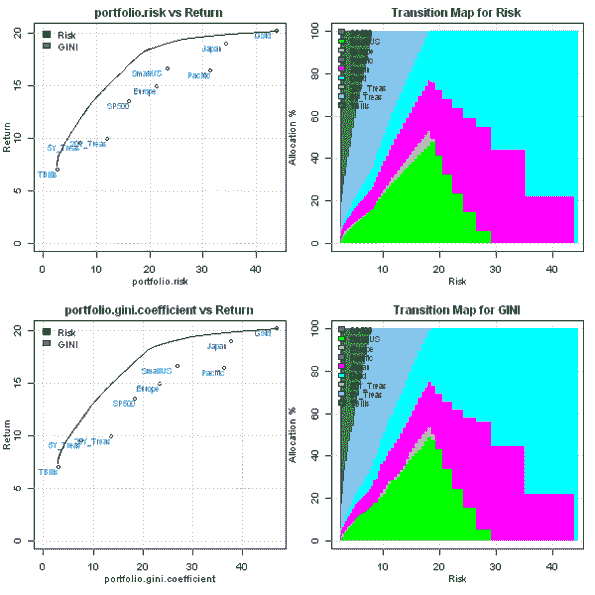
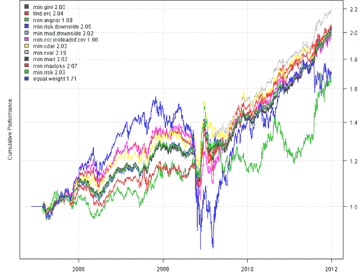
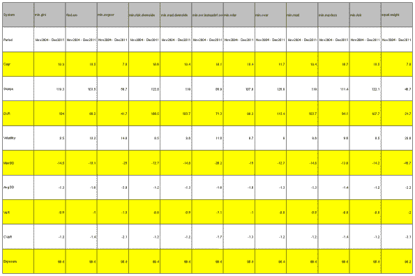

<!--yml
category: 未分类
date: 2024-05-18 14:41:41
-->

# Gini Efficient Frontier | Systematic Investor

> 来源：[https://systematicinvestor.wordpress.com/2012/03/24/gini-efficient-frontier/#0001-01-01](https://systematicinvestor.wordpress.com/2012/03/24/gini-efficient-frontier/#0001-01-01)

[David Varadi](http://cssanalytics.wordpress.com/) have recently wrote two posts about [Gini Coefficient](http://en.wikipedia.org/wiki/Gini_coefficient): [I Dream of Gini](http://cssanalytics.wordpress.com/2012/02/24/i-dream-of-gini/), and [Mean-Gini Optimization](http://cssanalytics.wordpress.com/2012/02/25/mean-gini-optimization/). I want to show how to use Gini risk measure to construct efficient frontier and compare it with alternative risk measures I discussed previously.

I will use [Gini mean difference](http://en.wikipedia.org/wiki/Mean_difference) risk measure – the mean of the difference between every possible pair of returns to construct Mean-Gini Efficient Frontier. I will use methods presented in “The Generation of Mean Gini Efficient Sets” by J. Okunev (1991) paper to construct optimal portfolios.

Let x.i, i= 1,…,N be weights of instruments in the portfolio. Let us denote by r.it the return of i-th asset in the time period t for i= 1,…,N and t= 1,…,T. The portfolio’s Gini mean difference (page 5) can be written as:


It can be formulated as a linear programming problem


This linear programming problem can be easily implemented

```

min.gini.portfolio <- function
(
	ia,		# input assumptions
	constraints	# constraints
)
{
	n = ia$n
	nt = nrow(ia$hist.returns)

	# objective : Gini mean difference - the mean of the difference between every possible pair of returns
	#  1/(T^2) * [ SUM <over j = 1,...,T , k>j> a.long.jk + a.short.jk ]
	f.obj = c(rep(0, n), (1/(nt^2)) * rep(1, nt*(nt-1)))

	# adjust constraints, add a.long.jk , a.short.jk
	constraints = add.variables(nt*(nt-1), constraints, lb=0)

	# [ SUM <over i> x.i * (r.ij - r.ik) ] - a.long.jk + a.short.jk = 0
	# for each j = 1,...,T , k>j	
	a = matrix(0, n + nt*(nt-1), nt*(nt-1)/2)
		diag(a[(n+1) : (n + nt*(nt-1)/2), ]) = -1
		diag(a[(n+1+nt*(nt-1)/2) : (n + nt*(nt-1)), ]) = 1
	hist.returns = as.matrix(ia$hist.returns)

	i.start = 0
	for(t in 1:(nt-1)) {
		index = (i.start+1) : (i.start + nt -t)
		for(i in 1:n) {
			a[i, index] = ( hist.returns[t,i] - hist.returns[,i] ) [ (t+1) : nt ] 
		}
		i.start = i.start + nt -t		
	}
	constraints = add.constraints(a, 0, '=', constraints)

	# setup linear programming	
	f.con = constraints$A
	f.dir = c(rep('=', constraints$meq), rep('>=', len(constraints$b) - constraints$meq))
	f.rhs = constraints$b

	# find optimal solution
	x = NA
	sol = try(solve.LP.bounds('min', f.obj, t(f.con), f.dir, f.rhs, 
					lb = constraints$lb, ub = constraints$ub), TRUE)

	if(!inherits(sol, 'try-error')) {
		x = sol$solution[1:n]
	}

	return( x )
}

```

Let’s examine efficient frontiers computed under Gini and Standard deviation risk measures using sample historical input assumptions.

```

###############################################################################
# Load Systematic Investor Toolbox (SIT)
# https://systematicinvestor.wordpress.com/systematic-investor-toolbox/
###############################################################################
con = gzcon(url('http://www.systematicportfolio.com/sit.gz', 'rb'))
    source(con)
close(con)

	#--------------------------------------------------------------------------
	# Create Efficient Frontier
	#--------------------------------------------------------------------------
	ia = aa.test.create.ia.rebal()
	n = ia$n		

	# 0 <= x.i <= 1 
	constraints = new.constraints(n, lb = 0, ub = 1)

	# SUM x.i = 1
	constraints = add.constraints(rep(1, n), 1, type = '=', constraints)		

	# create efficient frontier(s)
	ef.risk = portopt(ia, constraints, 50, 'Risk')
	ef.gini = portopt(ia, constraints, 50, 'GINI', min.gini.portfolio)

	#--------------------------------------------------------------------------
	# Create Plots
	#--------------------------------------------------------------------------
	layout( matrix(1:4, nrow = 2) )
	plot.ef(ia, list(ef.risk, ef.gini), portfolio.risk, F)	
	plot.ef(ia, list(ef.risk, ef.gini), portfolio.gini.coefficient, F)	

	plot.transition.map(ef.risk)
	plot.transition.map(ef.gini)

```

[](https://systematicinvestor.wordpress.com/wp-content/uploads/2012/03/plot1g-small.png)

The Gini efficient frontier is almost identical to Standard deviation efficient frontier, labeled ‘Risk’. This is not a surprise because asset returns that are used in the sample input assumptions are well behaved. The Gini measure of risk would be most appropriate if asset returns contained large outliers.

To view the complete source code for this example, please have a look at the [aa.gini.test() function in aa.test.r at github](https://github.com/systematicinvestor/SIT/blob/master/R/aa.test.r).

Next I added Gini risk measure to the mix of Asset Allocation strategies that I examined in the [Backtesting Asset Allocation portfolios](https://systematicinvestor.wordpress.com/2012/03/19/backtesting-asset-allocation-portfolios/) post.

[](https://systematicinvestor.wordpress.com/wp-content/uploads/2012/03/plot1-small4.png)

[](https://systematicinvestor.wordpress.com/wp-content/uploads/2012/03/plot2-small4.png)

The Gini portfolios and Minimum Variance portfolios show very similar perfromance

To view the complete source code for this example, please have a look at the [bt.aa.test() function in bt.test.r at github](https://github.com/systematicinvestor/SIT/blob/master/R/bt.test.r).