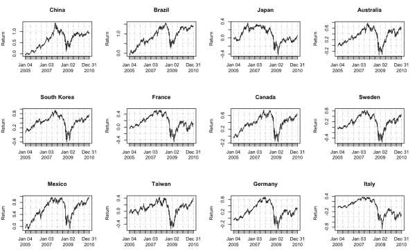
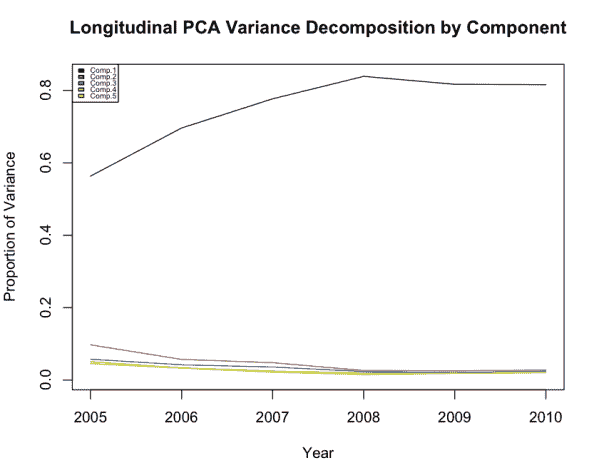
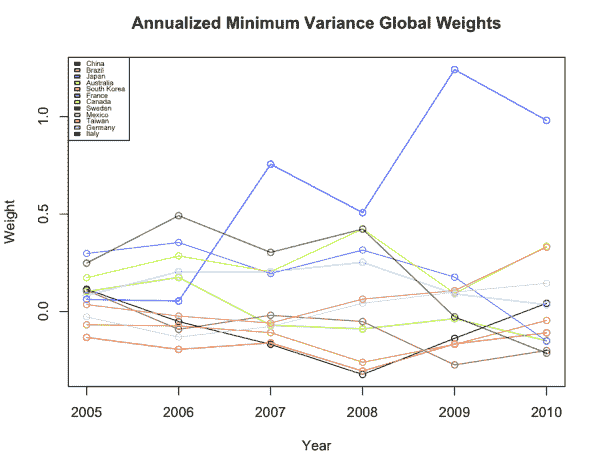
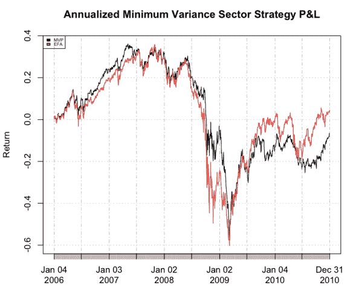
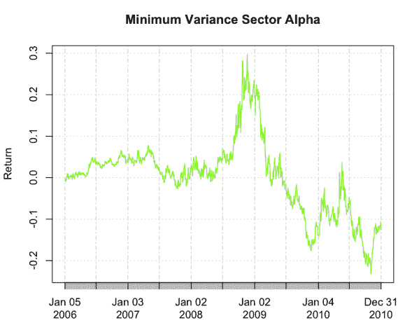
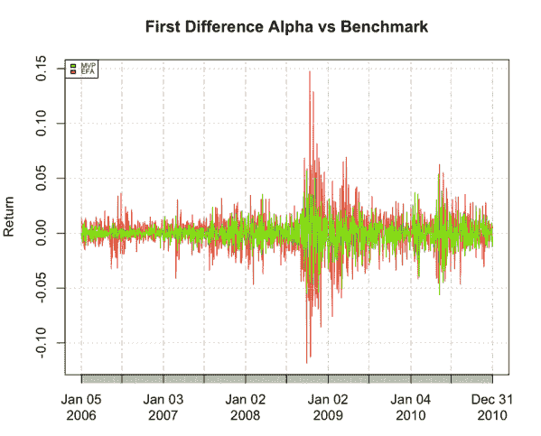
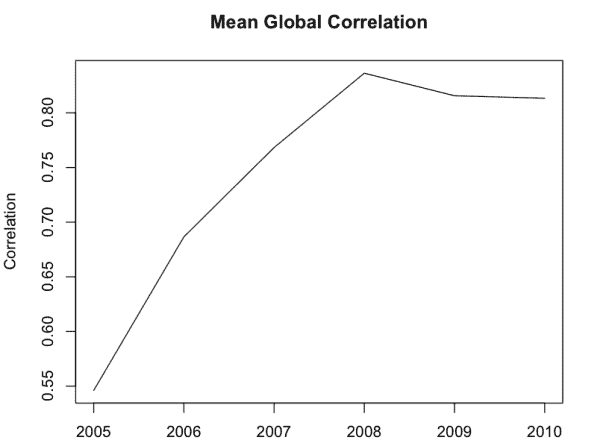
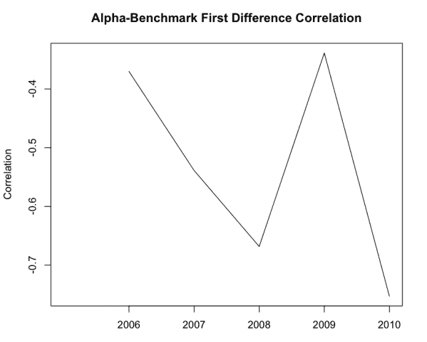

<!--yml
category: 未分类
date: 2024-05-18 13:52:10
-->

# Global Rotation with Minimum Variance | Quantivity

> 来源：[https://quantivity.wordpress.com/2011/04/24/minimum-variance-global-rotation/#0001-01-01](https://quantivity.wordpress.com/2011/04/24/minimum-variance-global-rotation/#0001-01-01)

Analyzing foreign equity tilt within asset allocation has always been a macroecon crapshoot, given geopolitical turbulence, [currency risk](http://en.wikipedia.org/wiki/Currency_risk), and country-sector concentration. Towards eliminating discretionary prediction, this post applies [minimum variance rotation](https://quantivity.wordpress.com/2011/04/20/minimum-variance-sector-rotation) to prominent equity markets within [EAFE](http://en.wikipedia.org/wiki/MSCI_EAFE). The results are quite interesting in comparison with the previous [1999 – 2010 analysis of US sectors](https://quantivity.wordpress.com/2011/04/22/minimum-variance-sector-rotation-part-2/).

The following international ETFs are included in this analysis: Germany (EWG), China (FXI), Brazil (EWZ), Japan (EWJ), Australia (EWA), South Korea (EWY), Italy (EWI), France (EWQ), Canada (EWC), Sweden (EWD), Mexico (EWW), and Taiwan (EWT). While many additional international ETFs exist today, their inception dates are too recent to accommodate a longitudinal panel of sufficient length. Global rotation will be benchmarked against [EAFE](http://en.wikipedia.org/wiki/MSCI_EAFE) (via [EFA](http://finance.yahoo.com/q?d=t&s=EFA)), as S&P 500 does for the US market via SPY.

As macroecon context, the top-20 countries worldwide ranked in descending order of [GDP](http://en.wikipedia.org/wiki/Gross_domestic_product) according to [IMF](http://en.wikipedia.org/wiki/International_Monetary_Fund) are: US, China, Japan, India, Germany, Russia, UK, Brazil, France, Italy, Mexico, South Korea, Spain, Canada, Indonesia, Turkey, Australia, Taiwan, Iran, Poland. Thus, the selected ETFs represent 12 of the top-20 countries. Their performance, as measured in log returns, over the period are:

All countries echo the financial bubble, yet with widely varying post-trough recovery magnitude: Brazil, Australia, South Korea, Sweden, Mexico, Canada, and Taiwan all ended 2010 near their pre-bubble peaks; China, Japan, France, Germany, and Italy experienced more muted recoveries. This hints to recovery strength and GDP relationship: *post-bubble recovery is progressive weaker with increasing GDP*. This is unexpected, as US markets experienced strong recovery (within 15% of pre-bubble peak).

The proportion of variance explained by the market component is significant, exceeding 80% during 2008 – 2010\. The upward trend mirrors the US sectors.

Next, visualize the global weights derived from annually generating the [minimum variance portfolio](https://quantivity.wordpress.com/2011/04/17/minimum-variance-portfolios/). Remarkably, *weight for Japan jumps from under 20% to over 100%* during this period, with corresponding significant decrease for Italy:

Without doubt, the dramatic change in weighting dominance of Japan in 2009 and 2010 is a puzzle to investigate further. As will be seen below, this change in weighting results in a fairly significant regime change subsequent to 2008.

Trading the strategy derived from these weights result in the following daily P&L performance:

Obviously, P&L is pretty lackluster: slightly beating benchmark 2006 – 2009 (including solid 20% over benchmark going into the trough); while the wheels come off in mid-2009\. Looking at 2009 returns for Japan and the 2009 MVP weights, EWJ may be to blame. Given EWJ has been mean-reverting around 10 since April 2009, this begs a variance penalization question: *is using the covariance matrix unfairly penalizing “good” (upside) variance, at the expense of “bad” (downside) variance*? This question is perhaps worth further analysis (see [A Brief History of Downside Risk Measures](http://citeseer.ist.psu.edu/viewdoc/summary?doi=10.1.1.22.262), Nawrocki [1999]).

The remarkable disparity in P&L between US and global rotation warrants further investigation. Begin with the strategy alpha versus benchmark (as defined by [Minimum Variance Rotation: Part 2](https://quantivity.wordpress.com/2011/04/22/minimum-variance-sector-rotation-part-2/)), illustrating inconsistency with US markets: *similar outperformance during market crisis, yet underperformance during market strength*. While this is qualitatively consistent with minimizing upside variance (per above), the magnitude of underperformance is unexpectedly significant.

The overlapping time series of first differences for alpha and benchmark also exhibit inconsistency with US sectors: although similarly heteroskedastic, alpha variance is *more consistent and less time synchronized* during and subsequent to 2008\. The comparatively smaller heteroskedasticity is very interesting, begging distributional dissimilarity of alpha between US versus global markets. This observation is all the more intriguing, given the qualitative similarity in return time-series across both US and global markets during and subsequent to 2008.

To investigate further, consider the mean correlation amongst all foreign markets: nearly monotonically increasing, peaking and holding steady at more than 80%. This monotonicity contrasts with US sector correlation which dipped in 2006 and 2009:

Finally, despite increasing global markets correlation, alpha-EFA correlation also exhibit inconsistency with US sectors; specifically, correlation dropping in 2009 only for foreign markets.

Undoubtedly, this post discourages trading of global rotation using minimum variance. The salient question is *why*, given the success of this methodology for US sectors. Further investigation of the several curiosities raised herein may help unravel this mystery.

Thoughts anyone?