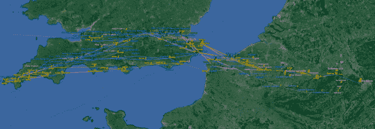

<!--yml
category: 未分类
date: 2024-05-18 14:15:22
-->

# HFT IN MY BACKYARD | THE MAP – Sniper In Mahwah & friends

> 来源：[https://sniperinmahwah.wordpress.com/2015/04/15/hft-in-my-backyard-the-map/#0001-01-01](https://sniperinmahwah.wordpress.com/2015/04/15/hft-in-my-backyard-the-map/#0001-01-01)

I realized yesterday I forgot the most important point in the conclusion of the first season’s series [finale](https://sniperinmahwah.wordpress.com/2015/04/13/hft-in-my-backyard-vi-2/): the map! As I wrote in this last episode, this map is a web of possibilities – some paths are the real ones, other are only possible routes since competitors have licenses here or there but no dishes installed, etc. I learnt on this [forum](http://nuclearphynance.com/Show%20Post.aspx?PostIDKey=173805) that I saved a (HFT?) firm “a few months work”; that means this map is a little bit bankable. Up to $47,000? – just kidding. You can download the kmz file [here](https://drive.google.com/file/d/0B2lFW4gYvBDNOTZyNXQxbVlsVmc/view?pli=1) or by clicking on the map below – but don’t use it with Google Drive (it’s a mess), download the file and open it with Google Earth, that’s better. The recent New Line Networks paths are included, but without the Ofcom links/licenses. That said, this map is probably a decent start. If you want to write me a check, send the money on this bank account (IBAN BE27 0688 9041 6173\. BIC GKCCBEBB), this is the account of my not-for-profit book company, I need $5,000 for a book about a fascinating medieval cartographer I’ll publish in September. Be generous. Thanks.

