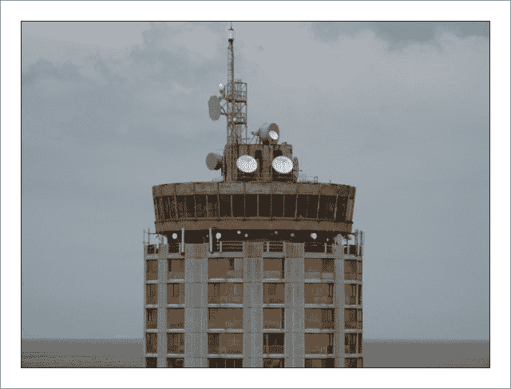

<!--yml
category: 未分类
date: 2024-05-18 14:18:41
-->

# HFT in my backyard | A short pause – Sniper In Mahwah & friends

> 来源：[https://sniperinmahwah.wordpress.com/2014/10/13/hft-in-my-backyard-a-short-pause/#0001-01-01](https://sniperinmahwah.wordpress.com/2014/10/13/hft-in-my-backyard-a-short-pause/#0001-01-01)

The Ofcom spectrum [website](http://spectruminfo.ofcom.org.uk/spectrumInfo/) being down, it’s nearly impossible to continue the “HFT in my back yard” series seriously. I have most of the data needed to finish Part IV, but I don’t want to write an incomplete account of Latent Networks – on which I just found the last “smart move”. What’s more, I discovered a new microwaves network here in my backyard. In fact, it’s an old one – to be honest, he never existed but the story if verrrrrrry interesting (in the end, I think I could write a little book about all this stuff). I still have to review some US legal documents (this if my new gig) and have to check if I can report publicly what I have found – I already entered a private property by visiting the Jump tower in Houtem, some FBI and US Defense people came to read my blog, so I don’t want do make things worse for myself – jail is not cool I think. Last but not least,  I have to finish a 4,000 words article for a French academic [journal](http://terrain.revues.org/2644) of anthropology about my first hypothesis regarding the “nature of market microstructure”, and I’m quite late (very late, in fact). So I’ll post Part IV early next week, hoping that the Ofcom website will be available again in the next few days.

An interesting tower I’ll talk about in Part IV