<!--yml
category: 未分类
date: 2024-05-18 14:19:44
-->

# HFT in my backyard – II – Sniper In Mahwah & friends

> 来源：[https://sniperinmahwah.wordpress.com/2014/09/25/hft-in-my-backyard-ii/#0001-01-01](https://sniperinmahwah.wordpress.com/2014/09/25/hft-in-my-backyard-ii/#0001-01-01)

This is insane: more than 28,000 visitors came to read [Part I](https://sniperinmahwah.wordpress.com/2014/09/25/hft-in-my-backyard-i/) of “HFT in my backyard”. Some of them are inevitably bots, but my logs reveal the majority to be human readers from bank desks, technology providers and so forth. Who would have imagined a simple [map](http://www.theatre-operations.com/HFT_EU_09.22.2014.kmz) would garner such interest? Microwaves have been used for HFT since 2010 after all. Since so many readers want to learn about these networks, allow me now to continue my story. In order to give you a clear picture of what to find on the map and how to locate all these towers, let’s return to Houtem.

###### 

###### FROM FRANKFURT TO LONDON… AND CHICAGO

In the US, the New York Stock Exchange (NYSE) is currently located in Mahwah, in New Jersey. For the Lenape people who originally lived there, the word mahwah meant “Place Where Paths Meet” – a perfect description of a present day exchange. At NYSE, co-located traders meet in a data center, and microwave paths converge on the roof. In Europe, there are two main data centers in England near London: one to the east in Basildon, the NYSE facility housing the Euronext/Liffe exchanges plus Goldman Sachs’s dark pool Sigma-X; and one to the west in Slough, the LD4 data center containing the BATS exchanges. Frankfurt, Germany is home to the Equinix FR2 data center which hosts Deutsche Börse and Eurex.

[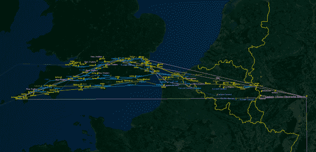](https://sniperinmahwah.wordpress.com/wp-content/uploads/2014/08/capture-d_c3a9cran-2014-09-22-c3a0-08-56-09.png)

There are two types of competitors in the very small world of microwaves. First are HFT prop trading firms: Chicago-based [Jump Trading](http://www.jumptrading.com) (aka World Class Wireless), Dutch companies [Optiver](http://www.optiver.com) and [Flow Traders](http://www.flowtraders.com) (aka Global Connect) and  [DRW](http://drw.com) (aka Vigilant Global). Some of these firms sell part of their bandwidth to other customers. Second are actual providers: [McKay Brothers](http://www.mckay-brothers.com), [Custom Connect](http://custom-connect.net) and, more recently in EU, NeXXCom or Latent Networks. Their customers are banks, hedge funds, even other HFT firms. Some like McKay are only interested in the Frankfurt-London path, while others such as Optiver, Flow Traders, Jump and Vigilant also join the  [Atlantic Crossing 1](http://en.wikipedia.org/wiki/Atlantic_Crossing_1) cable landing station in Whitesand Band, Cornwall, England, to allow data to cross over the Atlantic and go straight to Chicago using US microwave networks. Let’s start with Jump Trading.

###### AN EPIC AUCTION SALE

Contrary to the legend, the Houtem tower featured by [Bloomberg](http://www.bloomberg.com/news/print/2014-07-15/wall-street-grabs-nato-towers-in-traders-speed-of-light-quest.html) was neither used nor owned by NATO; rather the tower was built by and for the US Army in the 1970s. The tower (and two others located in Belgium, one of which is also now used by Jump) was [sold](http://www.defense.gov/Releases/Release.aspx?ReleaseID=9245) to Belgium in 2006\. “The Department of Defense announces today the decision to inactivate and return three microwave radio relay sites to Belgium. (…) Closure of these sites will result in an estimated annual savings of over $84,000 based on a comparison of the current annual operations and maintenance costs to an annual replacement commercial communications cost,” wrote the US Department of Defense. In 2012, the Belgium Ministry of Finance used the same money-saving rationale to auction the tower.

The [sale](http://www.servicespatrimoniaux.be/interfpatrnl/Green/Immeubles/Brugge/BruggeVeurneReiger/BruggeVeurneReiger.html) took place in Veurne on December 18, 2012\. While the auctioneer is now retired and my request for his phone number was refused by the Services Patrimoniaux office, I did speak with someone who attended the auction. Only eight people attended: the auctioneer, his assistant, a government official, and five potential buyers – two or three Americans including a Jump representative, one large Belgian law firm probably acting on behalf of a competitor and a single observer. Prior, the prospective buyers had all visited the Houtem tower in situ so they entered the auction knowing the tower was in poor shape and required renovations my informant estimated would cost the winner $1,000,000\. The starting price was €255,000 and the Belgium government would have been very happy with €400,000\. The first tick-size was a €5,000 increment, but after half an hour the price was at €700,000 and the tick-size was increased to €10,000 accordingly.

The auctioneer didn’t know who the buyers really were or why they’d have such interest in a lousy old tower; this unexpectedly high price left him perspiring nervously and calling for a break. Collecting himself in the bathroom, he exhaled quietly, bewildered, “What the hell…” The auction resumed, bids climbing to €1,000,000, €1,500,000, €2,000,000\. At this point the auctioneer asked for another pause. Finally, after three and a half hours, the tower was sold for €5,000,000\. One attendee quickly left, as his car was parked in front of a police station and the meter was long expired. Another losing bidder approached Jump to ask, “Can’t we arrange?” meaning their company would purchase bandwidth or rent some dish space on Houtem tower. I wish I had been a fly on the wall to confirm my suspicions about which competitor attempted to make arrangements with Jump at the auction deep in Flanders that day.

###### A CRAZY VISIT TO THE HOUTEM TOWER

[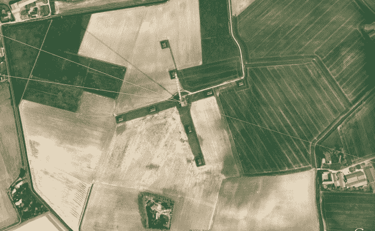](https://sniperinmahwah.wordpress.com/wp-content/uploads/2014/09/jump-houtem.jpg)

Since I missed the tower over my early July holiday, I decided to go back to Houtem with my family at the beginning of September. I spoke with different people from the microwaves industry ranging from Jump’s competitors to technology providers, and they explained how I might conduct my field work. I learned to be discreet, parking my car far from a tower, taking binoculars and a camera, checking the GPS of my mobile and then walking – one is obliged to walk far, as most of the towers are in potato fields. Several expeditions to different towers gave me the practice to perfect my technique before I was confident to approach the object of my visit. At Houtem, I parked near a farm and walked along the Chemin des Limites road near the Belgium-France border. Nearing the site, I noted a van and a workman in the tower’s basement. “Not good news,” I told myself, thinking an intelligence officer should always remain unseen. I began to surreptitiously photograph the Houtem tower:

[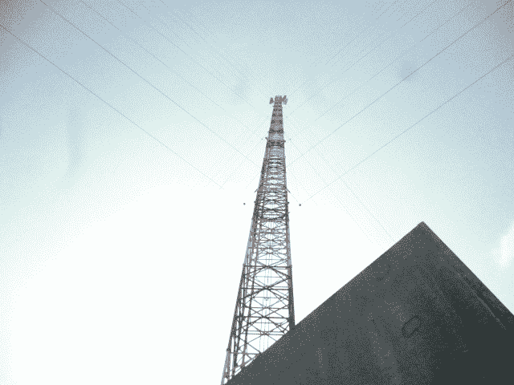](https://sniperinmahwah.wordpress.com/wp-content/uploads/2014/09/p1010381.jpg)

[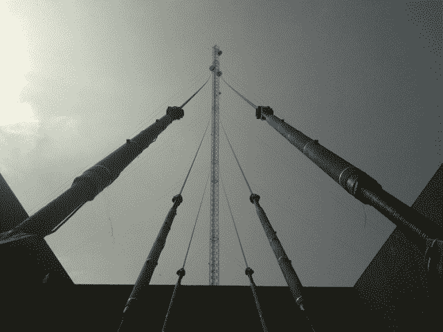](https://sniperinmahwah.wordpress.com/wp-content/uploads/2014/09/20140904_151812-1.jpg)

When the worker came to burn things in the field, I moved closer:

[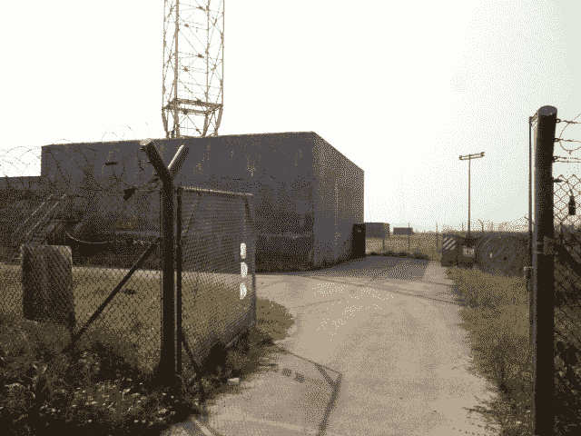](https://sniperinmahwah.wordpress.com/wp-content/uploads/2014/09/p1010379.jpg)

There was none “No Trespassing” sign on the railing so of course I entered only to discover an unexpected windfall – the workman left all the doors open! My 63 year old mum stood guard, eyeing down the worker as I visited each room, taking pictures of the equipment until there, right in front of me, was a big red button functioning as the emergency stop. It was amazing to realize I could have cut the Jump microwaves network just by pushing it. But I didn’t want to bother Jump nor Perseus’s customers, and besides, microwave networks have fiber optics backup so any sabotage would have been useless. A message to the jump lawyers: don’t sue me. I know I was on “private property” so I won’t publish the photographs I took, save this one:

It’s fascinating to see the extremely small basement of a 243 meter tower. These kind of towers are engineering marvels. Here the diameter of the foundation is only 25 centimeters and the structure stands erect only thanks to 48 guy wires. Okay, I have to publish one more photo, as the viewpoint is amazing:

[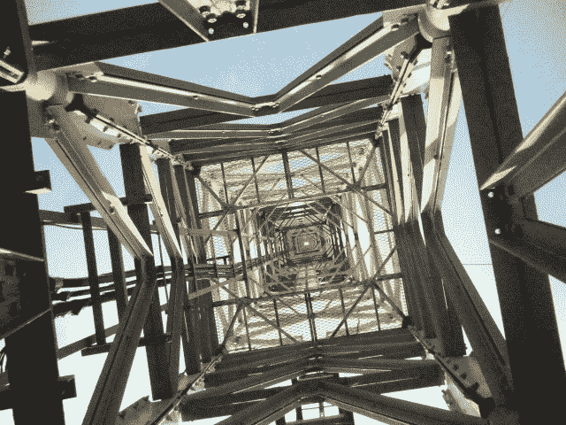](https://sniperinmahwah.wordpress.com/wp-content/uploads/2014/09/p1010386.jpg)

I was actually more interested in trying to jump and climb the tower than cutting the power, but the worker came back so I disappeared quietly.

The tower has been fully refurbished from top to bottom with all new guy wires, but my goal was to check the dishes. When the Bloomberg story came out, there were two dishes at the top of the tower:

[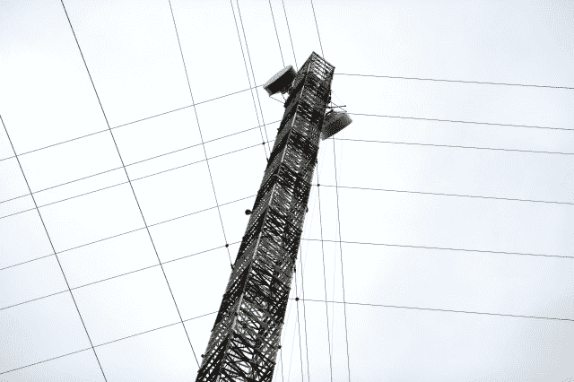](https://sniperinmahwah.wordpress.com/wp-content/uploads/2014/09/in8nuv2cznua.jpg)

© Bloomberg

My photograph shows three dishes, so Jump added one between early July and early September:

[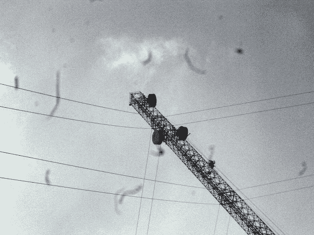](https://sniperinmahwah.wordpress.com/wp-content/uploads/2014/09/p1010377.jpg)

This brings me to the question that so flummoxed the auctioneer: why? Why would Jump pay so much for the Houtem tower? The first reason is height; HFT players need tall towers for speed, and the Houtem tower is the fourth tallest tower in Belgium. The list below expands [Wikipedia](http://en.wikipedia.org/wiki/List_of_tallest_structures_in_Belgium)‘s list of the highest structures in Belgium to include my HFT firm entries:

Since the Houtem tower was owned by the US army between 1974 and 2006, I dug up this [document](http://permanent.access.gpo.gov/gpo29426/79-30_ocr.pdf) published by the US Department of Commerce in 1979 and titled “Signal Level Distributions and Fade Event Analyses for a 5 GHz Microwave Link Across the English Channel”. The article contains these two charts:

[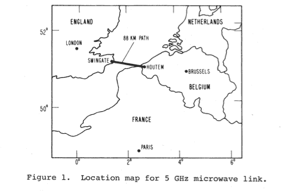](https://sniperinmahwah.wordpress.com/wp-content/uploads/2014/09/capture-d_c3a9cran-2014-09-25-c3a0-11-36-47.png)

(Incidentally, Jump uses a frequency between 7.448400 and 7.48401 GHz for this 87.8 kilometer path..)

[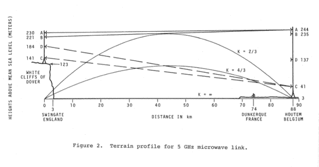](https://sniperinmahwah.wordpress.com/wp-content/uploads/2014/09/capture-d_c3a9cran-2014-09-25-c3a0-11-37-28.png)

All the HFT competitors have to cross the English Channel from France or Belgium to England. They mainly go to Swingate in the north of Dover, where there are two old towers housing Optiver, McKay and Vigilant, or to Hougham in the south of Dover where Latent and Custom Connect have dishes:

The Swingate towers are located on the famed white cliffs of Dover, at about 141 meters above sea level. However, most HFT competitors link to Swingate from Dunkirk, a city which is at sea level elevation:

In Dunkirk, dishes have been installed on the Tour du Reuze:

[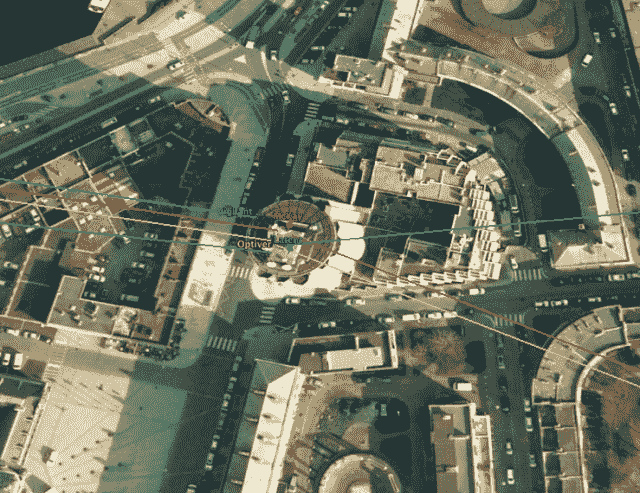](https://sniperinmahwah.wordpress.com/wp-content/uploads/2014/09/capture-d_c3a9cran-2014-09-25-c3a0-12-05-57.png)

For the logic, let’s go back to amend the US Department of Commerce chart:

Without getting too deep into the physics, microwaves don’t travel in straight lines. Depending on atmospheric conditions they bend more or less and mostly downward. This generally extends the reach of towers beyond the straightforward result that [Euclidian geometry](http://en.wikipedia.org/wiki/Horizon) would yield. Jump’s tower provides only a very limited advantage because the extra distance is proportional to the square root of its height whereas it’s price is more than linear in height. I have not found anyone who has understood why Jump paid such a large price.

I don’t know if Jump was in Dunkirk before purchasing the tower, or if they used another tower in Calais (Mollien, 50°57’23.31″N | 1°52’19.86″E) to link to Swingate. I do know that their current microwave route in Belgium is divided in two parts from Houtem: the Houtem-Swingate path enabling a way to Slough west of London, and the Houtem-Ramsgate path allowing access to Basildon east of London.

###### THE WAVRE TOWER

Jump uses other towers in Belgium as well. There is a distinct lack of transparency in Belgium radio regulators, but I have found [dossier](http://cadastreantenne.issep.be/Dossiers8/5214/RP1-RAP-12-01777-BEP.pdf) after [dossier](http://cadastreantenne.issep.be/Dossiers8/5217/RP1-RAP-12-01787-AMJ.pdf) after [dossier](http://cadastreantenne.issep.be/Dossiers8/5216/RP1-RAP-12-01781-BEP.pdf) after [dossier](http://cadastreantenne.issep.be/Dossiers8/5215/RP1-RAP-13-00833-BEP.pdf) allowing me to piece together some paths:

In Flobecq, another old US army tower, they co-locate with Flow Traders and Optiver:

[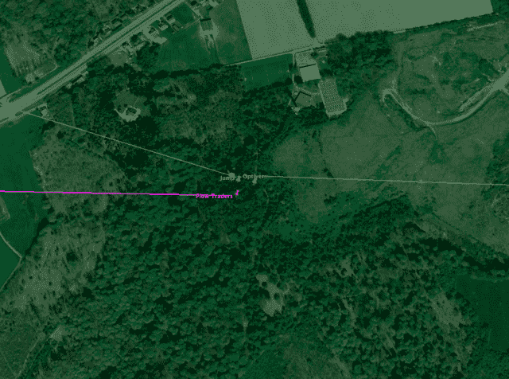](https://sniperinmahwah.wordpress.com/wp-content/uploads/2014/09/capture-d_c3a9cran-2014-09-25-c3a0-12-27-36.png)

In Hannut, they co-locate only with Optiver. Comparing [this](http://cadastreantenne.issep.be/Dossiers8/5216/RP1-RAP-12-01781-BEP.pdf) [two](http://cadastreantenne.issep.be/Dossiers8/5216/RP1-RAP-13-00827-BEP.pdf) documents reveals Jump added a third dish in Hannut between February 2012 and February 2013, perhaps after they bought the Houtem tower. In Liège, Jump is alone on a tower but Vigilant and McKay are within 1.07 kilometers:

I only visited one other tower housing Jump, in Wavre near Brussels. The Wavre tower is the third tallest structure in Belgium. Once again, I parked my car from the tower and walked through the fields. Some techs were working at the top of the 250 meter tower, but they looked tiny from my vantage point on the ground. Unlike the Houtem tower, which needs guy wires to remain erect, the Wavre tower is a beautiful “standing structure”:

[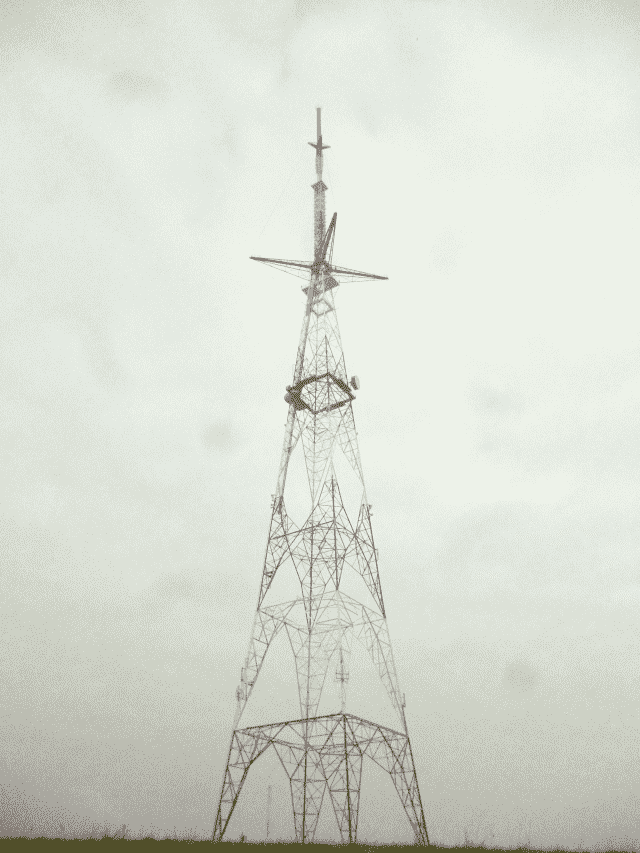](https://sniperinmahwah.wordpress.com/wp-content/uploads/2014/09/p1010361.jpg)

Wavre is also used by practitioners of the extreme sport “base jumping”. [Here](http://fr.wikipedia.org/wiki/Base_jump) you can see two crazy people jumping from the tower – hope they didn’t damage the Jump dishes during their fall:

[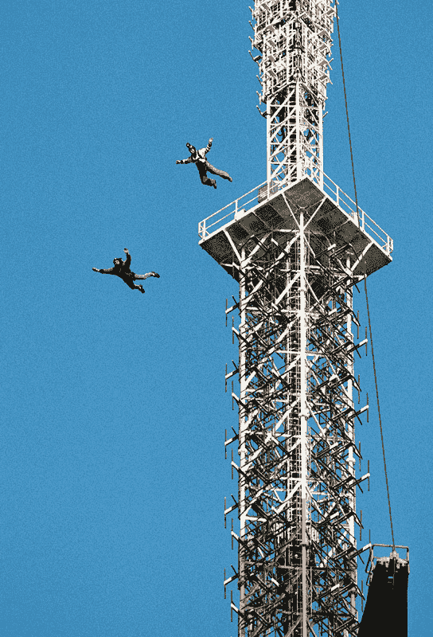](https://sniperinmahwah.wordpress.com/wp-content/uploads/2014/09/03wavre006b.jpg)

My reason for trekking to the Wavre tower was that it made big news in Belgium when it was sabotaged last spring. On the early morning of May 24, 2014, a few people started a fire which caused severe damage to the tower – this [video](http://www.rtbf.be/video/detail_pylone-rtbf-de-wavre-incendie-vers-quelles-solutions?id=1930036) coverage in French actually shows Jump dishes in a shot. The tower is property of the Belgium national TV/radio operator RTBF but also supports many dishes used by mobile operators. The fire received such media attention because May 24 was an important election day in Belgium, and the police wondered whether the fire was related to the election. RTBF quickly erected a temporary tower to install mobile, TV and radio dishes, but the Jump dishes stayed on the tall tower because the 50 meter temporary one wasn’t high enough.

[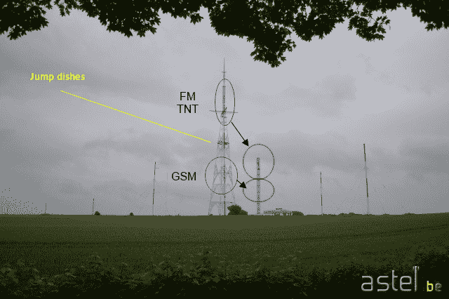](https://sniperinmahwah.wordpress.com/wp-content/uploads/2014/09/5167.jpg)

During my visit to the Wavre tower, there were still some burnt parts on the ground:

[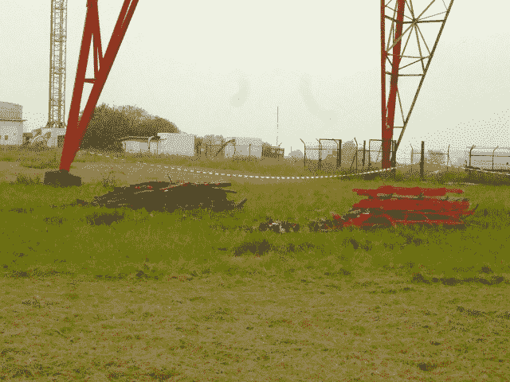](https://sniperinmahwah.wordpress.com/wp-content/uploads/2014/09/p1010336.jpg)

It is certain that all the cables burned, rendering the Jump network ineffective for some time. I wonder if police interrogated any of Jump’s competitors, or anyone who knew a trading firm was on the Wavre tower. As of early September all the cables were knew so the Jump network is likely in good shape. Following are the three big dishes owned by Jump, two pointing to Hannut and the other facing toward Flobecq or Oostvleteren:

######  HEIGHT AND SPEEED

I would love to know if Jump, Optiver and, above all, Vigilant really use these paths between Newhaven and the Isle of Wight:

The Jump competitor who asked, “Can we arrange?” at the auction for the Houtem tower may not have been asking to install dishes on the tower; rather his proposal might have been to share bandwidth. Despite the small world of financial microwave networks being as silent as the potato fields in which stand their towers, I have discovered that Jump is sharing its network with [Perseus](http://perseustelecom.com/perseus-to-address-trading-and-microwave-technology-at-hifreq-trade-2013/) and another data provider I’m not at liberty to name. The facts are as follows:

*   A microwave link can split bandwidth up into 10Mbps increments.
*   The microwave link has an aggregate of 100Mbps. Every 64 byte packet send over these links takes 6 microseconds and change to serialize.
*   Each participant sends 64 byte frames of trade data to the service.
*   At 10Mbps clients can only send 1 packet every 60 or so microseconds.

Now, imagine every customer in a service sends data at about the same time, a somewhat likely scenario due to the likelihood of one customer sending data nano or microseconds before the next customer and so on. In this thought experiment, Customer 1 is first, taking 6 microseconds to serialize into the 100Mbps microwave link. Customer 2 sends their trade data 2 microseconds later, so they wait 4 microseconds to serialize and another 6 to actually serialize. Customer 3 sends trade data 1 microsecond after Customer 2, waiting 3 microseconds for Customer 1, then 6 microseconds for Customer 2, then 6 more microseconds to actually serialize. Customer 4 is quicker; they send their data 1 nanosecond after Customer 3\. And wait 2.999 microseconds for Customer 1, then another 6 for Customer 2, then another for Customer 3, then another 6 microseconds to actually serialize.

This example illustrates the supremacy of the owner of network in terms of speed in a shared bandwidth agreement. Jump shares its bandwidth with Perseus. While Perseus has additional customers, none will be as fast as Jump. This doesn’t mean Jump is the fastest operator in the HFT world, however. Despite purchasing a tall tower in a strategic place, they still aren’t as quick as contenders like….well, I’ll detail the fastest of the HFT competitors in Part III.

© Bloomberg

###### OUTRO

Thank you Katie.