<!--yml
category: 未分类
date: 2024-05-18 14:19:06
-->

# HFT in my backyard – III – Sniper In Mahwah & friends

> 来源：[https://sniperinmahwah.wordpress.com/2014/10/02/hft-in-my-backyard-iii/#0001-01-01](https://sniperinmahwah.wordpress.com/2014/10/02/hft-in-my-backyard-iii/#0001-01-01)

###### INTRO

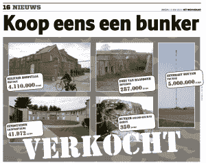

Last Friday evening, I received a tip via telephone, “*You should go to the Houtem tower tomorrow morning. Jump may work on the network*.” Unfortunately I couldn’t make it back to Houtem. But it would’ve been amazing to see contractors adding or realigning dishes, or working on equipment. Who knows what they got up to on Saturday! While it [appears](http://www.janverfaillie.be/Pers/2013-06-11_HetNieuwsblad.pdf) the €5,000,000 Houtem tower was the best deal the Belgium government made in 2013, the question of whether the purchase was a good deal for Jump still remains. The military [history](https://www.wikileaks.org/plusd/cables/1973BRUSSE01930_b.html) of these towers prior to their use for HFT is fascinating.

To learn more about Houtem tower, take a look at [these photos](https://www.facebook.com/media/set/?set=a.718402394868445.1073741843.234984306543592&type=1), check out [this Google Group](https://groups.google.com/forum/#!topic/be.radio/vCyR0XGTOQA), and [read an account](http://www.ramstein.af.mil/news/story.asp?id=123109403) of the removal of all equipment, antennas and associated hardware by the 1st Communications Maintenance Squadron: *“The site in Houtem Veurne, Belgium, has a 799 foot tall communications tower. Not only did Airmen have to climb this enormous tower, but if the support lines gave way and it fell in the right direction, a portion of the tower would have landed in France. While many of the technicians won’t miss the painstaking climb to the top of that tower, most are sad to see it go since it was such a challenge*”. A “[Cable and Antenna Maintenance Craftsman](https://www.linkedin.com/profile/view?id=283424761&authType=NAME_SEARCH&authToken=IyDW&locale=en_US&srchid=761093101411906956974&srchindex=1&srchtotal=1&trk=vsrp_people_res_name&trkInfo=VSRPsearchId%3A761093101411906956974%2CVSRPtargetId%3A283424761%2CVSRPcmpt%3Aprimary)” who worked for the United States Air Force based in Ramstein, Germany, inadvertently reveals in his LinkedIn profile that long before HFT, Houtem tower was all about high frequency: “* Team project lead of microwave antenna shroud replacement at the 800ft level, Houtem, Belgium radio relay site”* and “*[I] installed and maintained microwave, Ultra High Frequency, Very High Frequency, and High Frequency antenna systems, cabling, connectors and their structures.*” The “[U.S. Air Force Wire and Cable Dawgs” Facebook page](https://www.facebook.com/81545200950/photos/a.127454680950.115565.81545200950/10152148558085951/?type=1) also includes anecdotes and the only photograph I found which was taken from the top of the tower:

From the HFT microwaves industry I have also heard many stories. Two competitors visiting the same tower at the same time studiously avoided eye contact. A contractor working for various competitors complained about “*all of these American guys asking for high towers… they just don’t exist!*” Of course, some exist and are now used by high-frequency traders. There is this anecdote about Jump: “*They were at a structure in Belgium waiting on an authority who controls this structure to give them permission. It was taking awhile. So they put a tower on wheels at the site. That pissed some people off. But then the tower was moving a lot. So they started pouring concrete around the base of the vehicle. The police were called out and there were forced to stop*.” I don’t know if it’s true, but it’s fun – *se non è vero è bene trovato*. I was also told about a contractor who was supposed to install a dish for a firm on a tower already home to another HFT firm’s dishes. The workers made a mistake and pointed the new dish toward a tower used by a competitor!

Most invaluable to researching these microwave networks was the book *[The Death of a Pirate. British Radio and the Making of the Information Age](http://www.adrianjohns.com/death/)* (available in French [here)](http://www.zones-sensibles.org/livres/adrian-johns-la-mort-dun-pirate/) by one of the greatest historians I know, [Adrian Johns.](http://home.uchicago.edu/~/johns/) This must-read tome focuses mainly on the famous UK pirate radios located on boats in the 1960s, but also cover the radios installed on the incredible [Shivering Sands Army Forts](http://en.wikipedia.org/wiki/Shivering_Sands_Army_Fort), which were part of the [Maunsell army Forts](http://en.wikipedia.org/wiki/Maunsell_Forts#Maunsell_army_forts) used for anti-aircraft defence during WWII. Thanks to these standing structures, the dishes were both more stable and *taller* than those on boats. By squatting in the old forts, broadcasters including Screaming Lord Sutch’s Radio City could use their height to reach more listeners and thus more revenue via advertising. It was all about height.

 Here are the precise [locations](http://www.benvenutiasealand.it/mappa-dei-forti/) of the Shivering Sands and Red Sands forts:

[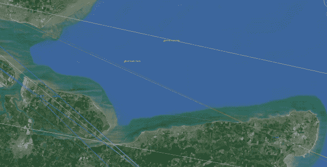](https://sniperinmahwah.wordpress.com/wp-content/uploads/2014/09/capture-d_c3a9cran-2014-09-30-c3a0-11-09-22.png) See how the Shivering Sands forts are exactly on the straight line between NYSE’s facility in Basildon and Frankfurt’s Deutsche Börse. Optiver and McKay Brothers may each have a path very close to Red Sands as well (but I’m doubtful). I wonder if any HFT players thought to use these old forts. It would be amazing to replace the old pirate radio dishes with the big [Andrew dishes](http://planning.cornwall.gov.uk:8181/rpp/index.asp?caseref=PA13/00320) Jump Trading favors. Torrent provider [The Pirate Bay](http://thepiratebay.se) has already tried to install servers on another fort further north, the famous  [Principality of Sealand](http://en.wikipedia.org/wiki/Principality_of_Sealand) to convert it to a “[data haven](http://en.wikipedia.org/wiki/Data_haven)”).

The most interesting discussion in* The Death of a Pirate, *however, is the history of the first radio pirates. They were not pop broadcasters earning cash using waves in international waters, but rather people who fiddled with the British Broadcasting Corporation (BBC) receivers to listen to non-BBC programmes like Radio Normandy. Waves are fruits of nature, to me a common good. When the first pirates emerged, states quickly monopolized these fruits and then were obliged to sort them. The International Telecommunication Union (ITU), originally founded in 1865 as the International Telegraph Convention, was charged with allocating waves.In the present, high-frequency traders have to pay state regulators for permission to use microwaves. If a firm wants to cross the channel from France to England, it has to ask state regulators for frequencies. Since most frequencies in the area were already booked or squatted, crossing the channel wasn’t an easy task – one competitor had some difficulties to cross the Channel. HFT is hard, and pirates may not be dead.

###### CUSTOM CONNECT

According to [Bloomberg](http://www.bloomberg.com/news/print/2014-07-15/wall-street-grabs-nato-towers-in-traders-speed-of-light-quest.html), “‘*Custom Connect’s network was the first microwave link connecting the main financial centers in Europe that multiple trading firms could pay to use *[…] *About 25 companies use Custom Connect’s network, including trading units at investment banks and high-frequency trading houses,’* *said CC co-owner Jan Willem Meijer.* ‘*The network, which cost about 5 million euros ($6.8 million) to build, relies on 13 towers across Europe’”*. Jump purchased a single tower at Houtem for the price of a whole network. My investigation of Custom Connect (CC) commenced in early July. I was visiting the CC website and at one point a chat window popped up and someone asked if he could help me. It was Jan Willem Meijer. When I told him I want to know where the CC towers are, he answered, “*I can’t share. Confidential*”. What a pity. On the CC website, however, there’s an  [article from *De Volkstrand*](http://custom-connect.net/assets/misc/press-releases/De_Volkskrant_Custom%20Connect.pdf) (English version [here](http://custom-connect.net/news/de-volkskrant)), containing a map.

[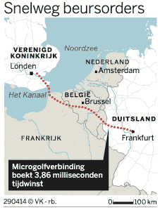](https://sniperinmahwah.wordpress.com/wp-content/uploads/2014/09/capture-d_c3a9cran-2014-09-28-c3a0-13-10-17.png)

© De Volkskrant | April 30, 2014

While not a truly accurate map, it’s interesting. Belgium is the least transparent country regarding data, but I was able to use various [dossiers](http://cadastreantenne.issep.be/Dossiers8/5415/RP1-RAP-13-00204-BEP.pdf) to find some towers housing CC dishes. Others I located thanks to [Cartoradio](http://www.cartoradio.fr/cartoradio/web/), the official map of the French Agence National des Fréquences (ANFR), one of the French state regulators with Arcep. If you click on the right tower, the names “Custom Connect”, “Global Connect”, “Latent Networks”, etc., will appear and there you have all the details about the dishes. [Azimuths](http://www.google.com/url?q=http%3A%2F%2Fen.wikipedia.org%2Fwiki%2FAzimuth&sa=D&sntz=1&usg=AFQjCNGUg3XIJUewlVcevIl1cD4TKgBMBQ) are of particular interest, as they tell us where the signal goes. This allowed me to draw my first paths on Google Earth:

Comparing the map from the *Volkstrand* article with mine revealed a problem with the Genappe tower (depicted as a white rectangle in the image above). Custom Connect [should have two dishes](http://cadastreantenne.issep.be/Dossiers8/5415/RP1-RAP-13-00204-BEP.pdf) on this tower, but the tower is north of the paths I drew. I have no data to link this tower to another, so my bet is on CC setting up a new network using the Genappe tower to replace the one in the south of Belgium. This is an educated guess, of course, but it is within the realm of possibility. Now let’s take a look at how the CC network crosses the channel:

Custom Connect has dishes on a 107.2 meter guyed tower at Mont Lambert, near Boulogne-sur-mer (where Vigilant also likely have dishes), and the [Cartoradio](http://www.cartoradio.fr/cartoradio/web/) data tells us the two dishes have a 327.2 degree azimuth. This means the CC signal goes to another guyed tower to the south of Dover. CC also has dishes in Wrotham and Dunkirk, England, but reviewing my papers before writing this post, something disturbing jumped out at me.

When I started my map by drawing CC paths in July, I was unaware of the precious data one could find on the [Ofcom](http://www.ofcom.org.uk) website. Ofcom is the English regulator which allocates radio waves to customers such as radio and television broadcasters, mobile operators… and high-frequency traders. The Ofcom map allowed me to check where operators have asked to use frequencies, which in turn allowed me to find towers in England that may be used by these operators. One competitor gave me the tip to use Ofcom’s map to search for licenses used to cross the channel. Click [here](http://spectruminfo.ofcom.org.uk/spectrumInfo/licences?service=Fixed+Links&code=301010&freqStart=2&freqStop=24&unit=GHz&ngrloc=&offset=&nw=%2851.11731684874898%2C+1.5325927734375%29&ne=%2851.11731684874898%2C+2.5872802734375%29&se=%2850.450509053586615%2C+2.5872802734375%29&sw=%2850.450509053586615%2C+1.5325927734375%29&googloc=%2850.78510168548186%2C+2.0599365234375%29&googoffset=36.8&submit=Submit+search) for a list of the English-licensed operators using the 2-26 gigahertz range (which is used by high-frequency traders) in the north of France and Belgium:

[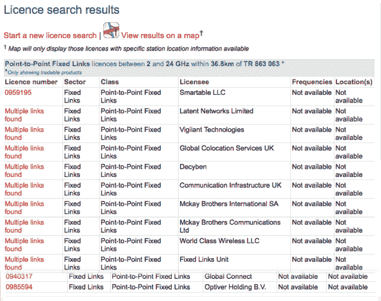](https://sniperinmahwah.wordpress.com/wp-content/uploads/2014/09/capture-d_c3a9cran-2014-09-30-c3a0-14-00-51.png)

You find Vigilant Global (aka Smartable LLC), McKay Brothers (aka Decyben), Jump Trading (aka World Class Wireless), Flow Traders (aka Global Connect), Optiver and Latent Networks but not Custom Connect, and that’s strange. I decided to compare the different data coming from the different regulators. I downloaded all the available public [data](http://www.theatre-operations.com/ANFR-59-62.zip) from the French ANFR. The files list all the towers and all the dishes used (or not) by all operators. I dug a little and realized that all (without exception) the Custom Connect dishes in France are listed with this tag: “*Dish authorized but not activated*”. Very strange.

I dug more. I realized that the [planning application](http://publicaccess2.tmbc.gov.uk/online-applications/applicationDetails.do?activeTab=documents&keyVal=N8WK4IQHA3000) for the CC dishes in Wrotham was very recent as the firm received an approval in July 2014\. But the network is said to be operational since March 2013; Wrotham being in the middle of the Dover-Slough pathway, does that mean Custom Connect didn’t have a Dover-Slough link prior to July or August 2014? That would mean CC was only providing a network between Frankfurt and Basildon. There is more: the [planning permit](http://pa.midkent.gov.uk/online-applications/applicationDetails.do?activeTab=documents&keyVal=ZZZVS1KJTA933) for the CC dishes in Dunkirk was granted in January 2014 – that’s problematic because Dunkirk is in the middle of the Dover-Basildon way, and this network is supposed to be operational since March 2013. What’s more, there is no Ofcom license with the name “Custom Connect” in Dunkirk. How they send a signal to Basildon? The most interesting is the [planning application](http://planning.dover.gov.uk/online-applications/applicationDetails.do?activeTab=documents&keyVal=DCAPR_224609) for the Dover tower:

[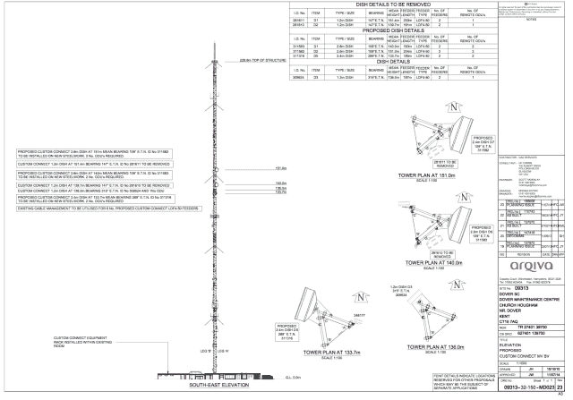](https://sniperinmahwah.wordpress.com/wp-content/uploads/2014/09/capture-d_c3a9cran-2014-09-30-c3a0-14-48-20.png)

© Dover District Council

First of all, the permit was submitted on July 25, 2014, and it’s not approved yet – files say CC wants to remove the dishes pointing to Boulogne, add a dish to go to Wrotham and keep the dish which points to Dunkirk. Secondly, the files also say two new dishes will have a 109° azimuth, so they won’t point to Boulogne but somewhere further north. Last but not least: the Ofcom [database](http://spectruminfo.ofcom.org.uk/spectrumInfo/licences?service=Fixed+Links&code=301010&freqStart=2&freqStop=24&unit=GHz&ngrloc=&offset=&nw=%2851.11301985367974%2C+1.2463688850402832%29&ne=%2851.11301985367974%2C+1.249244213104248%29&se=%2851.11121472716214%2C+1.249244213104248%29&sw=%2851.11121472716214%2C+1.2463688850402832%29&googloc=%2851.1121172992349%2C+1.2478065490722656%29&googoffset=0.1&submit=Submit+search) tells us CC has two licenses in Dover – 0996747 and 0956492\. The license number 0996747 is needed to send the signal from Dover to Wrotham, and you can locate the license 0956492 in… Basildon. All of this sounds strange. I doubt it’s possible to build a path from Dover directly up to Basildon – if it’s possible, why all the competitors need at least one more tower between Dover and Basildon? What’s more, if CC has a license for a Dover-Basildon path, what about the planning application for the Dunkirk tower? That makes no sense (I can’t go more into technical details, but those who know will understand: it’s impossible to get a license on Dunkirk using the frequency assignment CC have at Dover and Basildon as the Dunkirk tower is in the same parity as Basildon and Dover.) So the situation is:

[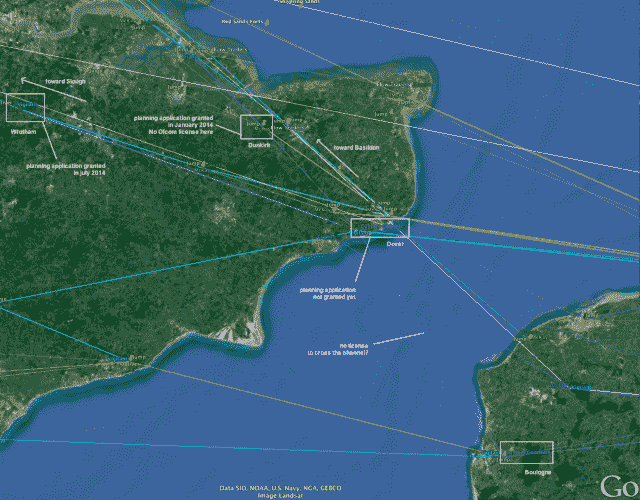](https://sniperinmahwah.wordpress.com/wp-content/uploads/2014/10/cc-avec-comments.png)

I talked with people from the microwaves industry. I have been told it would be possible to cross the channel without a license but that would have been tough – and not very legal. I also heard rumors about a competitor having installed dishes without permission on the Dunkirk tower (some say that could be Custom Connect). But rumors are rumors, and I prefer facts. Having said that, it would not be the first time a HFT player would sneakily install dishes. Once Jump installed illegal dishes on the famous Swingate tower and they humbly [apologized](http://planning.dover.gov.uk/online-applications/files/E997135014F4091378DD3AF44F29F01C/pdf/12_00732-PLANNING_STATEMENT-214045.pdf):  “*The two largest dishes proposed for World Class Wireless **were actually installed in advance of the submission of the planning applications**. Both WCW and Arqiva *[the owner of the tower]* wish to offer their sincere apologies for this oversight and no disrespect was meant towards the Council*”. LOL. Both the Dunkirk and Swingate towers were a part of the famous [Chain Home](http://en.wikipedia.org/wiki/Chain_Home) system built in 1937 (I’ll detail on Part V); they have been very important for the Royal Air Force during WWII and now they are a part of UK’s history. Installing dishes without permission on these historical monuments is a “*felony*”. These monuments are the crown jewels of the United Kingdom – be respectful, guys!

I don’t know about the illegal dishes in Dunkirk, but I know for sure CC doesn’t have radio licenses there. As for the channel, I have found all the licenses needed by the different competitors, except the Custom Connect one – perhaps they are hiding very well, using other names, etc. I visited again the Custom Connect website, hoping the chat window would open but nobody was there. But I discovered a very amazing detail. The motto of the firm seems to be a statement once made by Steve Jobs. Check the LinkedIn [profile](http://nl.linkedin.com/in/olavvandoorn) of Olav van Doorn (the other co-owner of Custom Connect). The description of the company starts with these two sentences: “*‘It’s better to be a pirate than to join the Navy’** (Steve Jobs). Nothing describes better what Custom Connect is all about*”!

What? Custom Connect runs a piracy business? No way… I thought radio pirates no longer existed! During my three-month investigation I have heard about some guys trying to pirate frequencies but these tales may by myths. I can’t believe one of the fastest state-of-the-art network in the world would pirate radio frequencies. That can’t be. But that would be amazing: the old Maunsell army Forts, built in 1937, have been used by the pirate radios in the 1960s; so I would not be surprised to find pirates in Dunkirk and Swingate, as the tower was built in 1937 too, for the same military purpose. There is much mystery about Custom Connect – data is probably missing – but what cannot be disputed is the fact Jump Trading once installed illegal dishes on the Swingate tower. Pirates are not dead.

###### OPTIVER

I didn’t know who I would find when I was drawing my first paths on the map. I was pretty sure to meet McKay Brothers (I knew they were working on a network) but first I met firms I had never heard of before. One is Communication Infrastructure Ldt. It’s probably a network provider *à la* Custom Connect, not a prop trading firm. I have found them everywhere, from Cornwall to France. One of the anonymous e-mails I have received when investigating (yeah, I received anonymous emails!) said: “*Communications Infrastructure is a shell with no customers and only licenses to sell to a sucker like…*” – stop. Wait a minute. I won’t publish the name of the “*sucker*” yet, as the firm will be a guest star of Part IV. But I confirm: Communication Infrastructure asked for a lot of licenses in England but I have found no planning application. I even doubt they have installed dishes (in France, some of them are “*not activated*”.) [UPDATE, 10/06/2014: they have at least one planning application granted, [here](http://pa.midkent.gov.uk/online-applications/applicationDetails.do?activeTab=documents&keyVal=ZZZVS3KJTA534) | sorry for the mistake]. An empty shell for now?

I also got to know [NexxCom,](http://www.nexxcomwireless.com) which built a microwave [network](http://www.nexxcomwireless.com/2012/02/06/high-frequency-trading-nexxcom-wireless-claims-major-speed-advantage/) between New Jersey and Chicago. I discovered them in Cornwall, at the very end of the microwaves paths. There are two kind of competitors in Europe: some are only interested by linking London and Frankfurt (Custom Connect, McKay Brothers); others decided to spread their networks to Chicago (Vigilant, Optiver, Jump Trading, Flow Traders, Comm. Infra and NexxCom), so they have to go to South Cornwall where they can meet the [Atlantic Crossing 1](http://en.wikipedia.org/wiki/Atlantic_Crossing_1) (AC1) landing station – from there, data is sent in the US thanks to optic fibers. But in two years Cornwall will no longer be important, so I don’t really understand why NexxCom submitted a planning permit in Four Lanes last February. (I have heard NexxCom may be supported by a HFT firm but I have no name.)

[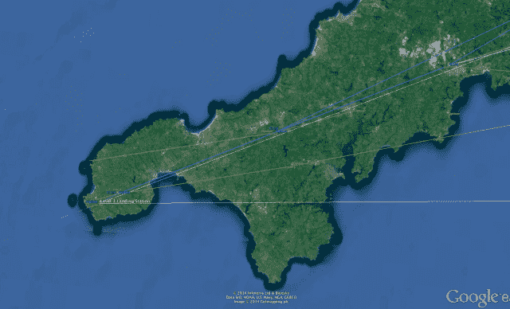](https://sniperinmahwah.wordpress.com/wp-content/uploads/2014/09/capture-d_c3a9cran-2014-09-30-c3a0-15-56-52.png)

One big competitor – far more serious than Communication Infrastructure or NexxCom – is Dutch prop firm [Optiver](http://www.optiver.com). Optiver has some elegant paths and a good reputation in the industry. Some say they may be the fastest – being the fastest is cool, but the most fundamental task is to *remain* the fastest, and that’s not easy. Optiver has two licenses to cross the channel and they co-locate with Custom Connect and McKay Brothers in Dunkirk. I visited the [Hannut](http://cadastreantenne.issep.be/Dossiers8/5639/RP1-RAP-14-00930-AMJ.pdf) tower in Belgium and shot their cabinet:

Optiver has interesting paths in Cornwall (they have offices in Chicago):

###### FLOW TRADERS

You won’t find the name “Flow Traders” (another Dutch prop [firm](http://www.flowtraders.com)) in any legal document, you’ll only read the name “Global Connect”. I had never heard of “Global Connect” before, but the postal address is Jacob Bontiusplaats 9, 1018 LL Amsterdam, where Flow Traders is located. I have nothing special to tell about Flow. Some say they were the first European firm to build a microwave network between London and Frankfurt (and they have licenses to cross the channel). Like Optiver, Flow Traders has paths until Cornwall. There is a third big Dutch firm in Amsterdam, [IMC](http://www.imc.nl/financialmarkets), but I couldn’t find evidence IMC has a microwaves network, even if in this LinkedIn [page](https://www.linkedin.com/jobs2/view/11284658) published on January 31, 2014, we learn the firm is “*seeking a technical Project Manager or Lead Engineer to improve our efforts in building out the fastest network paths used for transmitting financial market data between major financial locations around the globe*”. A new competitor may appear on my map soon.

###### VIGILANT GLOBAL

Here is [Vigilant Global](http://www.vigilantglobal.com), a Montreal-based prop trading firm. Vigilant is now a subsidiary of [DRW](http://drw.com).  One people from the industry once confessed: “*Vigilant is my best competitor.*” Another said: “*I actually admire Vigilant/DRW. They were first. They seem to be pretty class acts about it all.*” Yes, Vigilant were the first to build a network in Europe. They probably initiated their network 2011, perhaps even in 2010 (there is a funny anecdote about an old dish on the Equinix data center in Frankfurt). By working on the map I understood why some people in the industry admire Vigilant: they are really good.

Ann Brocklehurst [wrote](http://www.annrbrocklehurst.com/2013/06/vigilant-global-builds-new-wireless-network-in-europe-north-america.html) about the difficulties Vigilant encountered when they tried to install dishes in [Benfleet](http://www.echo-news.co.uk/news/10467922.Councillors_throw_out_plans_for_more_antennae_on_Benfleet_Water_Tower/), but I don’t think this was a big problem. Why Vigilant is good? First, they don’t ask for a lot of licenses before installing their dishes (Jump ask for a lot of frequencies but often they don’t use them at all, even if they have to pay the UK regulator). I think the Vigilant engineers checked all the possibilities very carefully before asking for licenses. Secondly, they have some very elegant paths. I would be very curious to know if Vigilant really built these paths from Boulogne to Cornwall:

These are long and complex paths (microwaves don’t like dampness nor fog). But their best move is probably this path:

To understand it you must have in mind that a new optic fiber cable is in progress between England and the US: the notorious [Hibernia](http://thechronicleherald.ca/business/1224651-continental-cable-connection) cable (the plan has a long and fun history I will detail in Part V). It has been said the Hibernia cable should be faster than the AC1 cable by saving six milliseconds – that’s why the title of my book is *6*. But the landing station of Hibernia (in Brean, Somerset) is far from the AC1 landing station (Whitesand Bay, Cornwall):

[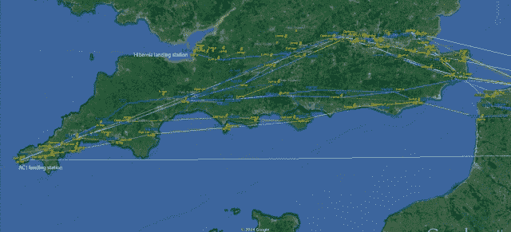](https://sniperinmahwah.wordpress.com/wp-content/uploads/2014/10/networks-before-hibernia.jpg)

The Hibernia cable is due to open in two years. If the high-frequency traders can save six milliseconds with the help of new optic fibers, they won’t use the AC1 cable anymore. That would be stupid to have these fast microwaves networks without exploiting a new faster cable. That means allllllll the paths going to Cornwall will be dead in two years. And the map will look like that:

[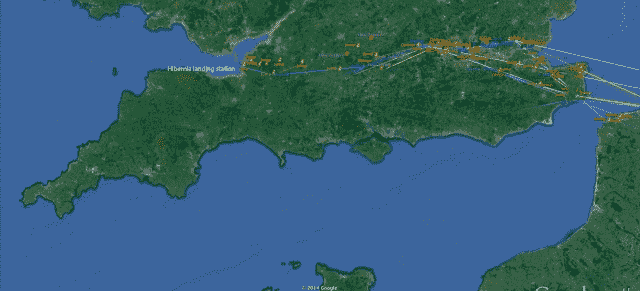](https://sniperinmahwah.wordpress.com/wp-content/uploads/2014/10/networks-after-hibernia.jpg)

So Jump Trading, Vigilant and Flow Traders already booked licenses/frequencies to build new paths between Slough and Brean (Optiver may be around too), and Vigilant has anticipated the Hibernia cable with this long and classy path:

I would love to have a chat with the Vigilant engineers who designed the paths. These people definitively have good neural networks.

###### MCKAY BROTHERS

Let’s finish with [McKay Brothers](http://www.mckay-brothers.com). Even if the first Chicago-New Jersey microwaves network was built by Alex Pilosov’s [Windy Apple Technologies](http://www.windyappletech.com), everyone thinks McKay are the fastest in the US. In this [document](http://aviatnetworks.files.wordpress.com/2013/09/a-low-latency-mw-regulations-19sep13.pdf) released by Aviat Networks (Aviat provides technology to most of – if not all – the HFT players, both in the US and in EU) you can read this: “*The McKay Brothers LLC low latency network between Chicago and New York—the world’s busiest route for low latency financial networks…*”. McKay is now a fierce competitor in Europe. Their network is [still](http://www.mckay-brothers.com/wp-content/uploads/2011/11/Map-for-web.jpg) in progress but I have found towers where they have put dishes in place. One of their best path is between Liège and Sint Pieters Leeuw (in Belgium). Here is the only Belgian document I have found with all the details about the dishes put by a private operator (I parsed more than 18,000 [documents](http://cadastreantenne.issep.be) to find it):

That’s how I could draw this 96,3 kilometers path between two of the tallest towers in Belgium:

T[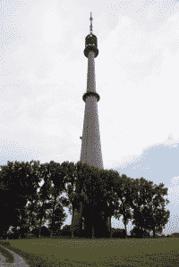](https://sniperinmahwah.wordpress.com/wp-content/uploads/2014/08/spl2.jpg)he [Sint Pieters Leeuw](http://en.wikipedia.org/wiki/Sint-Pieters-Leeuw_Tower) tower is the tallest standing structure in Belgium (300 meters). McKay having the fastest microwaves network in the US, I am not surprised to find their dishes on this tallest structure – a new “*cathedral of capitalism*”. I went to visit the building and shoot McKay’s dishes. Again, the tower is surrounded by potato fields, and right at the basement of the tower there is a small pen where a calf was quietly watching me shooting the tower. This beautiful [building](http://en.norkring.be/transmitter-park/sint-pieters-leeuw/) is owned by [Norkring](http://en.norkring.be). Norkring is a is a network provider managing 24 transmitter masts in Flanders and Brussels*. *They even offer colocation: “*On eight locations, Norkring België offers all facilities for hosting telecommunication operators, local broadcasters, emergency services, television operators, the police, or any other party that wishes to set up a wireless network. Several heights are possible for installing antennas on our transmission towers, ranging up to a level of 300 meters.*” I don’t know where are these eight towers (you can’t find this information on the Norkring website) but I have been told Vigilant could use one (or more) Norkring tower. Other HFT players may also use the [Norkring network](http://en.norkring.be/transmitter-park/all-transmision-masts-charted/).

© Norkring

But the most interesting part of the Sint Pieters Leeuw tower are these incredible stairs. I have been asked to appear in a French documentary about HFT and market microstructure, and I think the best place to shoot is there:

[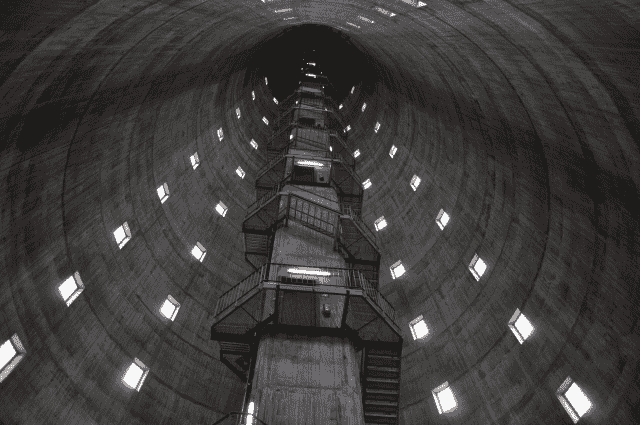](https://sniperinmahwah.wordpress.com/wp-content/uploads/2014/09/sint-pieters-leeuw-victormaloustraat36.jpg)

One last thing about McKay Brothers (and the parent company [Quincy Data](www.quincy-data.com)): they are transparent. They are the only providers to publish both [prices](http://www.quincy-data.com/wp-content/uploads/2012/04/20140903b-QED-Product-Offering.pdf) and [latencies](http://www.quincy-data.com/wp-content/uploads/2012/04/20140903b-QED-Product-Offering.pdf) “*client port to client port*”. “Client port to client port” means that latencies (*e.g.* 2.195 milliseconds between Basildon and Frankufrt, but McKay will be faster soon) are calculated for a trip between a co-located server (inside NYSE’s facility in Basildon) to another colocated server (inside Equinix data center in Frankfurt). I think they are the only ones to publish these latencies. What’s more, McKay Brothers co-CEO Stéphane Tyc advocates for more transparency in the market industry (check the last [white paper](https://sniperinmahwah.wordpress.com/2014/09/19/hft-the-missing-data/) he released two weeks ago about better execution). I think McKay Brothers goal is to “level the playing field” in the small world of microwaves networks. They are on the tallest structure in Belgium, but will they be the fastest? All bets are off.

###### OUTRO

One network is missing: Latent Networks. I had never heard of them it I found some of “their” towers. I tried to get information about them but the people behind the company did everything possible to hide. So I decided to dig. Then the first anonymous email arrived in my mailbox. Then the name of a big HFT firm from Chicago showed up – not Jump Trading. Then I started a strange relationship with a kangaroo. I’ll devote Part IV to Latent Networks. Stay tuned.