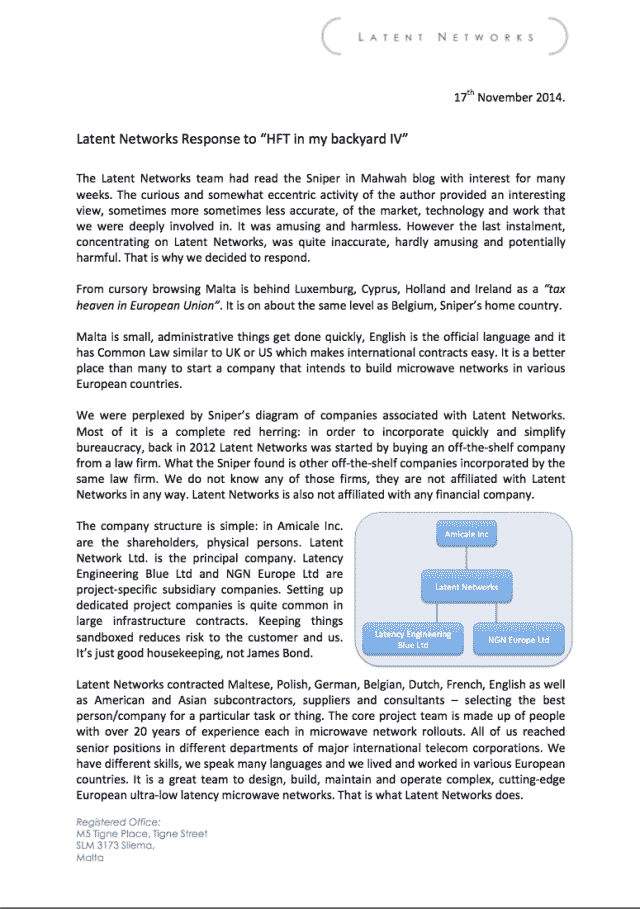
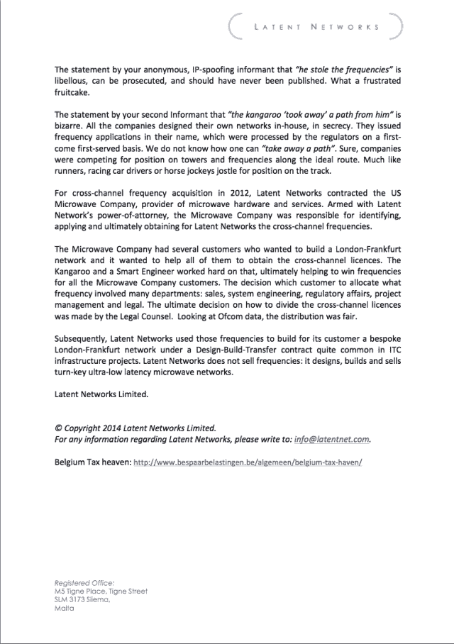

<!--yml
category: 未分类
date: 2024-05-18 14:18:28
-->

# HFT in my backyard | IV, episode 2 – Sniper In Mahwah & friends

> 来源：[https://sniperinmahwah.wordpress.com/2014/11/18/hft-in-my-backyard-iv-episode-2/#0001-01-01](https://sniperinmahwah.wordpress.com/2014/11/18/hft-in-my-backyard-iv-episode-2/#0001-01-01)

Further to [Part IV](https://sniperinmahwah.wordpress.com/2014/11/03/htf-in-my-backyard-iv) of the “HFT in my backyard” series where I tried to catch Latent Networks, I received a letter from Malta untitled “Latent Networks Response to “HFT in my backyard IV“. Latent kindly asked me to publish this answer here, and I think it’s fair to comply with the request. Some answers may lead to other questions, which may lead to other answers, etc., but I’m not good at ping pong so let’s leave it there. Here is the Latent answer (also available in [PDF](https://sniperinmahwah.wordpress.com/wp-content/uploads/2014/11/latent-networks-final.pdf)):

