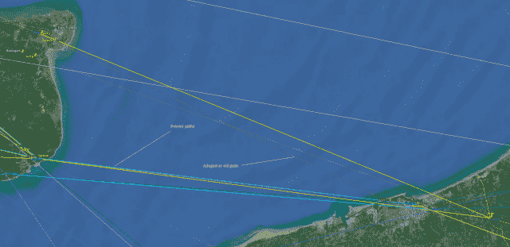
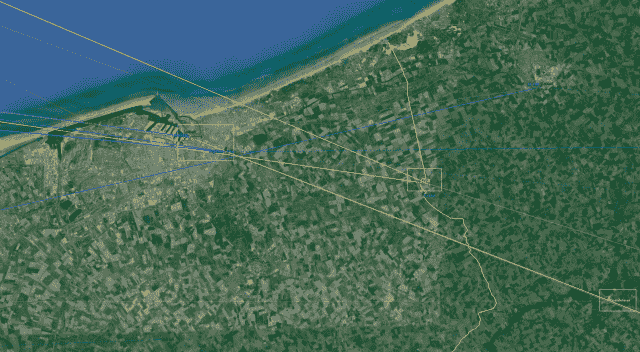

<!--yml
category: 未分类
date: 2024-05-18 14:19:54
-->

# HFT in my backyard | Interlude – Sniper In Mahwah & friends

> 来源：[https://sniperinmahwah.wordpress.com/2014/09/26/hft-in-my-backyard-interlude/#0001-01-01](https://sniperinmahwah.wordpress.com/2014/09/26/hft-in-my-backyard-interlude/#0001-01-01)

###### (LAST UPDATE: SEPT. 27, 2014, 09:05 AM)

Before posting the Part III of my story, a few words about the microwaves networks [map](http://www.theatre-operations.com/HFT_EU_09.22.2014.kmz "HFT microwaves networks in Europe") I have published in Part I. More than ~~2,475~~ ~~2,883~~ 3,010 people have download it. This is huge. I didn’t think that this map would would garner such interest. I thought a few hundreds of people from the industry would have been interested. I’ll talk in detail about the “making-of“ in Part VI, but since a lot of people are interested, I must clarify one or two points. I want like to make it clear that the map is a web of possibilities. Some paths (between two towers) are proven and used; others are possibilities, or old paths, or future paths, or tested paths. Sometimes it’s easy to find the real paths, but I talked enough with some competitors to learn that it’s virtually impossible to draw the perfect map – even if you visit *all* the towers, check the dishes, note the azimuths, etc. This is a job for an intelligence officer, not for an anthropologist. In the Google Earth file, paths have different opacities: bold paths are 100% sure – check the links, they draw you into the silent world of microwaves. Just one example:  What’s more, some microwaves networks are still in progress; and others may modify soon a path, jumping from a tower to another. Jump Trading had dishes in Belgium (in Oostvleteren) before purchasing the Houtem tower in January 2013\. So, this is a map still in progress – I improve it as soon as I get new information –, and I update the file (almost) daily. If you want to be up-to-date, check the more recent file. Last update: two hours ago. I’ll talk later about the mess regarding the data needed to draw such a map. I (and HFT competitors as well) have to deal with three national regulators (England, France, Belgium). For example, take Jump Trading, aka World Class Wireless (WCW). Like all the operators, they have to ask to the French regulator [Arcep](http://arcep.fr) for using some frequencies in France. Even if they don’t use dishes in France, they need authorizations if a path goes over France (and the Houtem-Swingate path runs over France). So you can trace WCW activities by looking for the public documents released by the regulator. Yesterday, a few microseconds after I posted the Part II, I realized a new [document](http://www.arcep.fr/uploads/tx_gsavis/14-1034.pdf) came out last week on the Arcep website, on September 16, 2014, about Jump Trading. Here are two screenshots:   I’m now quite familiar with these legal documents. It tells us that WCW is authorized to use two frequency ranges – 12,75-13,25 ghz and 17,7-19,7 ghz – between Belgium and France. That is a shame but Arcep don’t publish the annexes (where all the locations are specified) but if you are familiar with microwaves, you know that with a 12-19 ghz frequency range, theoretically you can’t do more than a 60/70-kilometer path. That’s why this document is interesting. Why Jump Trading would build a short path between France and Belgium? They have the beautiful tall tower in Houtem, so they have the perfect paths to cross the Channel an go deep in Belgium. So why they ask for new frequencies in Belgium and France? One answer would be: Jump still use some dishes in Oostvleteren, and the new authorizations are valid only for this tower. That would mean: Jump may build two different networks – and that’s not impossible. Another answer would be: they will install new dishes on the Houtem tower. Maybe, but the question remains: thanks to the Arcep document, we know the dishes will be used for a path between France and Belgium (even if some may cross the Channel with a 18-19 ghz frequency range, it’s not about England here).  One possibility would be: Jump Trading wants to reach the dishes they use in Boulogne:     

I was finishing this short post when I received a tip: Jump Trading may work on the Houtem tower tomorrow in the morning, Saturday 27 Sept., 2014. I can’t be there, but I have a message for readers who may live near Houtem: go there, and take a camera. Parti III will be online next Monday or Tuesday. Thank you for reading me.