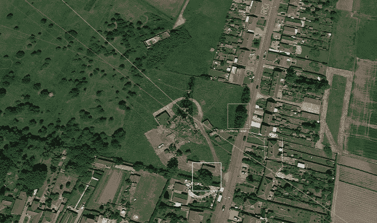

<!--yml
category: 未分类
date: 2024-05-18 14:19:15
-->

# HFT in my backyard | More on piracy – Sniper In Mahwah & friends

> 来源：[https://sniperinmahwah.wordpress.com/2014/10/06/hft-in-my-backyard-more-on-piracy/#0001-01-01](https://sniperinmahwah.wordpress.com/2014/10/06/hft-in-my-backyard-more-on-piracy/#0001-01-01)

No luck: the Ofcom [website](http://spectruminfo.ofcom.org.uk/spectrumInfo/)/database is down at the moment (they are working on the servers), and I can’t post the Part IV of “HFT in my backyard” without checking data (it’s not about towers, it’s all about how then operators can buy and re-sell frequencies). I should have take screenshots before the website was down (how stupid I am). Anyway, *if* the Ofcom updates the database, it may be possible to get some new data about the HFT microwaves operators.

###### BACK TO DUNKIRK

In the meantime, let’s return to Dunkirk (the English Dunkirk, not the French Dunkirk – the French Dunkirk will be featured in Part IV). Dunkirk is on the Dover-Basildon path:

In [Part III](https://sniperinmahwah.wordpress.com/2014/10/02/hft-in-my-backyard-iii/) I talked about the fact Custom Connect doesn’t seem to have an Ofcom license there, and about the rumors saying they may have installed illegal dishes on this tower (illegal means: without planning permit, or before the permit was granted). I decided to dig more about the planning applications concerning this tower. Sometimes the devil is in the detail. There are four HFT players on this tower (Custom Connect, Optiver, McKay Brothers and Latent Networks), and they all have submitted permits.

The [first](http://pa.midkent.gov.uk/online-applications/applicationDetails.do?activeTab=documents&keyVal=ZZZVS2KJTA178) was Optiver (submission in October 2013, authorization granted in December 2013). By checking all the documents, I found this [comment](http://pa.midkent.gov.uk/online-applications/applicationDetails.do?activeTab=documents&keyVal=ZZZVS2KJTA178) (the eighth document), made by a neighbor: “*There are already 2 Dishes installed on the Mast and have been there for awhile now so I’m presuming that this is what the application is now for!*” How interesting! Before the first HFT player arrived in Dunkirk, there were two dishes on the tower (put before October 2013). Those of Custom Connect? I don’t think Optiver would have installed their dishes before authorization, they seem to be very very careful.

The [second](http://pa.midkent.gov.uk/online-applications/applicationDetails.do?activeTab=documents&keyVal=ZZZVS2KJTA033) planning application was the McKay one (submission and authorization in November 2013) – no comments were made. The [third](http://pa.midkent.gov.uk/online-applications/applicationDetails.do?activeTab=documents&keyVal=ZZZVS1KJTA933) one was by Custom Connect (submission in December 2013, authorization granted on January 2014). The [fourth](http://pa.midkent.gov.uk/online-applications/applicationDetails.do?activeTab=documents&keyVal=ZZZVS1KJTA787) was the Latent Networks one (submission in January 2014, authorization granted in March 2014). The same neighbor who talked about the two dishes “*already* *installed*” made this comment: “*Is there a limit on the number of dishes and small buildings on this site as we have I believe we currently 4 applications some already passed. Just concerned that if there is not a plan the site will be a mess.*” This neighbor is well informed: there are four applications, all submitted by HFT players. That’s interesting because you can read the same statements in other applications, everywhere in the UK – people asking why, suddenly, some old towers are invaded by new dishes. It’s HFT, stupid! (Sorry… I don’t want to insult this lady.)

There is another comment (concerning the fourth and last application submitted by Latent): “*Dunkirk Parish Council object to this application. The Council are concerned about the number of applications regularly being received for dishes on the mast and the cumulative affect that this may have. The health and safety risks of installing such equipment is not referred to in the supporting documents. The Council are also concerned that there is no certainty to the limit of future similar applications which may be received. **The applications are each made by different telecommunication companies via different agents and there doesn’t appear to be any central control by the owner of the site as to what is installed on the mast and in the site buildings**. Despite requests in the past the owner has not provided details of the programme of work, maintenance of the mast and site, and safety certificates in place. Again, there doesn’t appear to be anyone managing these aspects at the site. Dunkirk Parish Council feel that the committee should be aware of these concerns when making their decision. Louise Blackshaw Clerk to the Council*” **Bold** is mine, as I already read the same statements in other planning applications. Sometimes authorities don’t understand who really is behind the permits. I don’t know why…

Let’s have a new look at the Custom Connect application. Words are important. Very important here, as the heading of the planning application is: “*Retrospective consent for two 1.2m microwave dishes installed at a height of 40m on the existing 110m tower, associated cabling and the installation of a small equipment cabin at ground level*”. Yes, you read correctly. “***Retrospective consent***” [means](http://www.e-m.uk.com/frequently-asked-questions-co-4): the dishes were installed before the authorization was granted. Rumors were facts: Custom Connect pirated the tower by installing their dishes prior to any authorization. Bad boys… (but we don’t know if the two dishes the neighbor talks about were the Custom Connect ones, or others).

Now read this other statement sent to the Dunkirk Parish Council in December 19, 2013\. The same neighbor who complained about the two dishes “*already installed*” also wrote: “*As we are having so many applications for dishes to be put on the mast which also entails building various cabins can it be confirmed that there is a limit on how many the mast can accommodate. Also what size are these buildings going to be ? **I would also like to add that one of the applicants has already cut down some of the trees on the Public Road opposite my property NO 26 Courtenay Road**.*” What? Someone cut down trees? It’s bad. No respect for the environment. Microwaves require line of sight from one tower to the next but we can’t really know who cut down the trees – some HFT player, or someone else? Optiver was the first firm to have authorizations to put dishes on the tower, and I doubt they cut them between December 9 (when they received authorizations) and December 19 (when the neighbor did this comment). When the trees were cut down? The neighbor thinks it’s “*one of the applicants*” and the only recent applicant names you can find on the Swale Borough Council for the Dunkirk tower are some HFT operators. But we’ll never know if the chainsaw was the one of the pirates…