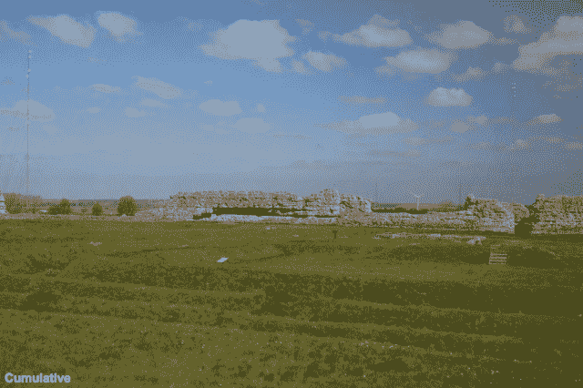
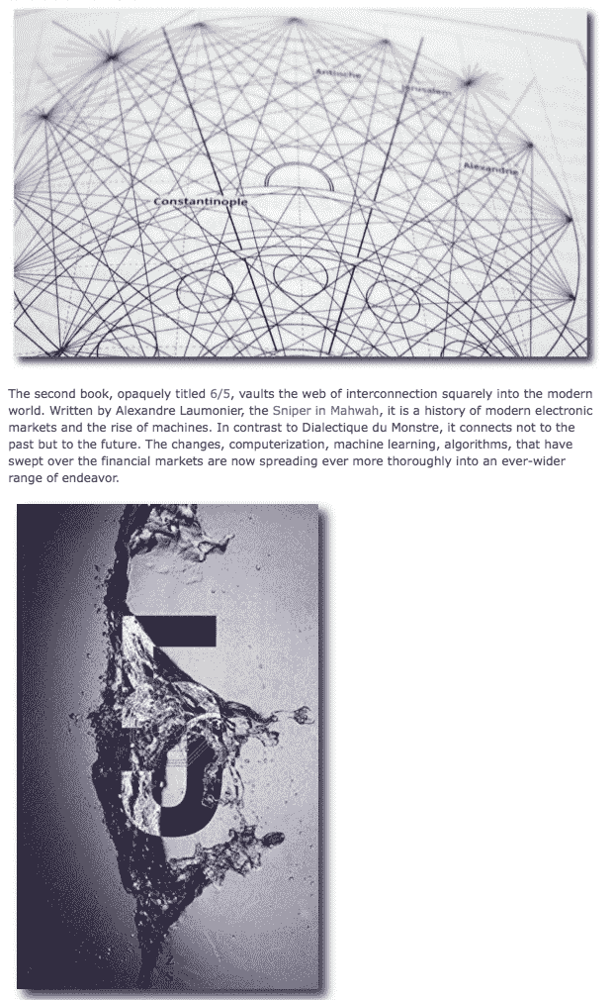

<!--yml
category: 未分类
date: 2024-05-18 14:10:04
-->

# HFT in my backyard | S02E00 – Sniper In Mahwah & friends

> 来源：[https://sniperinmahwah.wordpress.com/2016/12/23/hft-in-my-backyard-s02e00/#0001-01-01](https://sniperinmahwah.wordpress.com/2016/12/23/hft-in-my-backyard-s02e00/#0001-01-01)

#### THE INTRO

##### **Paris**

“Life is not only HFT, and it goes by even faster”. I totally agree with this statement by [@MarcosCarreira](https://twitter.com/MarcosCarreira), made in his [review](http://mcarreira.typepad.com/mc_notes/2016/12/market-microstructure-paris-2016-part-2.html) of the last [Market Microstructure – Confronting Many Viewpoints](http://market-microstructure.institutlouisbachelier.org/Program.aspx?lng=EN#.WFFU_3dMCEJ) organized in Paris two weeks ago. As I attended the conference two years ago (I even gave a little speech at the speakers’ dinner, I was honored to be invited to talk about “market microstructure in the Middle Ages” – this year the speakers’ dinner speech was by [Donald MacKenzie](http://www.sps.ed.ac.uk/staff/sociology/mackenzie_donald)), I came back in the French capital for two days to listen to some interesting (but a little bit complex) talks about “Instability from Information Efficiency” or “High-Frequency Trading and Extreme Price Movements” or “Dissecting Cross-Impact on Stock Markets: An Empirical Analysis” and so on. If you like finance, market structure and mathematics, this conference is *the place to be*; if you don’t get the extra-long mathematical formulas (like me), this is the place to be too since there are opportunities to meet people involved in the market (structure) industry (read Marcos’ [review](http://mcarreira.typepad.com/mc_notes/2016/12/market-microstructure-paris-2016-part-2.html) to learn more about what happened in Paris this year).

Two years ago the best moment I had was a coffee I had with microwave provider McKay Brothers’ CEO Stéphane Tyc (one of the best players in the HFT “arm race”) and Eric Budish (an academic from Chicago who wants to slow down the market with [auctions](https://faculty.chicagobooth.edu/eric.budish/research/HFT-FrequentBatchAuctions.pdf)) – the two obviously totally disagree on HF, but the chat was quite challenging. This year I met Sebastian, who works for Deutsche Börse/Eurex as an engineer, in charge of the matching engine of the exchanges (the matching engines are like the old pits: a place where buyers and sellers meet, collocated as close as possible to the engine). It’s always good to see the face behind a Twitter account. We had a lunch and discussed about the design of such engines – to me the main issue here is information dissemination: when a trades occur, most often the buyer and the seller know about the trade (sometimes far) before the transaction is publicly disseminated to the other participants. It seems like Eurex want to reduce this gap (check out this technical [document](http://www.eurexchange.com/blob/238346/5e2ce06990dd2a2e108fd2030dfcf5a2/data/presentation_insights-into-trading-system-dynamics_en.pdf)). (This issue is not a small one: I recently learnt that because of a software upgrade, an exchange having a matching engine in UK allow the buyer and the seller involved in a trade to know about it *70 microseconds* before the other participants, and this is a lot, such a thing should not exist). Sebastian also introduced me to two of his colleagues who work for the CME Group, on the matching engines (it seems like they were in Paris quite incognito), so the next day I had a lunch with three guys with whom I had the opportunity to know more about the way they design this critical and technical piece at the center of capitalism – the matching engine). Very interesting. Nice guys, nice lunch.

More important: by listening to the various talks about HFT, the engineers realized (one more time) how serious is the problem of data. Lots of academics complain because they can’t get recent data from the exchanges (given the scandalous amounts of money the exchanges earn by selling data to the ones who generate it, they obviously don’t offer it *for free* to other people); we even joked about the fact some academics still rely on a (now un)famous data set from Nasdaq, for the years 2008 and 2009, to analyze HFT activity (this is a non sense). The very good news is (at least this is their personal view) they are willing to give more data to the academics (“we’ll see what we can do in terms of better providing data sets to academics and guidance on how to use them”). Hurray. The most important would be to get data from *more than one exchange*, as it’s nearly impossible to learn about what’s going on in the markets with data coming from one venue (a trader may remove liquidity here and add liquidity there, etc.). Data is everything, for both the traders and the academics.

**Moscow**

Speaking of mathematics, people reading French  maybe interested by this [book](http://www.zones-sensibles.org/pavel-florensky-les-imaginaires-en-geometrie/) whose the English title would be *Imaginary numbers in Geometry*: *Les Imaginaires en géométrie. Extension du domaine des images géométriques à deux dimensions (Essai d’une nouvelle concrétisation des imaginaires)* by Pavel Florensky (1882-1937). Florensky was quite a fascinating Russian mathematician and an Orthodox priest (check out [Wiki](https://en.wikipedia.org/wiki/Pavel_Florensky)) who wrote the most part of this book when he was studying mathematics in Moscow, but the last part was done 20 years later when Moscow celebrated the five hundredth anniversary of Italian poet Dante’s death. The book is full of mathematical formulas I don’t understand, but in short, as Wiki rightly pointed out, “it’s devoted to the geometrical interpretation of Albert Einstein’s theory of relativity. Among other things, he proclaimed that the geometry of imaginary numbers predicted by the theory of relativity for a body moving faster than light is the geometry of the Kingdom of God. For mentioning the Kingdom of God in that work, he was accused of agitation by Soviet authorities.” – this is worst: this book was one of the reasons Florensky was sent to a gulag, where he lived for years before being executed with a single bullet to the head. A sad story. 

The [foreword](http://www.zones-sensibles.org/wp-content/uploads/2016/10/preface_web.pdf) of the book is by mathematician Cédric Villani (Fields Medal in 2010) (“À travers sa tentative de synthèse entre science et spiritualité, saluons le courage d’une pensée ardente qui refusa d’être une brique sagement rangée dans un édifice, si magnifique soit-il” Cédric writes) and there is a long [introduction](http://www.zones-sensibles.org/wp-content/uploads/2016/10/introduction_web.pdf) by physicist [Pierre Vanhove](http://ipht.cea.fr/Pisp/pierre.vanhove/) (who works on perturbative and non-perturbative string theory, among other topics). Pierre was the last people to be involved in the translation of the book from Russian to French – the amazing story is that this translation was first started in 1926 by a friend of Florensky, so it took nearly one century to finish it! This is a fascinating book, even if you don’t understand all the formulas. If some Russian-speaking quants are interested, here a [link](http://www.runivers.ru/upload/iblock/25d/florensky.pdf) for the Russian text. A world where it would be possible to be faster than the speed of light *c* cannot but interest high-frequency traders…

##### **Richborough**

I don’t forget I also have to finish the “[HFT in the banana land](https://sniperinmahwah.wordpress.com/2016/01/26/hft-in-the-banana-land/)” spin-off. I have been quite silent here about the ongoing battle between Vigilant Global and Jump/KCG/New Line Networks who seek to erect giant 305-mteer (or 322-meter – it’s a big difference as you’ll see later) in Richborough, UK, where the majority of the residents and the majority of the local public bodies don’t want such masts in their backyard. But the final verdict will be given by the Dover District Council, and the council is not required to follow the opinion coming from the different parishes. I have been following what’s going there for months now, obviously I read all planning application documents ([here](https://planning.dover.gov.uk/online-applications/applicationDetails.do?activeTab=documents&keyVal=DCAPR_229267) and [there](https://planning.dover.gov.uk/online-applications/applicationDetails.do?activeTab=documents&keyVal=DCAPR_228292)), I have exchanged dozens of emails with a local activist, Bass de Banaan, who is against the masts and worked hard to understand what’s going on there, and so on. As soon as the Dover District Council confirms the date of the meeting where the masts will be discussed (decided?) I’ll post the penultimate episode of “HFT in the banana land”. In the meantime, an article about this battle should appear in *Square Mile* magazine (UK), and a multimedia article should be online soon on the *Het Financieele Dagblad* website (Netherlands).

From Richborough Fort – inside the fort. The landscape with no mast.

Cumulative photomontage from Richborough Fort – inside the fort. The landscape with the New Line Networks (left) and Vigilant Global (right) masts.

##### My backyard

The problem with the “HFT in my backyard” series is: I have too much data but not enough time to write the complete story of the microwave networks linking London and Frankufrt. Another problem is new networks showed up (or will show up soon), so it’s a never ending story. Life is short, I’m working on more interesting stuff and from February 2017 I’ll be [busier](https://gargantua.polytechnique.fr/siatel-web/linkto/mICYYYUJp7YK), so I won’t have the time for a long season 2—I’ll just try to summarize some interesting/amazing/serious/fun/weird/not cool stuff, 10 episodes at most. But I decided to write a book (or half a book) about this saga—I’ll detail in an upcoming episode. One of the reasons I got too much data is I have new friends—people working in the telco area—who helped me to spot new HFT dishes in France (human intel and field work are good). One even downloaded the (UK regulator) Ofcom data base to generate a [map](https://carte-fh.lafibre.info//index.php?zone=uk) with allll the wireless networks in UK; if you keep only the HFT microwave links, it looks like that:

Click to enlarge

(The long green Aviat network going from Slough to Cork is of particular interest ;) but that’s for an other episode). One of these new friends is in touch with , who “likes infrastructure”, and Russ “added an experimental microwave (HFT) layer, showing microwave links in the UK operated by trading firms” on his [Open Infrastructure Map](https://openinframap.org/#lat=51.0820&lng=0.9915&z=9); here is the Channel area:

Click to enlarge

A lot of people are working to map these networks, and that’s good, I’m not alone anymore. As for me, I’ll start “HFT in my backyard” season 2 with a first episode about a new network who showed up recently; it’s not about Frankfurt-London anymore, it’s about London-Zurich (and/or Milan?). Seems like two Dutch trading firms are on this new path (at least for now): one (whose name starts with a F) has a full network, the other (whose name starts with a O) is just starting it. Moving towards new horizons (be they 2, 6 or 12) is interesting. 

Click to enlarge

I’ll start the season 2 early January and I’ll try to finish it at the end of January, so that I’ll be able to move on. This has been quite a busy and tiring year, now it’s time to have a break. Merry Christmas to all.

##### A Christmas gift from Yale

Thanks a lot to Greg Laughlin for this very kind blog [pos](http://oklo.org/2016/12/22/6543/)t; linking Opicino de Canistris’ map and  James Lovelock’s Gaia hypothesis is quite a excellent and feeling intuition.

*Hanc blogis exiguitas non caperet* is so true… As writer Jose Luis Borges wrote once, “the idea of the definitive text belongs only to religion or exhaustion”. That’s why it’s really time to rest.