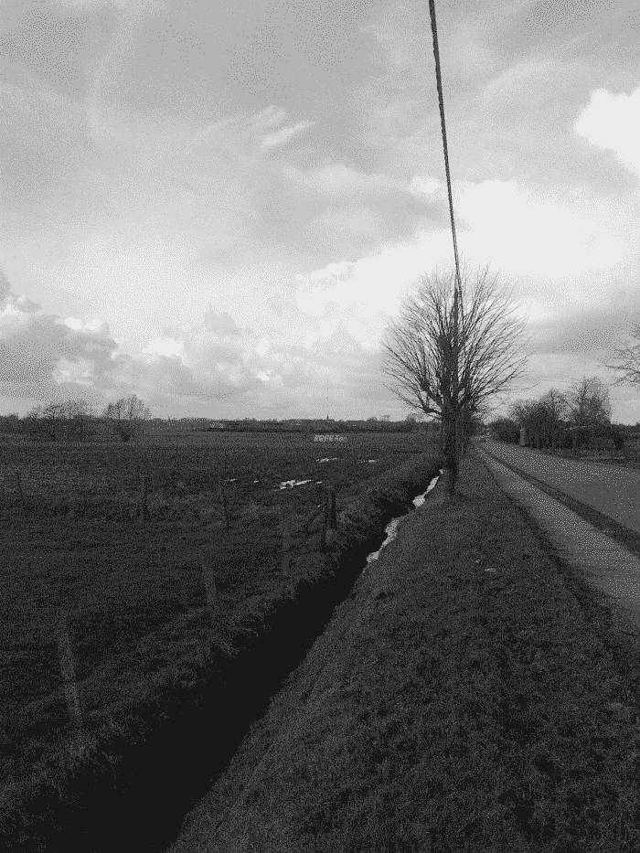
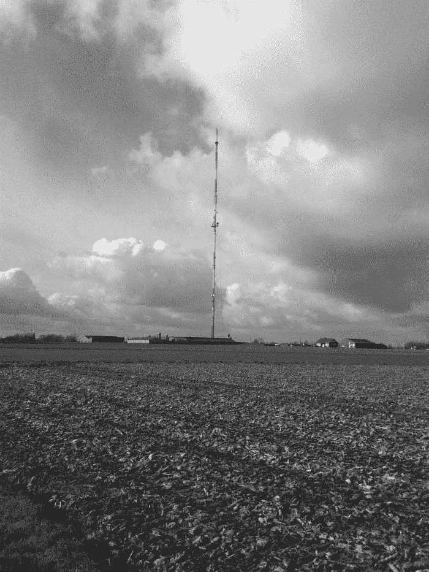
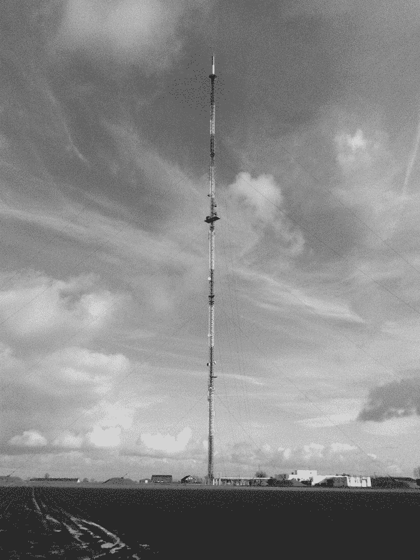
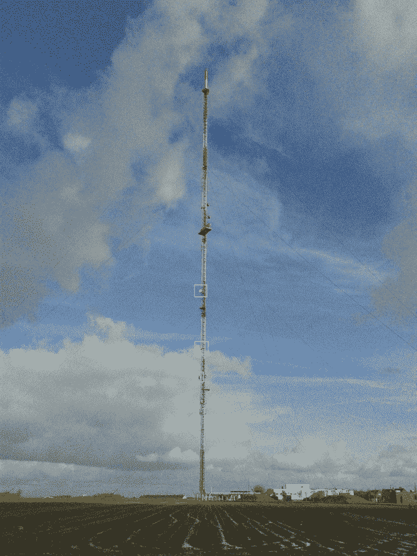
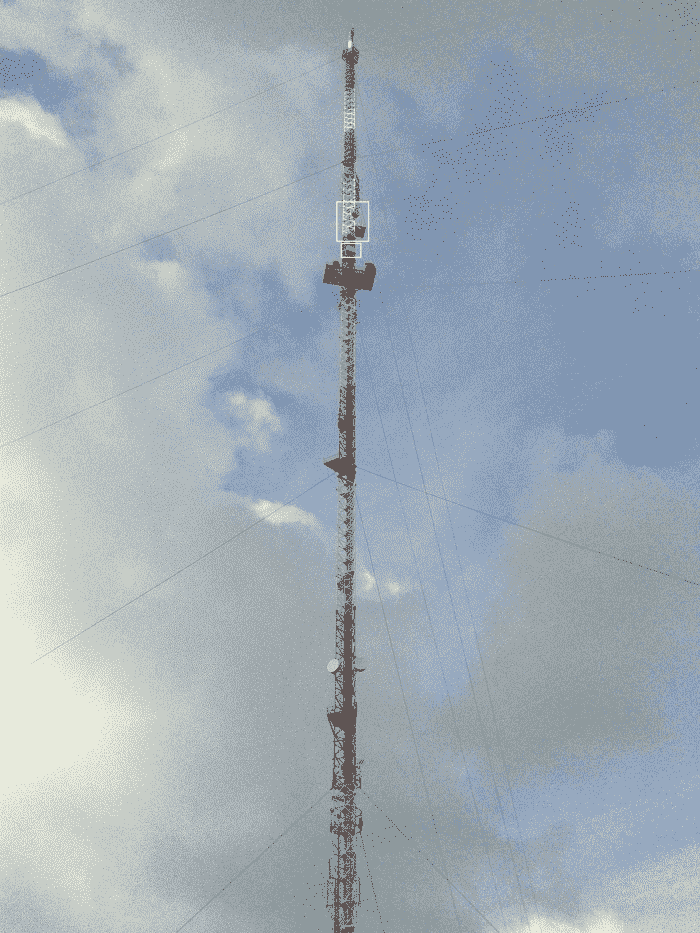
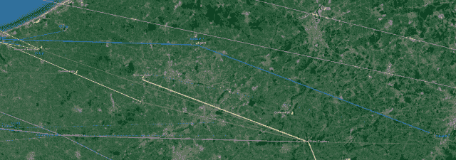
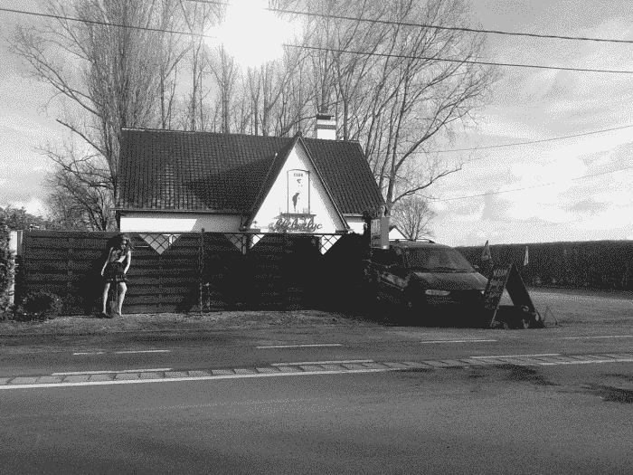
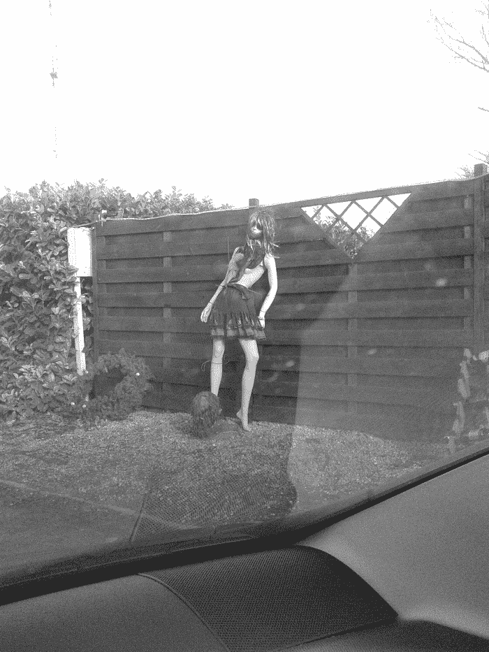
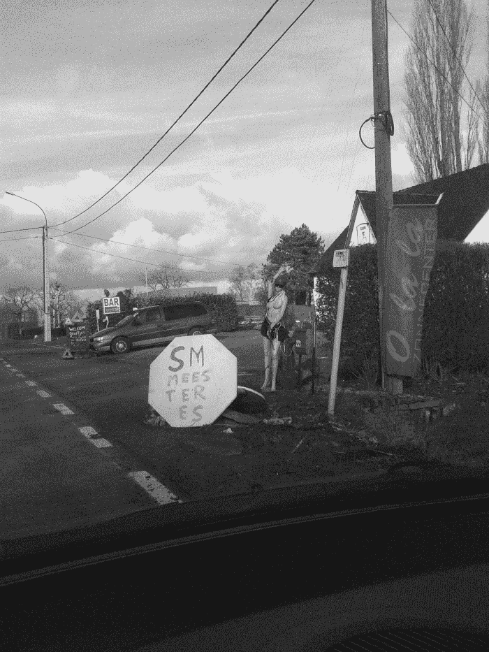
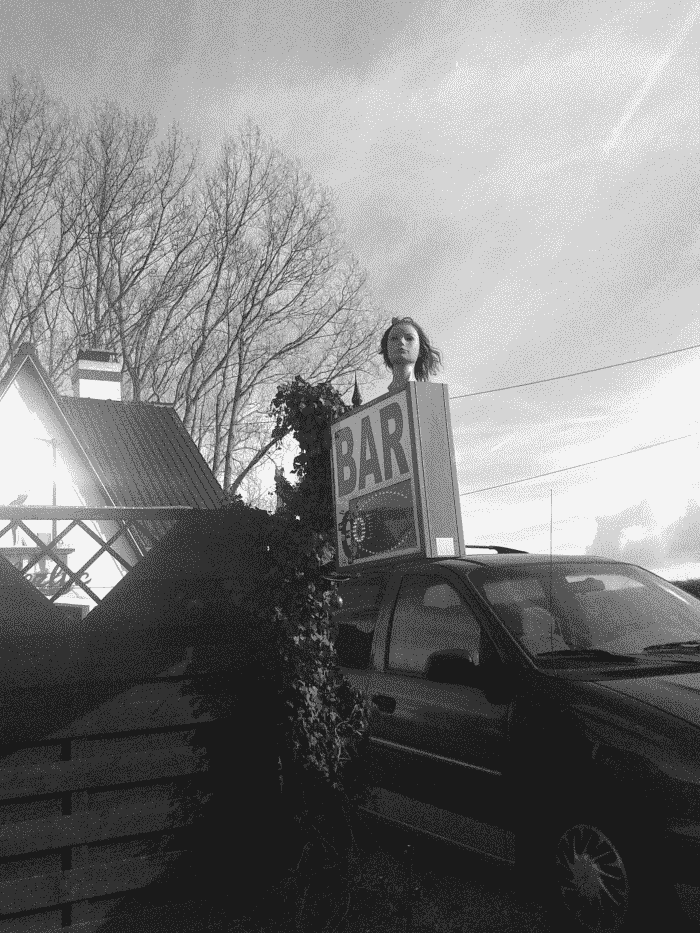

<!--yml
category: 未分类
date: 2024-05-18 14:16:22
-->

# HFT in my backyard | The last tower – Sniper In Mahwah & friends

> 来源：[https://sniperinmahwah.wordpress.com/2015/02/03/hft-in-my-backyard-the-last-tower/#0001-01-01](https://sniperinmahwah.wordpress.com/2015/02/03/hft-in-my-backyard-the-last-tower/#0001-01-01)

Before finishing this series, I couldn’t miss one tower located in my backyard. This tower may be helpful to answer to one question about Vigilant Global. As there is no public data in Belgium about the towers / dishes / frequency licences / etc., only speculation (and a little of fieldwork) is possible. The question was about the Channel (again). Most of the HFT competitors cross the Channel between Swingate (UK) and Dunkerque (France) – with the exception of Jump since they purchased the tall “NATO” tower in Houtem. But the data about Vigilant is not clear. They have Ofcom licences for two towers in North of France: Dunkerque (where they may colocate with Optiver, Latent, McKay Brothers) and Coudekerque:

The Dunkerque [licence](http://spectruminfo.ofcom.org.uk/spectrumInfo/licences?googloc=(51.0389181051126%2c+2.378668785095215)&code=all&se=(51.03761606823887%2c+2.380739450454712)&googoffset=0.1&nw=(51.04022010539774%2c+2.3765981197357178)&freqStop=24&unit=GHz&ne=(51.04022010539774%2c+2.380739450454712)&service=Fixed+Links&freqStart=2&sw=(51.03761606823887%2c+2.3765981197357178)&submit=Submit+search&groupKey=2) is supported by the planning [application](http://planning.dover.gov.uk/online-applications/applicationDetails.do?activeTab=documents&keyVal=DCAPR_220195) in Swingate, meaning that Vigilant has a Dunkerque-Swingate path. The Coudekerque [licence](http://spectruminfo.ofcom.org.uk/spectrumInfo/licences?googloc=(51.03005442370071%2c+2.4068909883499146)&code=301010&se=(51.02992116036919%2c+2.407102882862091)&googoffset=0.0&nw=(51.030187686649064%2c+2.406679093837738)&unit=GHz&ne=(51.030187686649064%2c+2.407102882862091)&service=Fixed+Links&sw=(51.02992116036919%2c+2.406679093837738)&submit=Submit+search&groupKey=1) (granted a few months after) is for a Coudekerque-Dover path, but if you can find a [planning](http://planning.dover.gov.uk/online-applications/applicationDetails.do?activeTab=documents&keyVal=DCAPR_222231) for Latent/Getco and another [one](http://planning.dover.gov.uk/online-applications/applicationDetails.do?activeTab=documents&keyVal=DCAPR_224609) for Custom Connect in Dover, there is no permit for Vigilant. On [Cartoradio](http://www.cartoradio.fr), the French regulator website, it’s possible to corroborate Ofcom data but sometimes the names of the operators are labelled “*station étrangère*” (foreign operator), so you don’t really know who is behind. But in Dunkerque, by deduction, since we have the Arcep data about McKay and Latent with their names, the “foreign operator” there may be either Optiver or Vigilant. What interested me was the fact that according to Cartoradio, both the foreign operators in Dunkerque (Optiver or Vigilant) and Coudekerque (Vigilant for sure) asked for frequencies with azimuts (91.5° in Dunkerque, 90.6° in Coudekerque) pointing to a tower in Belgium which is a special one. Special because **this is the [tallest](http://en.wikipedia.org/wiki/List_of_tallest_structures_in_Belgium) structure in Belgium**. The tallest of the tallest buildings in my backyard. Given that height may be critical (cf. [Part I](https://sniperinmahwah.wordpress.com/2014/09/22/hft-in-my-backyard-part-i/)), and given the tips I had from a Belgian telco informant (“*there were negociations with two parties and equipment is installed in the towers of Oostvleteren, Sint Pieters Leeuw and probably also **Egem*”), I wanted to check who would be on this tall tower – there is something phallic here.

This 305-meter guyed tower is located in Egem (Pittem), in West Flanders. It was built in [1973](http://en.wikipedia.org/wiki/VRT_Zendstation_Egem) (the same year as the Houtem one) and it’s a part of the [Norkring](http://www.norkring.be/zenderpark/zendmasten-in-kaart/) network. Norkring owns among other the Oostvleteren tower (where some competitors may be, according to my informant) and the Sint Pieters Leeuw one (where McKay put [dishes,](http://cadastreantenne.issep.be/Dossiers11/5651/RP1-RAP-14-01364-BEP.pdf) supporting my informant data). I decided to make a last trip in rural Flanders. Searching for such a tall tower is quite easy: you don’t need map or GPS, you just have to look at the sky. This tower can be seen from far away:

The atmosphere was very quiet, and once again I met my friends:

Here is the tallest building in Belgium:

There are many dishes on this tower (mainly used for TV and radio communications), but on the Antenna Site Archive [website](http://theantennasitearchive.com/belgium-pittem-vliegveldweg-pictures.html) it’s possible to find different photographies taken in 2011, just before the HFT microwave networks showed up. By comparing the 2011 photographies and those I took in Egem, it can be seen that new dishes were installed on the tower, and most of them are Andrews dishes. That’s interesting because various microwave competitors use these kind of dishes. Given the azimuts found on the Arcep website, I was able to draw some paths from Egem (going to Dunkerque and Coudekerque) and there are two Andrews dishes which seem to fit perfectly those azimuts (there is a third lower one pointing to Veurne, Belgium, but I’m not sure about that). 

That’s not easy to check the azimuts (I’m just an *amateur*) but since the two higher dishes are not installed at the same height and don’t have the exact azimut, I bet they are owned by two different competitors (or one competitor having to different paths but I’m doubtful about that). That would corroborate what my telco informant told me about the “*negociations with two parties”.*  On the other “side” of the tower, there are three Andrews dishes. They are so high that is really difficult to guess the azimuts, but two seem to have the same one, pointing to a location in Belgium:

These three dishes may confirm that two different competitors are in Egem. That’s interesting to note that the dishes are installed far higher than the ones pointing to France, meaning that they could point to another very tall tower. Given the azimut I could guess for these three dishes, I would not be surprised if they point to Sint Pieters Leeuw, another Norking tower which is the second tallest building in Belgium. That would corroborate what an informant told me: “*One last tip: find the Norkring map of Belgium. Vigilant really loves Norkring*.” If we speculate a little on that, the Vigilant path from France to Sint Pieters Leeuw would go through Egem:

But speculation is not truth, and I will probably never know for sure which HFT microwave competitors have dishes on the tallest building in my backyard.

It was very cold in Egem and I didn’t have my gloves, so after my visit I tried to find a coffee shop. I took my car, drove a few meters, turned left and then I saw a “Bar Open” sign. “*Perfect*”, I told myself… but when I arrived in front of the coffee shop things went wrong. There was a strange mannequin, waiting for clients:

The mannequin seems to walk on a human head…

I looked more at the “bar” and then I realized it was not a coffee shop. Not at all (you can guess the cables of the tower in the background, on the left):

This is a brothel specialising in SM! This place would be the perfect set for the next *Chucky* sequel:

Suddenly, the atmosphere became seriously creepy. Very shady. I came home, had a coffee and checked out this strange place on Street View/Google Earth. I wanted to see if the Google cameras shoot the creepy dolls but no, in 2010 the place was just a “club” (*i.e.* a brothel without SM). Nevertheless, the Google Earth screenshot is amazing:

A few meters from the ~~biggest penis~~ tallest tower in Belgium there is brothel. That irony.