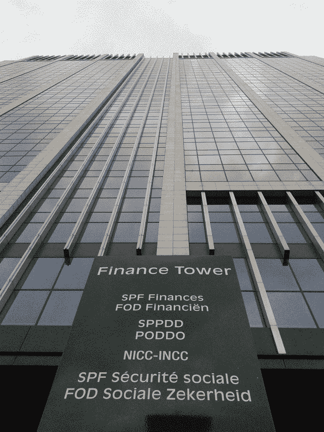

<!--yml
category: 未分类
date: 2024-05-18 14:20:03
-->

# HFT in my backyard | The office – Sniper In Mahwah & friends

> 来源：[https://sniperinmahwah.wordpress.com/2014/09/29/hft-in-my-backyard-the-office/#0001-01-01](https://sniperinmahwah.wordpress.com/2014/09/29/hft-in-my-backyard-the-office/#0001-01-01)

I was in the downtown area of Brussels two days ago, and I passed a building which appears to be the office of the Belgian “Service Public Fédéral”, the same which sold the [Houtem tower](https://sniperinmahwah.wordpress.com/2014/09/25/hft-in-my-backyard-ii/) to Jump Trading. That was funny to see these offices are in a tower. A “Finance Tower”. I am surrounded by towers.

I was about to release the Part II of *HFT in my backyard* (an overview of the different HFT competitors using microwaves networks in Europe) but over the past days I have classified and read again my data, and I have found some bizarre details about one competitor. I need to check the data. I will post the Part III tomorrow, or Wednesday.