<!--yml
category: 未分类
date: 2024-05-18 14:17:02
-->

# HFT in my backyard | V – Sniper In Mahwah & friends

> 来源：[https://sniperinmahwah.wordpress.com/2015/01/14/hft-in-my-backyard-v/#0001-01-01](https://sniperinmahwah.wordpress.com/2015/01/14/hft-in-my-backyard-v/#0001-01-01)

It’s time to finish the “HFT in my backyard” series. The last week was intense here and around me, and I think at some point it’s good to keep silent. What’s more, this Part V about the past and the future of data transmission needed some times to be achieved – I found too much interesting data. I think I could write a new sequel to my book (that would be fun); that said, I’ll only summarize the stuff I have accumulated since last September. (*Post scriptum*: I’ll post later in January the very last part of the series, titled “Miscellanea”, where I’ll amend some inaccurate facts and try to response to some questions I have been asked – at least, I’ll try to as I don’t have all the answers.) Let’s start with a little bit of history.

**INTRODUCTION: ARMS RACE AND INFORMATION TRANSMISSION**

This is a well known story: in 1815, English banker Nathan Mayer Rothschild used carrier pigeons to be the first to know the end of the Battle of Waterloo. The pigeons crossed the channel easily (they didn’t have problems with water reflections), arrived in London and told Rothschild about Napoléon’s defeat, so the banker “[made a killing by buying British government bonds](http://www.ft.com/intl/cms/s/0/255b75e0-c77d-11e2-be27-00144feab7de.html#axzz3NwLg99JT)”. The official story says Rothschild made a ton of money because he had the fastest transmission technology (pigeons) but that’s not true: the other part of the story (nearly unknown) is that Napoléon had a *faster* technology than the *Columbidae*: the *télégraphe Chappe*. In short, this ”optical“ or “aerial” network invented by [Claude Chappe](http://en.wikipedia.org/wiki/Claude_Chappe) employed various semaphore relay stations to carry information all around France:

[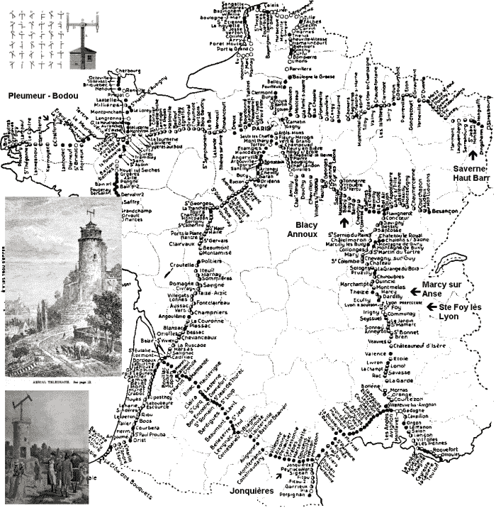](https://sniperinmahwah.wordpress.com/wp-content/uploads/2015/01/chappe.jpg)These networks were “optical” in the sense that the semaphores used to communicate from point to point needed lines-of-sight (like the microwave networks today); that explains why the stations were located in existing high points (mounts for instance) or, even then, in standing towers. Napoléon’s army was a frenetic client of Chappe, and the Emporor put money into the network, so the news about the defeat at Waterloo should have reached Paris *before* London. But the Rothschild’s pigeons won the race. Why? The fog, dude! On June 18, 1815, in Waterloo, the fog was so thick that Nap’s soldiers were perturbed and the Chappe network completely down: because of the fog the signal couldn’t be sent from Waterloo to the stations in North of France – you couldn’t see anything. Bad luck. That’s an amazing story because fog is still a problem for the new HFT (microwave) networks, two centuries after the debacle at Waterloo. Technologies may change but nature is still the same.

The outcome of a war has always been a latency issue. Greg Laughlin, who [worked](http://arxiv.org/abs/1302.5966) on recent information transmission between New York and Chicago (from fiber to microwave), wrote on his [blog](http://oklo.org/2014/11/28/optical-data-transmission/) about an old and mythical optical data transmission: “*the news of Trojan defeat over the course of a single night to Clytemnestra, scheming, four hundred miles away in Sparta*”. In Aeschylus’*Agammemon* you can read this: “*From Ida’s top Hephaestus, lord of fire, / Sent forth his sign; and on, and ever on, / Beacon to beacon sped the courier-flame / From Ida to the crag, that Hermes loves / Of Lemnos; thence unto the steep sublime / Of Athos, throne of Zeus, the broad blaze flared*”, etc. The signal was a flame, and since Aeschylus gives the names of the “stations”, Greg was [able](http://people.seas.harvard.edu/~jones/history/comm_chron1.html) to map the 600-kilometer network from Troy to Mycenae:

The longest path is 177 kilometers (from the famous Mount Athos to Kandilion), above the sea, and most of the stations are located on mounts or mountains. If you zoom on the Mount Jeraneia, guess what you can see there, now? A beautiful recent metallic tower:

Again, technologies may change but they still have to use the same features of nature. “*Just outside the ruins of Mycenae, the landscape looks as if there’s been little change in 3,000 years. I thought that this Google Earth screenshot…*

[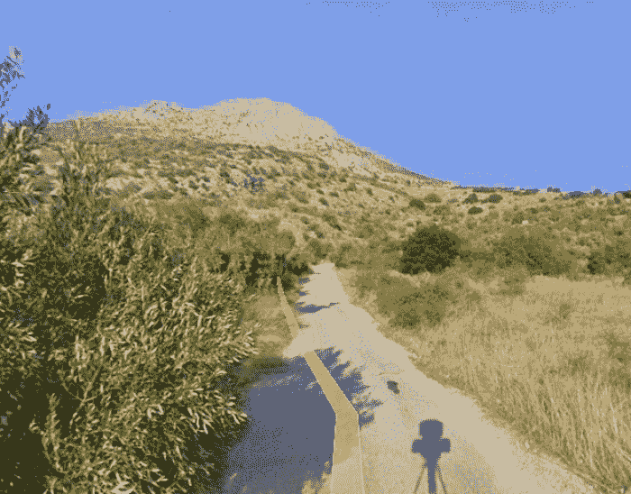](https://sniperinmahwah.wordpress.com/wp-content/uploads/2015/01/screen-shot-2015-01-11-at-10-34-07-am.png)

* … (just outside the ruins and facing in the general direction of the Arachne’s Peak, the final station of the route), provides a subtle confirmation of the ancient Hellenic ideal – transmitted to the Romans to the Enlightenment to the information revolution, and finally to the shadow of Google’s mapping camera*”, Laughlin adds. “*Given that the message was one bit, the signal coding was at the Shannon Limit*”.

##### **THE PAST, I: HOUTEM, FROM THE U.S. ARMY TO JUMP TRADING**

Let’s begin with what led me to investigate on the microwave networks now (or soon-to-be) used by HFT firms in Europe between London (Slough/Basildon) and Frankfurt. The Bloomberg [article](http://www.bloomberg.com/news/2014-07-15/wall-street-grabs-nato-towers-in-traders-speed-of-light-quest.html) which was the trigger of my enquiry was titled “Wall Street Buys NATO Microwave Towers in Quest for Speed” – here “Wall Street” means “[Jump Trading LLC](http://www.jumptrading.com)”, one of the biggest Chicago market makers who purchased this tall tower in Houtem, Belgium. Here is this tower again (read [Part II](https://sniperinmahwah.wordpress.com/2014/09/25/hft-in-my-backyard-ii/) for the details):

Before starting to hunt the other towers in order to map the high-frequency world in Europe, I fact-checked the history of this tower and I quickly realized this guyed mast was not built by/for NATO (even if NATO was not far). Bloomberg was right to talk about the “*U.S. armed forces*” in the article since this tower is a part of an interesting story involving the old microwave networks built by the US Army in Europe. Trying to summarize the history of the military networks is not an easy task (because of the so-called “defence secrecy”) but the beginning of the story is probably this “[Agreement Between The Government Of The United States And The Governement Of Belgium Concerning Certain Communications Facilities](https://books.google.be/books?id=6peOAAAAMAAJ&pg=PA415&lpg=PA415&dq=flobecq+agreement+between+the+government+of+the+united+states+and+the+government+of+Belgium+communications&source=bl&ots=OSJlUegCH7&sig=JcIQba3BYr4jAfR-tzkM-WiX2yY&hl=fr&sa=X&ei=mJOrVP_fEoPxapW1gNAI&redir_esc=y#v=onepage&q=flobecq%20agreement%20between%20the%20government%20of%20the%20united%20states%20and%20the%20government%20of%20Belgium%20communications&f=false)” dated April 19, 1963. The Article 1 says: “*The Belgian Government authorizes, ratifies and confirms the establishment, operation and maintenance by the United States Government of communications facilities at Flobecq and at other sites as now or may be later agreed upon the appropriate United States and Belgian authorities*”. That means: from 1963, the U.S. started to build different microwave networks in Europe as a part of Defense Communication System (DCS). There is no mention of the Houtem tower but the name Flobecq (a small village in Belgium) is amazing because in 2015 different HFT competitors ([Flow Traders](http://webcache.googleusercontent.com/search?q=cache:FYRvzAFt3wwJ:cadastreantenne.issep.be/Dossiers9/5354/RP1-RAP-12-03989-VAB.pdf+&cd=2&hl=fr&ct=clnk&client=safari), [Jump](http://cadastreantenne.issep.be/Dossiers8/5214/RP1-RAP-12-01777-BEP.pdf) and probably Optiver) have dishes on this old military tower:

[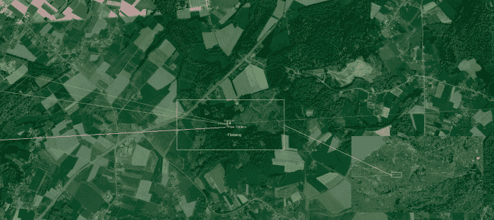](https://sniperinmahwah.wordpress.com/wp-content/uploads/2015/01/capture-d_c3a9cran-2015-01-06-c3a0-09-07-09.png)

The Defense Communication System had installations in Belgium, Greece, Italy, Portugal, Spain, Turkey and the U.K., and consisted of a mixture of microwave radio links and satellite communications terminals. These networks were not build in milliseconds: thanks to Julian Assange and Wikileaks, we learn by reading this declassified [cable](https://www.wikileaks.org/plusd/cables/1973BRUSSE01930_b.html) (dated April 6,1973, and titled *US Microwave-System In Belgium*) that the “*original target date for completion of microwave system was May 1973, but we understand that contract is currently being renegotiated between prime contractor to establish new target date of late 1973 or early 1974* […] *we are pouching copies of site visit reports dated january 2, 1973, which provide outline of work completed and work remaining at six out of the seven belgian sites (Houtem, Westrozebeke, Flobecq, Shape, Le Chenoi and Ben Ahin).*” This is the first mention of the Houtem tower. By reading [this](http://usarmygermany.com/Units/USAFE%20Units/USAREUR_HqUSAFE%201.htm) we learn the Belgium portion of the DCS network has been carrying traffic since mid-1974 (that corroborates other data suggesting the Houtem tower was built in 1973).

In a book published in 1989, [*United States Military Forces and Installations in Europe*](https://books.google.be/books?id=dzKr3mSKyIgC&pg=PA16&dq=us+military+forces+and+installation+in+belgium&hl=fr&sa=X&ei=vZ2rVIqXDYfd7QaEtoDYDg&ved=0CCAQ6AEwAA#v=onepage&q=us%20military%20forces%20and%20installation%20in%20belgium&f=false), we learn the U.S. Army had 19 facilities in Belgium (munitions depots, offices, etc.), including these three towers:

[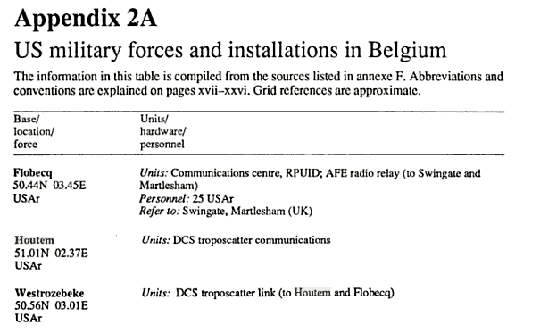](https://sniperinmahwah.wordpress.com/wp-content/uploads/2015/01/capture-d_c3a9cran-2015-01-06-c3a0-09-27-52.png)By digging a little more, you can find some old maps of the Defense Communication System with the Flobecq and Houtem towers:

[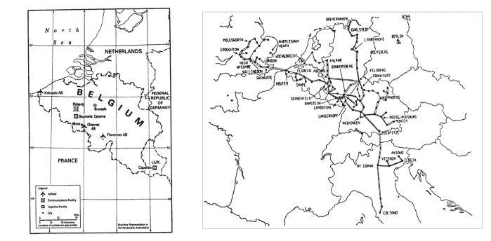](https://sniperinmahwah.wordpress.com/wp-content/uploads/2015/01/capture-d_c3a9cran-2015-01-06-c3a0-09-42-47.png)

These documents are interesting because we can link the Houtem tower (now owned by Jump) to the Flobecq one (where Jump colocates with Flow Traders). You can see the paths of the old DCS network are almost the same as those used by the HFT firms from Flobecq (Belgium) to Swingate (UK):

[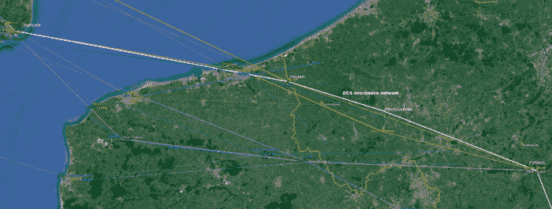](https://sniperinmahwah.wordpress.com/wp-content/uploads/2015/01/capture-d_c3a9cran-2015-01-06-c3a0-09-52-18.png)

The U.S. army also managed another microwave network named “[European Tropospheric-Scatter](http://www.usarmygermany.com/Sont.htm?http&&&www.usarmygermany.com/Units/Signal/USAREUR_SignalCorps%20ETA.htm)”. That’s really amazing because a part of this network goes from Flobecq to… Frankfurt! That led me to speculate about the HFT towers in Germany, as there is no public data about them in this country. I put the Tropospheric-Scatter paths on my map (picture below) and I wondered 1) if the Custom Connect route goes to Prüm or not, and 2) if all the competitors in Simmerath (McKay, Jump, Vigilant, Optiver and Latent), after passing the Weibern tower, are using the [Feldberg](//commondatastorage.googleapis.com/static.panoramio.com/photos/original/9192834.jpg) tower, 20 kilometers only from the Equinix data center hosting Deutsche Bourse/Eurex matching engines in Frankfurt:

[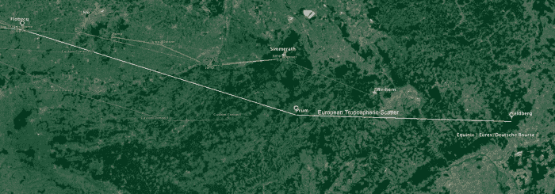](https://sniperinmahwah.wordpress.com/wp-content/uploads/2015/01/capture-d_c3a9cran-2015-01-13-c3a0-10-43-321.png)

On the other side of Flobecq, the Houtem-Swingate route seems to have generated interest because crossing the channel is a difficult task (you may have fog, you have to deal with water reflections, etc.). At least three academic articles were published about these difficulties, the first one in 1979 by the Defense Technical Information Center, *[Delay Line Requirements for Houtem-Swingate Link](http://books.google.be/books/about/Delay_Line_Requirements_for_Houtem_Swing.html?id=Qny2tgAACAAJ&redir_esc=y)*. A second paper was released in 1979 by the US Department of Commerce, [*Signal level distributions and fade event analyses for a 5 GHz microwave link across the English Channel*](http://permanent.access.gpo.gov/gpo29426/79-30_ocr.pdf) and describes “*instrumentation for fading studies and measurement results over an 88-km multiple-diversity line-of-sight microwave link across the English Channel operating in the **4* *to 5 GHz frequency range*” (now Jump uses a 7.470 Ghz frequency to cross the channel). The fact that (at least) three old technical papers highlighted the difficulties for a microwave path to cross the channel may probably explain the “*large amount of speculation*” I talked about in [Part IV](https://sniperinmahwah.wordpress.com/2014/11/03/htf-in-my-backyard-iv/) when the HFT firms/providers decided to build their microwave routes in Europe in 2012.

According to this [document](http://nato.radioscanner.ru/files/article63/communications_elect.pdf) released by the Department of the Air Force in 1996, the DCS network was upgraded from 1979 and became the Digital European Backbone (DEB): “*The DEB program replaces existing analog microwave equipment in the DCS in Italy, Germany, Belgium, Holland, and the United Kingdom with digital microwave and bulk encryption equipment*”; in 1988, “*Phase III extended digital service to the United Kingdom through Belgium. This link also provides digital connectivity to shape a quad-diversity line of site digital communications system and provides connectivity across the English Channel*” – thats means the Houtem tower was still used by the US Army in the 1990s. According to this other [document](http://www.comw.org/qdr/basestructure1999.pdf) released by the Department of Defense, all the towers in Belgium were still owned by the US in 1999\. But on January 20, 2006, the Department of Defense [announced](http://www.defense.gov/Releases/Release.aspx?ReleaseID=9245) “*the decision to inactivate and return three microwave radio relay sites to Belgium. The sites are: Houtem, Westrozebeke and Flobecq*. *The United States no longer requires these sites since the service provided by the radio relay system installed in 1996* *will be replaced by higher-capacity, lower cost commercial communications service*”, *i.e.* optical fiber cables. “*Closure of these sites will result in an estimated annual savings of over $84,000.*”

In 2006 the three towers were returned to Belgium, but my ~~backyard~~ country soon realized they were costly and useless. The Westrozebeke tower was destroyed; the Flobecq one was used by the Belgium Ministery of Defense but thanks to this [document](http://ventderaison.eu/melles_mourcourt/eie_windforever_2014/etude_incidence.pdf) we know that the radio link was shut down… two weeks ago, on January 1, 2015; and in 2012, Belgium decided to [sold](http://www.servicespatrimoniaux.be/interfpatrnl/Green/Immeubles/Brugge/BruggeVeurneReiger/BruggeVeurneReiger.html) the Houtem tower, which was in bad shape. I talked about the rest of the story in [Part II](https://sniperinmahwah.wordpress.com/2014/09/25/hft-in-my-backyard-ii/): an epic auction sale took place in Houtem on December 18, 2012, the Belgian government set the starting price at €255,000 but various HFT firms/microwave providers were in competition and Jump Trading was the successful bidder and bought the tower in January 2013 for $5.000.000 (and spent at least one more million to rebuild the facility). That’s how an old american guyed tower erected in Belgium by the US Army in 1973 was purchased by an American firm 40 years later. Amazing detail: the Army returned the tower because the new optical fiber cables were more efficient (in term of bandwidth) and later the tower was purchased by an American firm because microwaves are more efficient than fiber (in term of latency). How ironic is that?

##### **THE PAST, II: THE US ARMY-NATO COLOCATION**

The Houtem tower was never built or owned by NATO. That being said, there is a connection with NATO. The North Atlantic Treaty Organization also had various radio networks and the main one was the Allied Command Europe High ([ACE High](http://en.wikipedia.org/wiki/ACE_High)). The network was built around 1956 and decommissioned in the late 1980s. Here is the map:

[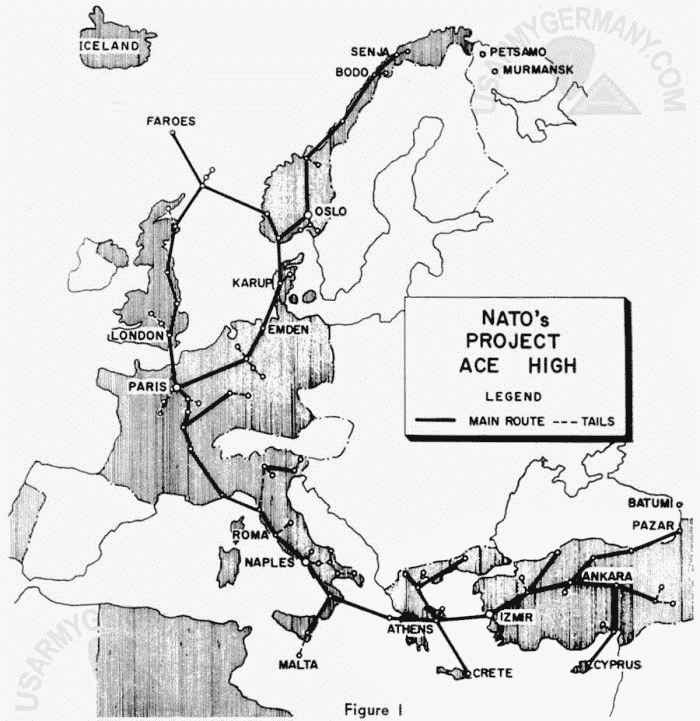](https://sniperinmahwah.wordpress.com/wp-content/uploads/2015/01/ace-high-map.jpg)

The network went from Turkey to Sweden through both France and the UK. But in 1966 Charles de Gaulle “*[pulled out](http://www.dailymail.co.uk/news/article-1161642/As-France-rejoins-NATO-humorous-reminder-missed-them.html) of the heart of the Nato alliance, claiming that belonging to the Nato military command undermined French independence and sovereignty*”. That means the radio networks couldn’t use towers in France anymore. The Organization decided to bypass France by creating new paths in Italy, Germany and Belgium in order to reach the UK. Here is a map of the “alternate/relocation routes” used after 1966 (here in blue and green):

[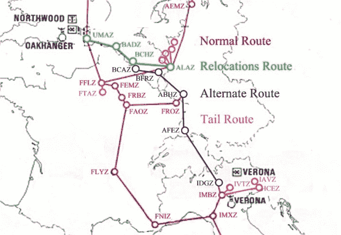](https://sniperinmahwah.wordpress.com/wp-content/uploads/2015/01/2_2lx395yd.jpg)

NATO needed to erect a tower in Belgium to cross the channel because of Charles de Gaulle: this is the “BADZ” tower on the map, in Adinkerke, located 8 kilometers from the Houtem tower (it’s still standing):

An other amazing fact about NATO network: one of the subnetworks (“Aircent Microwave Relay Network”) used a tower in Baraque de Fraiture (East of Belgium). Guess who you can find in 2015 on this tower? The dishes of a HFT microwave provider, [Custom Connect](http://cadastreantenne.issep.be/Dossiers8/5414/RP1-RAP-13-00197-BEP.pdf). There are other interesting things about these towers but that would be too long. Just note that due to geopolitical reasons, both NATO and U.S. Army networks had to be connected in Mons (Belgium) where the Supreme Headquarters Allied Powers Europe, one of NATO’s strategic military command, was moved when France left NATO. This kind of interconnection networks was called… “*colocation*” ;) Last but not least: both these networks ended in Turkey, so they were passing through Greece, and that’s how 20th century microwave networks (in green and blue in the picture below) almost met the old mythical Troy-Mycenae bonfire network in the Greek mountains:

##### **THE PAST, III: THE RAF IN THE U.K.**

The history would be incomplete without a few words about the Royal Air Force (RAF) and the Chain Home radar system. Chain home was a network built by the U.K. forces before and during the World War II to track German aircrafts (check the [map](http://www.radarpages.co.uk/mob/images/map3l.jpg)). The most famous towers erected are probably the “Three Sisters” in Swingate, built in 1936 (that’s how both NATO and U.S. Army networks were able to use these towers to cross the channel in the 1960s-1970s). One tower was dismantled in 2010 (it had become unstable) but on one of the two remaining towers you can find the dishes of some HFT competitors, McKay Brothers, Optiver and Jump Trading. Thanks to the Houtem pylon, Jump doesn’t need the Swingate tower anymore to go to Basildon [cf. [Part II](https://sniperinmahwah.wordpress.com/2014/09/25/hft-in-my-backyard-ii/)], but I bet the Chicago firm still needs it to send the signal toward Slough.

[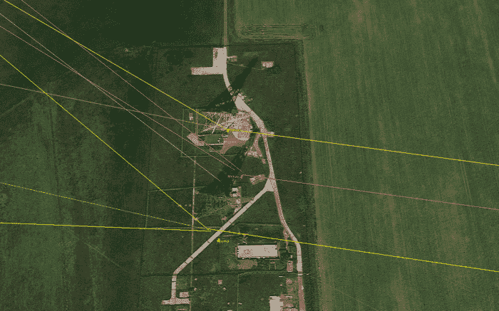](https://sniperinmahwah.wordpress.com/wp-content/uploads/2015/01/capture-d_c3a9cran-2015-01-13-c3a0-11-36-46.png)

If you want to know more about the history of these towers, just read the [planning statement](http://planning.dover.gov.uk/online-applications/applicationDetails.do?activeTab=documents&keyVal=DCAPR_220195) made by Jump Trading when they submitted a permit. What is amazing is the Chain Home network went from Swingate to Dunkirk… where you can find other HFT firms (McKay, Latent, Optiver, Custom Connect). So two firms (at least), McKay Brothers and Optiver, use a path which is the exact microwave route created by the RAF in the 1930s (about Custom Connect, see this [post](https://sniperinmahwah.wordpress.com/2014/12/04/hft-in-my-backyard-a-mystery-solved/) about Dunkirk):

[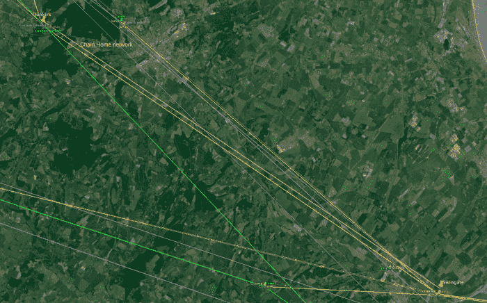](https://sniperinmahwah.wordpress.com/wp-content/uploads/2015/01/capture-d_c3a9cran-2015-01-13-c3a0-11-49-301.png)

Both the Swingate and Dunkirk towers are very famous in the U.K. Because of their role during World War II, they are listed in the National Heritage List for England. Now both the towers are historical monuments, and it’s unfortunate that two HFT firms, Custom Connect and Jump Trading, didn’t have a lot respect for history: I wrote in [Part III](https://sniperinmahwah.wordpress.com/2014/10/02/hft-in-my-backyard-iii/) about Jump apologizing for having installed dishes in Swingate “*in advance of the submission of the planning applications*” (in their own [words](http://planning.dover.gov.uk/online-applications/files/E997135014F4091378DD3AF44F29F01C/pdf/12_00732-PLANNING_STATEMENT-214045.pdf)) and later I [found](https://sniperinmahwah.wordpress.com/2014/10/06/hft-in-my-backyard-more-on-piracy/) that Custom Connect too put dishes before being granted to, in Dunkirk. As one HFT competitor told me, “*on a WW2 monument, this is a felony*”…

##### **THE FUTURE, I: HIBERNIA ATLANTIC**

The U.S. Army, NATO and the RAF erected a lot of towers during the second half of the 20th century, and these towers are now invaded by dishes owned by various trading firms/microwave providers. The Houtem tower was sold to Belgium in 2006 because the U.S. Army had found a better technology: fiber-optic cable but the line-of-sight microwave towers have found new clients (high-frequency traders) as latency is better than with cables. I tried to find some maps of the fiber networks existing between London and Frankfurt (to compare them with the microwave paths), I even contacted some network providers but I got no answer (“*trade secret*”). Once I watched at a large and detailed map of a London fiber network displayed on a wall, but it was on the floor of a big market maker so I was not authorized to take pictures. With Google Images you can find the “maps” of providers such as [euNetworks](https://www.google.com/search?q=eunetworks+london+frankfurt&safe=off&client=safari&rls=en&source=lnms&tbm=isch&sa=X&ei=GiC2VNiVGefZ7Aat3IC4Ag&ved=0CA0Q_AUoAA&biw=1135&bih=919) but these charts are oversimplified. There is one exception: on the [Zayo](http://www.zayo.com/solutions/financial-low-latency) website you can search for the different cable networks managed by the firm. Needless to say that the London-Frankfurt route is far from a straight line:

[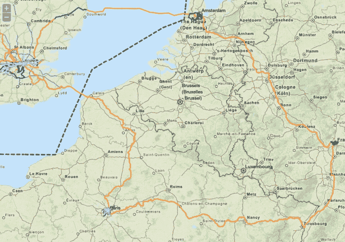](https://sniperinmahwah.wordpress.com/wp-content/uploads/2015/01/zayo.jpg)

Since the interconnection between different kind of networks is called “*colocation*”, let’s have a look at the colocation in Cornwall, South of England. There, the HFT networks end their continental routes and meet the optical fiber cables needed to cross the Atlantic Ocean. I’ve made a mistake in the previous parts of this series: there is no *one* cable there, but *two*, and it seems the HFT firms don’t use the same cables to cross the Ocean.

[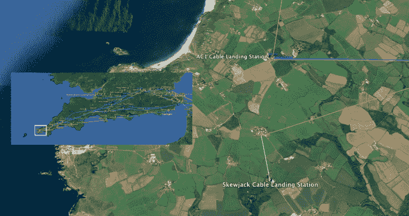](https://sniperinmahwah.wordpress.com/wp-content/uploads/2015/01/capture-d_c3a9cran-2015-01-13-c3a0-13-21-07.png)

The last dishes of the Jump microwave network are located at the “Skewjack” Cable Landing Station. According to this wonderful book by Andrew Blum, [*Tubes*](http://andrewblum.net), the locals called the place “skewjack” after the surfer’s camping ground that used to be on the site (read this interesting [interview](http://www.theguardian.com/commentisfree/joris-luyendijk-banking-blog/2011/sep/15/computer-programmer-high-frequency-trading) to learn about the comparison between surfers and HFT algorithms “*trying to spot a wave*”). This landing station is the one of the FLAG Atlantic 1 ([FA-1](http://en.wikipedia.org/wiki/Fiber-Optic_Link_Around_the_Globe)) cable, owned by [Reliance](http://globalcloudxchange.com). An interesting fact: remember that a company named Perseus Telecom is a [microwave provider](http://www.bloomberg.com/news/2014-07-15/wall-street-grabs-nato-towers-in-traders-speed-of-light-quest.html) for different HFT firms in Europe; Perseus doesn’t own (for now) a network but leases bandwidth from Jump’s one (cf. [Part II](https://sniperinmahwah.wordpress.com/2014/09/25/hft-in-my-backyard-ii/)), so it makes sense to see that Perseus [resells](http://perseustelecom.com/services/quanta/) the FA-1 cable to their customers – I don’t really know, but it’s likely that Perseus’ clients may sign for both a microwave network from Frankfurt to Cornwall *and* for the FA-1 cable from Cornwall to the U.S.

The proximity between Jump Trading and Perseus may explain why Jump competitors (Optiver and Vigilant at least) use another cable: the Atlantic Crossing 1 ([AC-1](http://en.wikipedia.org/wiki/Atlantic_Crossing_1)), whose *motto* is “One Planet. One Network”. It’s said to be faster than the FA-1 cable. The landing station is named “Whitesands cable station” and you can read a great description of the site in *Tubes* where Andrew Blum talks about “*one rack labeled SLOUGH*” – this is for the Whitesands-Slough cable network, but high-freqquency traders don’t care about it anymore as they have microwave to save a few milliseconds between the two locations. That said, both these two landing stations in Cornwall will probably be a part of history in the near future. As I wrote in [Part III](https://sniperinmahwah.wordpress.com/2014/10/02/hft-in-my-backyard-iii/), a new cable is in progress between the U.K and the U.S: the famous Hibernia’s [Project Express](http://www.hibernianetworks.com/project-express/).

Hibernia is a big provider for the [world of finance](http://www.hibernianetworks.com/hnservices/financial-markets/) – you can find [here](http://www.hibernianetworks.com/corp/wp-content/uploads/2014/07/HN-PoPs-11JUl14.pdf) the different points of presence of their cables. The “old” AC-1 cable offers transatlantic connection in 65 milliseconds but Project Express is said to shave six milliseconds off that time (that’s why I titled my book *6*). The 4,600 km cable was supposed to be completed in 2012 but Hibernia experienced difficulties – the main one was about [cybersecurity](http://www.telecomramblings.com/2013/02/hibernias-express-buildout-suspended-due-to-huaweis-us-problems/) issues due to a Chinese contractor, Huawei. Project Express was [back on track](http://www.telecomramblings.com/2014/07/hibernia-express-back-track/) in July 2013 and thanks to the [Herald Business](http://thechronicleherald.ca/business/1224651-continental-cable-connection) we know the U.K. landing station is in Brean (by the way, [early January](//transition.fcc.gov/Daily_Releases/Daily_Business/2015/db0112/DA-15-47A1.pdf) the American regulator FCC granted the transfer of Hibernia LLC to a firm named KCK Limited). (The landing station is not new and was built for [another cable](http://www.ofcom.org.uk/static/archive/oftel/publications/1995_98/mergers/fcc.htm).) All the trading firms using microwave to join Cornwall (will) have a little problem: Brean is not in Cornwall, but in Somerset; that means all the microwave paths going from London (or Dover/Swingate) to Cornwall will be completely useful at some point:

[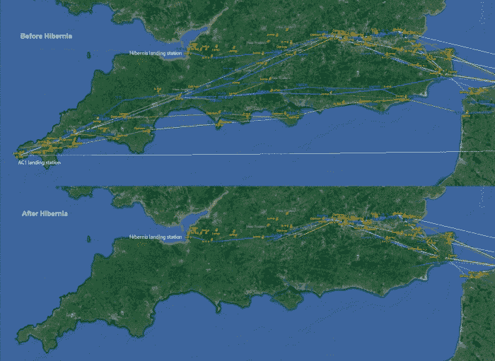](https://sniperinmahwah.wordpress.com/wp-content/uploads/2015/01/before_after.jpg)

But I may have made another mistake. Different informants in the industry (and one journalist) told me that Hibernia will not allow (at least for now) dishes at the Brean landing station. I tried to know more about that but the only answers I got were some “*neither confirm nor deny*” responses. Huh! People know but don’t talk. I wrote an email to Hibernia but I got zero answer (obviously). Then other informants told me Hibernia may finally allow dishes… Anyway, whatever the truth is, as I explained previously, different HFT competitors anticipated the new Project Express cable and booked licenses/frequencies on various towers between Slough and Brean. I finally [found](https://www.google.com/fusiontables/DataSource?docid=1NOw4q4NeBGvNnM8_L2QoPZCsOoFUdAgLhk5QRQk#rows:id=1) what seems to be the exact location of the Project Express landing station in [Brean](http://www.stevenheaton.co.uk/SubmarineCableLandingsUK/?p=198), which looks like that:

[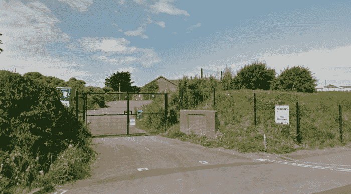](https://sniperinmahwah.wordpress.com/wp-content/uploads/2015/01/capture-d_c3a9cran-2015-01-13-c3a0-15-27-00.png)

Then I came back to my map, and how amazing is that… Guess who owns an Ofcom license *exactly* at the location of the landing station? Jump Trading:

[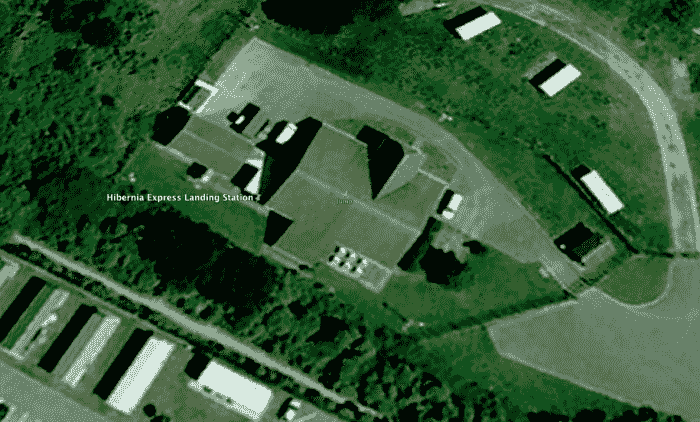](https://sniperinmahwah.wordpress.com/wp-content/uploads/2015/01/capture-d_c3a9cran-2015-01-14-c3a0-09-58-14.png)

The Ofcom [license](http://spectruminfo.ofcom.org.uk/spectrumInfo/licences?googloc=(51.2860442329784%2c+-3.0130863189697266)&unit=GHz&ne=(51.286272378029565%2c+-3.012721538543701)&service=Fixed+Links&code=301010&se=(51.28581608679386%2c+-3.012721538543701)&googoffset=0.0&nw=(51.286272378029565%2c+-3.013451099395752)&sw=(51.28581608679386%2c+-3.013451099395752)&groupKey=1&licenceNum=0956280&submit=Find%20licence) was granted on June 24, 2013, that is 4 month after Project Express was [suspended](http://www.telecomramblings.com/2013/02/hibernias-express-buildout-suspended-due-to-huaweis-us-problems/) (because of Huawei) and 13 months before it was [back on track](http://www.telecomramblings.com/2014/07/hibernia-express-back-track/). That’s an interesting timing. Hibernia announced the new cable would be available in September 2015\. If the company allows dishes there, it’s possible that the future of microwave in Europe will be around Brean. Wait and see.

##### **THE FUTURE, II: THE END OF COLOCATION?**

Trading firms need communication networks only because trading centers (the matching engines) are spatially distributed across the world. That’s why some firms need microwaves between Chicago and New York, or between London and Frankfurt, and fibers between Europe and the U.S, or between the U.S. and Asia, and so on. It’s all about geography. A the end of my book I quickly discussed about these issues with this theoretical article by Alexander Wissner-Gross (Harvard/MIT) and Cameron Freer (MIT) titled “[Relativistic statistical arbitrage](http://www.alexwg.org/publications/PhysRevE_82-056104.pdf)”, published in 2010 in *Physical Review*.

I won’t go into details about statistical arbitrage (I’ll explore stat arb in my next series), what’s interesting in this article is about space and trading. In short: trading algorithms are now located very close to the exchanges/matching engines (the colocation in data centers) so that they can execute orders faster (around 200-500 microseconds); but data *still* need to travel from an exchange to another. Wissner-Gross and Freer tried to imagine a world where algorithms would be installed in intermediate node locations *between* the exchanges – *i.e.* in optimal points, or midpoints between two trading centers. “*The server may be installed at or near the calculated location such that the latency of information propagation between the server and the first trading center is substantially the latency of information propagation between the calculated location and the first trading center*”. The authors computed the optimal locations (the “nodes”) for “*all pairs of 52 major exchanges”,* here in blue on this map, the red dots being the exchanges (note that the article was released five years ago, some red points may have slightly changed since then):

[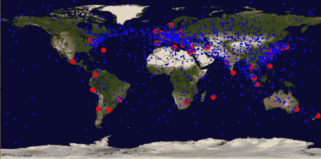](https://sniperinmahwah.wordpress.com/wp-content/uploads/2015/01/optimaltradinglocations.png)

I was very interested to imagine trading servers floating in the middle of oceans, so I decided to reproduce both the under-sea optical fiber cables around the world *and* the nodes of Wissner-Gross & Freer on the front cover of my book. Here is the European part of the cover:

[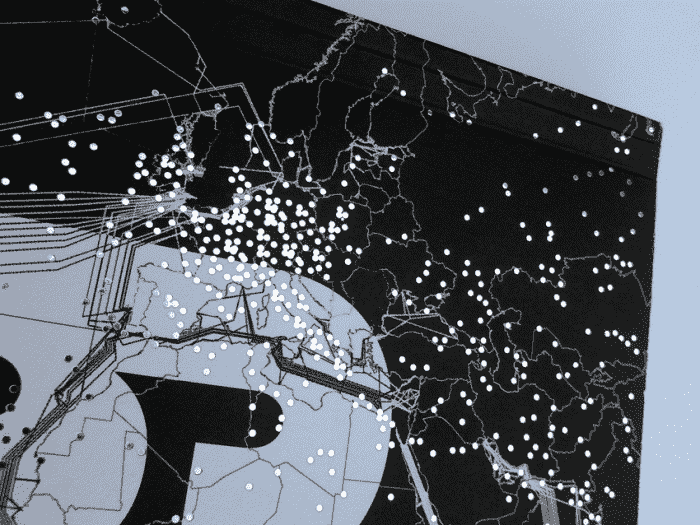](https://sniperinmahwah.wordpress.com/wp-content/uploads/2015/01/20140313_165439.jpg)

“*Note that while some nodes are in regions with dense fiber-optic networks, many others are in the ocean or other sparsely connected regions, perhaps ultimately motivating the deployment of low-latency trading infrastructure at such remote but well-positioned locations”*, the authors write. When I was working on this post, I realized this theoretical research may be not so theoretical. Indeed, on January 21, 2014, a [patent](http://www.google.co.ug/patents/US8635133) was filed in the U.S. by the Massachusetts Institute Of Technology, titled “System and method for relativistic statistical securities trading”, and the names of the “*inventors*” are Alexander Wissner-Gross and Cameron Freer.

This is a practical follow up of their 2010 article with a lot of details about what could be the future of trading. “*The system may comprise a processor configured to calculate a location for a server along a communication link between a first trading center and a second trading center based at least in part on a property of the communication link*”. This system would be better than colocation: “*Placing a server at a location along a communication link between two trading centers in a way that reduces the latencies of information propagation during a distributed trade may allow such trades to occur more frequently and may allow high-frequency distributed trading to occur at a higher speed than using a conventional approach in which a server is co-located with one of the trading centers*”. Here is one chart from the patent:

[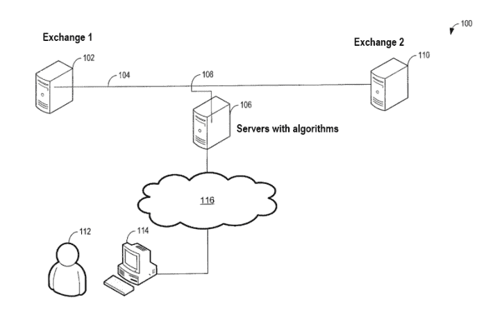](https://drive.google.com/viewerng/viewer?url=patentimages.storage.googleapis.com/pdfs/US8635133.pdf)

Since the servers 116 have to communicate with the exchanges 102 and 108, they need to be located on a communication network 104 at location 108. “*In some embodiments, communication link 104 may be a wireless link implemented using any suitable wireless technology to facilitate information transport without use of wires. Communication link 104 may transmit information using electromagnetic waves of any suitable frequency. For example, frequencies in the radio, microwave, visible, infrared, and ultra-violet ranges of the electromagnetic spectrum may be used. Communication link 104 may comprise any wireless technology for transmitting information including satellites, transmitters, receivers, antennas, repeaters, and/or radios*.”

“*The naive solution is to put preprogrammed computers on either side of a low-latency link*,” says Wissner-Groos in this [interview](http://spectrum.ieee.org/computing/it/financial-trading-at-the-speed-of-light), and the colocation leads to “*an arms race to reduce point-to-point latencies. The next phase is setting up at nodes*”. I remember a discussion with the CEO of a major microwave provider between Chicago and New Jersey; I learnt that most of the customers of this provider need microwaves to collect *data* from one exchange (let’s say the CME in Aurora) so that they can put an order at an other exchange (let’s say NYSE in Mahwah). That means most of HFT firms need super-fast networks to *know* what is happening here and there, and with this data the colocated algorithms can decide to buy and sell products *where* they are implemented/colocated – for instance an algo in Mahwah need to know what’s happening in Aurora about the E-mini S&P future (ES) so that it can trade SPDR S&P 500 ETF (SPY) in Mahwah. That’s why data needs to travel as fast as possible between the two exchanges – the “arms race”.

[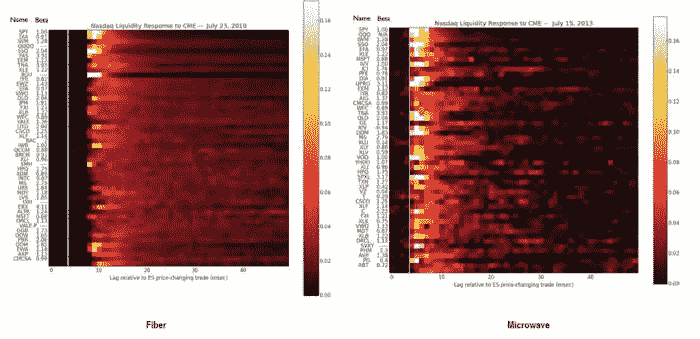](http://oklo.org/2015/01/01/lightspeed/)

If you are a trader and a customer of McKay Brothers’ microwave network (said to be the fastest), the best latency you can get between Mahwah and Aurora is [4.062](http://www.quincy-data.com/product-page/#latencies) milliseconds. Schematically speaking, Wissner-Gross and Freer’s idea is to locate algorithms somewhere around the midpoint between Aurora and Mahwah (the node) so that algorithms could get data in ± 2,031 millisecond (this is a theoretical example as most of the optimal locations for the nodes are generically *not* the exact midpoints). Since the authors filed a patent, and since they [were](http://www.kurzweilai.net/when-the-speed-of-light-is-too-slow) “*currently in talks with financial firms about licensing [their] technique”* in 2010, I assumed their “System and method for relativistic statistical securities trading” may have practical applications, so I wrote to Wissner-Gross and Freer to know more about that. The answer was kind but unfortunately they “*not able to talk about that at the moment*”. Too bad. But a few days after I got this answer, I realized that in 2011-2012 both [Alexander Wissner-Gross](http://www.alexwg.org/companies) and [Cameron Freer](https://www.linkedin.com/in/freer) were Advisory Board Members of a company named… Hibernia. Is that not interesting? I was wondering, for fun: if the system is potentially useful to trading firms, if the fastest communication link is a microwave network, and if the servers/algos have to be located along this link, that would mean algorithms may be placed on towers, right? Given that Belgium is at the midpoint of the London-Frankfurt route, that would mean my backyard may be invaded by algorithms…

##### **THE FUTURE, III: BALLOONS OR TROPOSCATTER?**

“*If trading centers in New York and London were connected by a trans-oceanic fiber-optic cable, it may be prohibitively expensive or impractical to place the server at a location in the ocean, if such a location were determined to be the most suitable location to place the server*”, write Wissner-Gross and Cameron in the patent document. So the question is: how could we place a server in the middle of the ocean? On floating platforms?

Today, a trading firm may use microwave networks between two land-based points but it’s impossible to build a line-of-sight network between the U.K. and the U.S. – unless you erect some floating islands in the Atlantic ocean but that would be complex, and stupid. That’s why, at least for now, there is no other solution than optical fiber cables to cross the Ocean. But on September 23, 2014, *PR Newswire* [announced](http://www.prnewswire.com/news-releases/innovator-windy-apple-announces-transatlantic-plans-and-offers-promotional-pricing-for-new-york-to-chicago-microwave-network-276622811.html) that Windy Apple Technologies (WAT) have plans to “*establish a transatlantic service, using advancements in equipment design and **non-traditional deployment platforms ***[bold is mine].* Plans include high- and low-bitrate networks for low latency links between** New York and London, giving WAT the opportunity to be both first to market and markedly more cost-efficient than the billion-dollar transatlantic fiber systems currently being built by competing providers*”. What are we talking about here?

*“We take a special pleasure in turning unfeasible concepts into feasible ones*”, said Alex Pilosov, WAT’s CEO, who built the first microwave network between Chicago and New York back in 2010 (just one month after the Spread Networks cable became operational). Someone in the HFT/microwave industry told me that “*Pilosov is like the typical Russian engineer who can build a space rocket with two pieces of chewing gum*”. Unfortunately, both WAT and *PR Newswire* don’t give a lot of details about these plans. “*The company’s internal R&D program has explored* […] *relay platform deployments utilizing airplanes, balloons and satellites.*” The word *balloon* may be a lead: at a [Paris conference](http://market-microstructure.institutlouisbachelier.org/?lng=FR) last December, McKay Brothers’ CEO Stéphane Tyc said the microwave networks needed by HFT firms will remain the fastest technology for 4-5 years, before the [Google balloons](http://www.google.com/loon/) show up.

[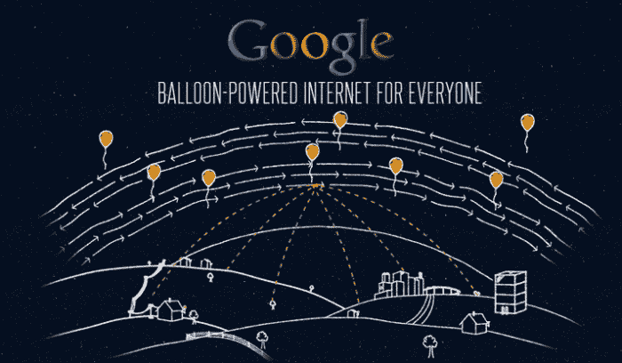](https://sniperinmahwah.wordpress.com/wp-content/uploads/2015/01/6a00e5500b4a64883301b7c71cece9970b.jpg)

I don’t really know how is it possible to build a network with the help of balloons, but I suppose (by oversimplifying) a signal would be sent by a dish located on the top of an exchange and received by a dish placed on a stratospheric balloon, and then the signal would be sent back to Earth to an other exchange? Would *one* high-altitude balloon be enough to cross the Atlantic Ocean, given the fact Earth is a sphere? I’m not sure at all (but this kind of balloon would be a perfect place to locate servers above the Ocean if the Wissner-Gross & Cameron system goes live). Another lead may be found in a [chat](https://twitter.com/windyappletech/status/518965058182053888) I had on Twitter with a Belgian telecom expert who asked if “*these HFT people ever looked into troposcatter as a cheap efficient alternative*” to multiple line-of-sight towers. Alex Pilosov posted this answer: “*Yes, we have. In fact, that’s what gave me the idea to build long-haul wireless*”. Interesting.

The Tropospheric scatter, or troposcatter, is a microwave radio technology that doesn’t need line-of-sight towers. Instead of sending a signal from a tower to another, troposcatter uses the troposphere as a region that affects the signal and returns it to Earth, so the signal can be received by a dish:

[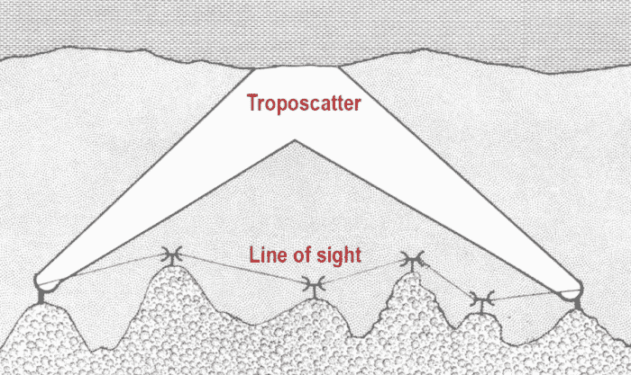](https://sniperinmahwah.wordpress.com/wp-content/uploads/2015/01/tropospheric_scatter.jpg)

With troposcatter communications technology, the signal can travel long distances (up to 1000 kilometers) and both transmitter and receiver don’t need to “see” each other. That’s amazing because most of the old microwave networks I talked about above (NATO’s Ace High, U.S. Army’s Defense Communication System, etc.) were networks of troposcatter relays. The Jump tower in Houtem was a “*DCS troposcatter communication link*”. That would be not surprising to observe that this old military technology may be exploited by high-frequency trading in the future. Troposcatter needs dishes far more bigger than those currently used by the line-of-sight microwave networks. Here is a photography of some abandoned troposcatter dishes erected for NATO’s microwave Ace High network in the U.K.:

[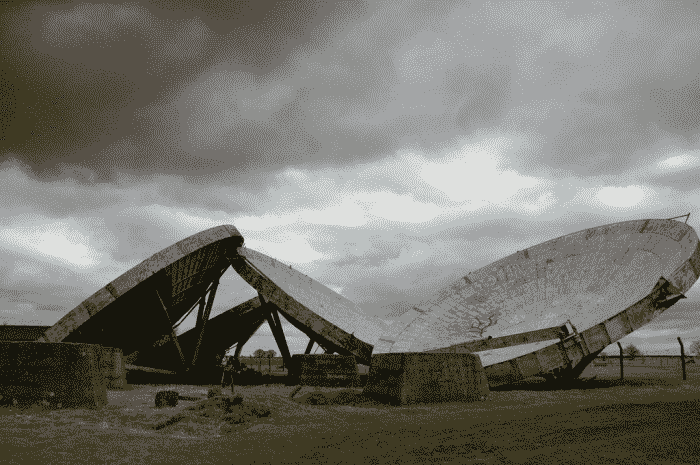](https://sniperinmahwah.wordpress.com/wp-content/uploads/2015/01/tropodishes1.jpg)

I don’t really know if Windy Apple Technologies’ projects will involve troposcatter, and if they will need such big dishes (I don’t think so) but we will see. In sum: it is clear that the arms race is not finished (yet). High-frequency trading will have to dominate nature, again. “*I see this work as one possible justification for making the entire surface of the planet more computationally capable”,* said Alexander Wissner-Gross in this [interview](http://www.kurzweilai.net/when-the-speed-of-light-is-too-slow). “*And in effect, making the whole planet smarter*.” I conclude with this question: what Earth thinks about that?