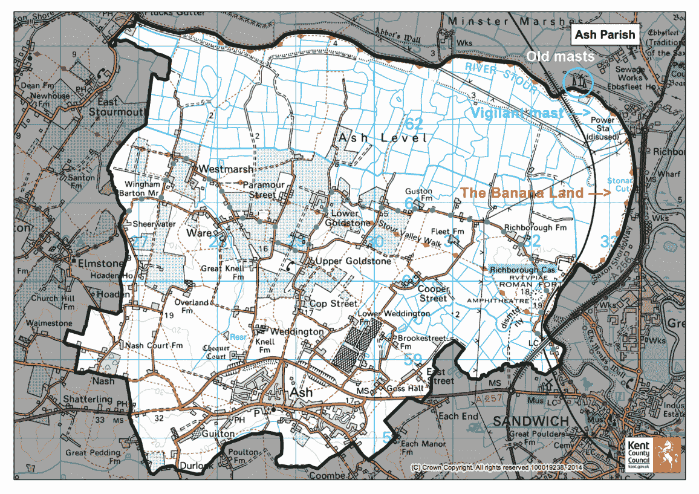
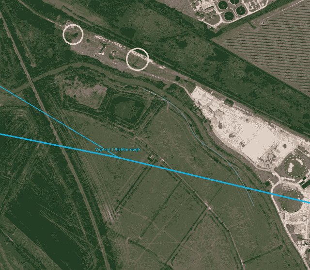
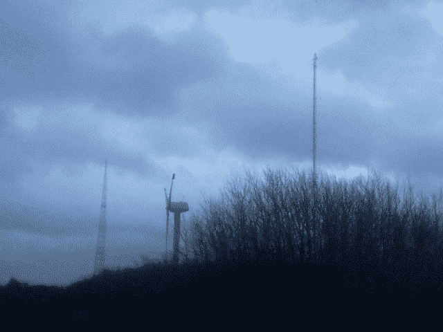
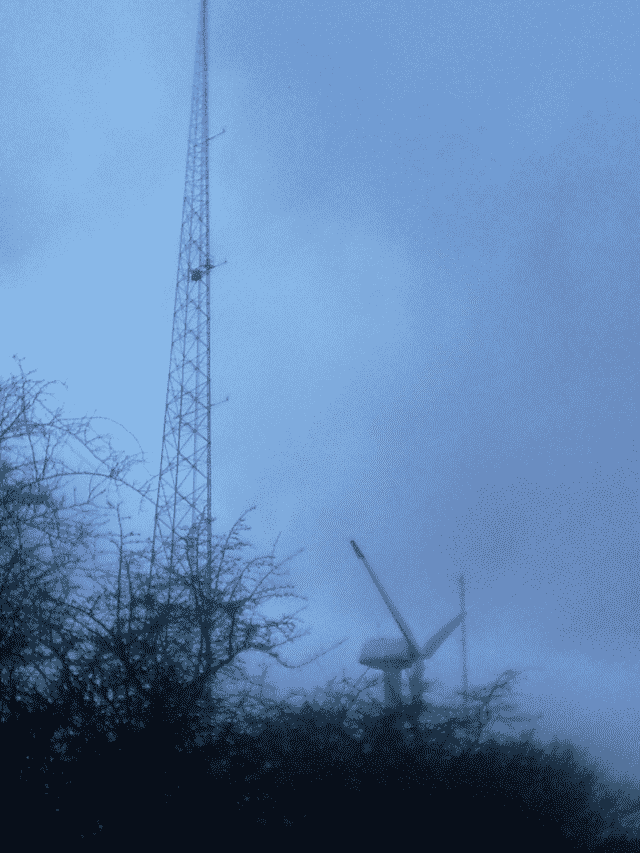
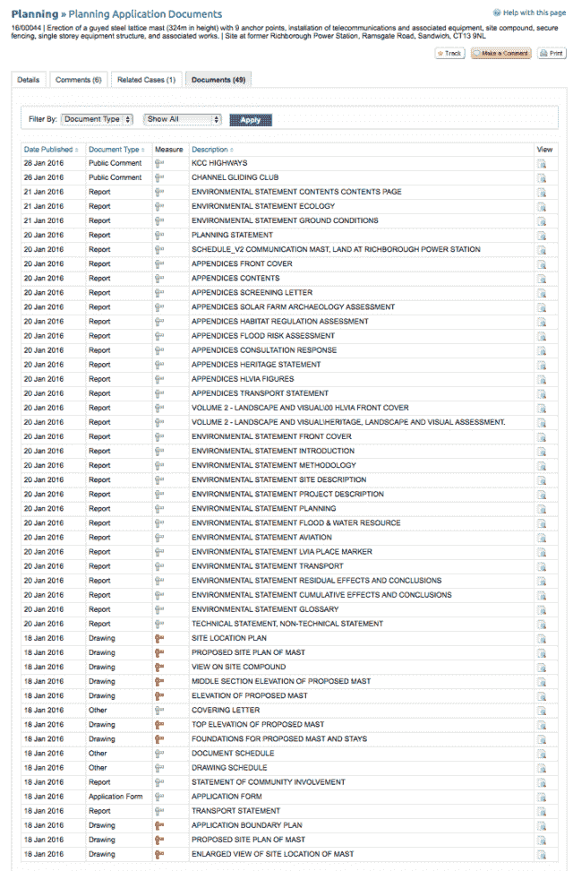
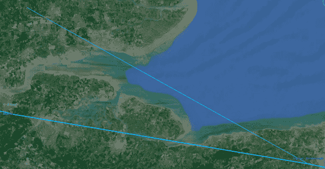
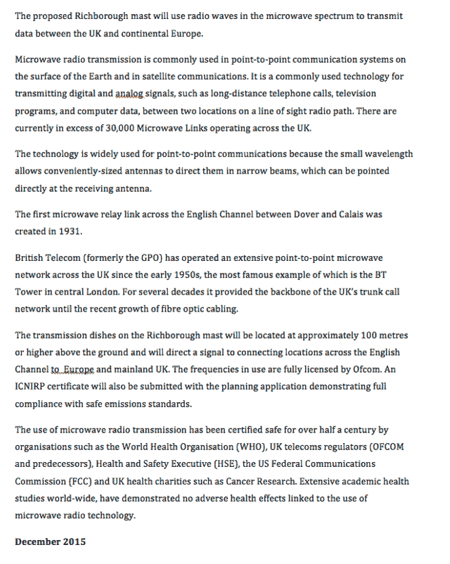

<!--yml
category: 未分类
date: 2024-05-18 14:13:04
-->

# HFT in the Banana Land | Part 2 – Sniper In Mahwah & friends

> 来源：[https://sniperinmahwah.wordpress.com/2016/02/01/hft-in-the-banana-land-part-2/#0001-01-01](https://sniperinmahwah.wordpress.com/2016/02/01/hft-in-the-banana-land-part-2/#0001-01-01)

The high-frequency trading world is always full of surprises, especially when roaming in some landscapes where small or tall towers are invaded by the dishes of HF traders who send signals above our heads. When I discovered (and tweeted about, on January 4th)  the 324-meter mast Vigilant  seeks to build in Richborough, I didn’t know that, three weeks ago, some local residents had taken charge of the project by digging a little the HFT world. Given the recents news coming from Ash, I decided that “[HFT in the Banana Land](https://sniperinmahwah.wordpress.com/2016/01/26/hft-in-the-banana-land/)” will of a spin-off of “HFT in my backyard”. After all, such a giant mast deserves well a longer story. So, here is “HFT in the Banana Land, Part 2”.

First of all, I was wrong about the name “Banana Land”: it doesn’t come from the possible pseudo-tropical of the old Richborough power station, but from the shape of the (curved) area where Vigilant wants to build the mast. The Banana Land is on the northern/eastern end of the Ash Parish:

###### 

It appears that just at the North of the field chosen by Vigilant there is a mind-mill and two existing masts too (here encircled in white):

A local resident of Ash took some photographies of these two masts (one guyed tower, and one concrete tower) and sent them to me so that I could check out if some HFT dishes may already have been there:

But as expected, no dishes in there. The heights of the masts would certainly not be appropriated to cross the Channel – I think these old masts could be used for a very local radio station available to the migratory birds living in the area, no more.

###### THE PLANNING APPLICATION

First part “HFT in the Banana Land” was written before January 18 but was posted online on January 26 only (I was waiting for some technical details about the different Fresnel zones crossing in the Channel). That’s how I missed that: contrary to what I wrote in the first part of this spin-off, the full planning application had been put online. And it’s [here](https://planning.dover.gov.uk/online-applications/applicationDetails.do?activeTab=summary&keyVal=DCAPR_228292). If I’m quite familiar now with the planning application submitted to install dishes on a tower, this Vigilant application is quite big; putting a dish on an existing tower is far more easy that erecting a 324-meter tower, so there are a lof of documents:

I would lie if I write that I have read all these technicals documents from A to Z, but nonetheless I check out the “Proposed site plan of the mast” where we can find more details about the dishes Vigilant wants to put on the tower:

First of all, we learn that Vigilant will use four dishes (at 320m, 310m, 300m and 290m) to send the microwave signal to Belgium, and those dishes are quite big (two are 3.7 meters, and that’s the first time I see such extensive dishes for HFT purposes). Secondly, we can see that Vigilant also indent to put dishes (at 320m and 310m) on the other side of the mast, having a 299° azimuth. These two dishes were not in the pre-planning application and seems to point to around Basildon (and that was expected – with such a tower in Richborough, going to Basildon should be easy with two paths only):

There are a lot of other specifications here and there, especially in the “Statement Of Community Involvement” document, where Vigilant explains (more in details than on their [website](http://www.richboroughmast.co.uk)) how the local communities will benefit from the mast (I briefly wrote about that in the [first part](https://sniperinmahwah.wordpress.com/2016/01/26/hft-in-the-banana-land/) of “HFT in the Banana Land”). If you have time to waste, you also can read all the Environmental Statements (if you want to know more about migratory birds for instance), but that would be long.

###### THE VIDEO THAT KILLS

On the “Statement Of Community Involvement” you can find a picture of one of the meetings with locals Vigilant organized on September 25 and 26 (you can download the exhibition boards on [Richboroughmast.co.uk](http://www.richboroughmast.co.uk/)).  

In addition to those two public meetings, the Ash Parish council announced in October 2015, on their [webpage](http://www.ashpc.kentparishes.gov.uk/default.cfm?pid=news&newsid=11281) dedicated to the “Richborough Communication Mast”, that “*Cascade Communications Ltd, media representative of client Vigilant Global, will give an overview of the mast proposal to parish Councillors between 6.45pm – 7.30pm, at the Library, Ash Village Hall on Monday 2nd November. It is understood a Vigilant Global representative will be present. Providing a Q & A opportunity is a primary focus of the session. The public is welcome to attend*”. It seems that at the two publics meetings of September, the discussions were about the benefits of the mast and “*a little about what Vigilant was going to do with the mast*”, according to residents, so some of them wanted to know more about Vigilant Global activities.

As, under UK law, a resident is allowed to film council meetings, the meeting with Vigilant Global was filmed, but don’t ask how I got it. One of my main frustrations in my investigation on the HFT microwave networks is that I missed this (in)famous auction in Houtem when, in December 2013, big HFT players from Chicago and big law firms from Belgium fought for hours to buy the Houtem tower (the starting price asked by the Belgian State was only €255,000, but hours later the winner, Jump Trading, was happy to pay $5,000,000). I really would have been in this small office, where the auction took place, lost in the Flemish country side. But now I have a video where I can see how one of the biggest HFT firms in the world, DRW, through their subsidiary Vigilant Global, are trying to deal with some council members and  residents. The film-maker asked me not to share it online, but as the meeting was public I am authorized to describe it and, above all, to give transcription of some Q&A – and some are stunning. The meeting took place in the small Ash Library where every Parish council meeting takes place (a 4 by 6 meters room), and the mast was the first subject of the meeting this day.

The Ash Parish offices

The video is one 33-minute still frame (the camera had been put down on a table). The Ash council members were there, along with some residents and, in front of them (and in front of the camera) one people from Cascade Communications (here Mr. PR) and, on his left, a representative of Vigilant (here Mr. Vigilant). Have in mind this video was taken three months ago, on November 2nd, 2015, that is two months before I heard about the Vigilant mast in Richborough, and two months and a half before I wrote the first part of “HFT in the Banana Land”. [My comments are in brackets.] First, Mr. PR repeated again the information provided on the [Richboroughmast.co.uk](http://Richboroughmast.co.uk): the history of the power station, the Nemo Link I talked about in [Part I](http://HFT%20in%20the%20Banana%20Land), the “Banana Land” (laughs), the point-to-point communication between UK and continental Europe, the benefits for the Dover Community Radio, etc. From 06:44, the construction is detailed (the mast, the solar panels, etc.). From 09:18, it’s all about the equipment (the guys, etc). From 10:00 Mr. PR and Mr. Vigilant explained why they need such a giant mast.

Things started to get difficult at 14:49: a resident asks Mr. Vigilant if they will use microwaves on the tower, and Mr. Vigilant give this answer: “*We will use radio waves… but I’m afraid I’m not engineer, but if you want specific questions I can bring your questions to our transmission panel…”,* and the resident answers back, “*I already sent emails but I got no reactions…*”. At 14:39, the same resident asks if the mast “*will be used for high-frequency trading*”, and Mr. Vigilant responds: “*It will to be used to transfer data… and high-frequency trading makes probably 3 or 4% of Vigilant activities… as we also have a real estate business and…*” [Hum hum… 3-4%? Is it credible to spend millions of dollars on a mast if HFT activities only account for 3-4%? It’s a little bit strange.] Next question of the resident: “*Will the mast to be used for high-frequency trading?*”; Mr. Vigilant’s answer: “*I need to check with the traders and come back…*” [???].

Things got worse at 15:57.

*   **Resident**: “*Is the mast part of a HFT network between London and Frankfurt?*” [well, given that Vigilant never referred to HFT in their public document, I realized that this resident was well informed]
*   **Mr. Vigilant**: “*It’s a network between UK and Belgium, yes*” [WFT]
*   **Resident**: “*And doesn’t go to Frankfurt?*”
*   **Mr. Vigilant**: “*I’m not sure where it’s passing…*” [WTF bis]
*   **Resident**: “*Well… so you are not that well aware of high-frequency trading, I see…”* [pow pow pow, take that Mr. Vigilant]
*   **Resident**: “*Where in Belgium does it go to?*”
*   **Mr Vigilant**: “*I think we have provided a map… or certainly it will be map in the planning application*” [ok. so, now there is a network, and a map? if it exists, it’s obviously not in the planning application]
*   **Resident**: “*You already have a connection from the continent to England? It goes by the Two Sisters I think…”* [the Two Sisters refers to the two towers in Swingate, near Dover, where some HFT had put dishes; from that I began to think that 1) this resident did intensive researches on the HFT microwave networks, or 2) he found some information on a blog]
*   **Mr. Vigilant**:  “*No, no…*” [ohhhhh… what about the Nova Scotia [application](https://planning.dover.gov.uk/online-applications/files/028F9965896FBC6892BD99EEFECADA93/pdf/15_00191-ELEVATIONS-276533.pdf)?]
*   **Resident**: “*Vigilant as a mast in Duinkerk [Dunkerque, France]? Or transmitters there?*”
*   **Mr. Vigilant**: “*The mast in the center of Duinkerk? No, we don’t have any equipment there”* [fair enough… that’s possible]
*   **Resident**: “*And the one in Houtem, in Belgium?*” [Houtem!]
*   **Mr. Vigilant**: “*I’m afraid I can’t comment on that…*” [???]
*   […]
*   **Resident**: “*What is the fastest way of communication for high-frequency trading?*”
*   **Mr. Vigilant**: “*I would have to ask…*” [uh?]
*   **Resident:** “*I can assure you: it’s microwave*” [true]

Let’s stop here (the massacre). When the name “Houtem” was drawn, it was evident that this resident had read “HFT in my backyard”. He confirmed it in an email: “*As a hobby I follow financial markets for over 20 years. Not to make money but I just like to know how the world works. I had come by your website before September 2015\. I am the guy who asked the questions about the microwaves. I did indeed find the Houtem mast and Duinkerk information on your blog. Also the link to Frankfurt I found on your blog. By reading your blog I understood that I had to film this meeting. All council members, I had sent a link to your blog, so they were fully aware what HFT and the network was about. I have no problem with companies and banks who make big money, I only want transparency”.*

Dear God… When I tweeted about the mast on January 4th, I was wondering if I was putting Vigilant in a difficult position by exposing publicly that the firm was a HFT firm. But not. Some residents and council members of Ash were well aware of Vigilant Global activites, two months before I heard about the mast from the first time (and I’m pretty sure the guy who sent me the link to the Richborough website is the same resident). That’s the proof information published by a blogger may help the community; information really matters – after all, if Vigilant wants to build this mast, it’s all about getting information before competitors do. This is probably because of “HFT in my backyard” that another resident, from Basildon, posted this public comment on the planning application [webpage](https://planning.dover.gov.uk/online-applications/applicationDetails.do?activeTab=neighbourComments&keyVal=DCAPR_228292), mocking Jump Trading :

My anonymous resident from Ash adds: “*I really don’t understand why they didn’t prepare [the meeting]*”. This is more than “they didn’t prepare”: this meeting is a (not flash) crash. Why Mr. Vigilant denied about microwaves? Given the accurate questions about Swingate, Houtem, Duinkerk, Frankfurt and so on, Mr. Vigilant should have understood that the people in front of him were well aware of what his firm is doing. I am sorry to have put Mr. Vigilant in such a difficult position, but denying what is public information was not a good idea at all (even without my blog, as the local wrote me, “*one simple Google search and you find out that Vigilant Global is a HFT company and that they use microwaves for their communication*”). As Mr. Vigilant did not provide answers to the questions from the council members, the council asked for a written response, [released](http://www.ashpc.kentparishes.gov.uk/default.cfm?pid=news&newsid=11281) by the Ash council on January 22:

At least this time they admit using microwaves, but why they still don’t confess their signal will cross not only the Channel but also my backyard? That’s strange. Anyway, I’m really wondering how is that possible a firm could be so good in designing microwave networks but so bad in public relation. I’ll devote Part 4 to some of the technical questions (asked during the meeting) regarding regulation of microwaves (it seems some residents have issues with safety). In the meantime, a last fun fact: on the other side of the Channel, one of my Twitter followers wrote me: “*We own a flat on the last floor of the Ostduinkerk tower”.* What a coincidence! “*Now let’s figure out a way to cash in.*” Lol. He’ll probably give me some news from his grand-mother, who lives there and has let people use the flat for a feasibility study… Last but not least, a new council meeting will take place in Ash today, at 6:30 pm. Council members will decide when they’ll all meet to make a decision about the Vigilant mast (probably by the end of February). And that’s not impossible I could get a new video.

###### THE CLIFFHANGER

The story of the yellow and red pins I’ll detail in Part III will be worth reading. Stay tuned.