<!--yml
category: 未分类
date: 2024-05-18 14:12:45
-->

# HFT in the Banana Land | Part III – Sniper In Mahwah & friends

> 来源：[https://sniperinmahwah.wordpress.com/2016/02/12/hft-in-the-banana-land-part-iii/#0001-01-01](https://sniperinmahwah.wordpress.com/2016/02/12/hft-in-the-banana-land-part-iii/#0001-01-01)

Well well well. The last days have been so intense that I don’t know where to start. Working on “HFT in y backyard” (season 1) was quite amazing, but this “HFT in the Banana Land” spin-off just goes crazy. One of my insiders working in the very little world of the HFT microwave networks regularly push me to write a book on his world, I regularly respond that I already wrote a book on HFT, but I may change my mind. *Flash Toys* would be a great title for such a book. We will see. In the meantime, let’s see what is happening in the banana land, and in my backyard. 

###### NEWS FROM ASH

My informant from Ash (let’s call it Mr. Resident), who sent me the terrible video I talked about in [Part II](https://sniperinmahwah.wordpress.com/2016/02/01/hft-in-the-banana-land-part-2/), attended the last Council meeting where it was decided that the Vigilant Global application would be discussed by the Ash Parish Council on February 15th (next Monday). As [announced](http://www.ashpc.kentparishes.gov.uk/UserFiles/file/Telecommunications%20mast%20notice%20re%2016_00044.pdf) [on](http://www.ashpc.kentparishes.gov.uk/default.cfm?pid=news&newsid=11281) the Council [website](http://www.ashpc.kentparishes.gov.uk/default.cfm?pid=news&newsid=11281), “*this is a public meeting and parishioners are able to speak during the public contribution time to state their views on the planning application*”. I will devote Part IV to this meeting (Mr. Resident will film it), to the public [comments](https://planning.dover.gov.uk/online-applications/applicationDetails.do?activeTab=makeComment&keyVal=DCAPR_228292) made on the application website and to safety issues with microwave – in short, all the public comments are against the giant tower Vigilant Global wants to erect in the Banana Land; this is not a good start, and I feel that some residents will fight vigorously against the tower.

There is an interesting anecdote. I told Mr. Resident that he should look around for unknown faces in Ash, and especially during the Council meetings. The reason was that I know (Vigilant) competitors may send someone to attend these meetings in order to get intel about what is going on. I know for instance that different rivals of Jump Trading attended the (now famous) auction where the Houtem tower was sold to Jump, in December 2013, for €5,000,000\. So I told Mr. Resident to be attentive. And he was: after the last Council meeting in Ash, on February 1st, Mr. Resident and other speakers talked about 10 minutes and then they all went home. Mr. Residents “*rolled a cigarette walk a little up and down outside. At that point a guy walked up to me and asked me about the mast. I asked him if he was a local and he told me he came from Wingham (A village up the road). One of his first question was, what date is the meeting about the mast? I thought that was strange, and told him that I didn’t know the date. Ooh it will be on the council website he told me. I said that is correct. Then he asked me what is it for a mast you talk about so I explained that it was a microwave masts for a network between London and Frankfurt. The conversation became really strange from this point onwards*.” Hum…

This strange visitor started to ask questions to Mr. Resident: “*How many mast are there on this route? How dangerous are these microwaves? Why are your so interest in this all? Why are you opposing this mast? Where do you live? What kind of work do you do?*” “*Bizarre questions for someone who is a local and has ‘never’ heard of the mast Vigilant wants to build*” told me Mr. Resident, and indeed, this is weird. “*He never was inside the meeting and when we said goodbye he walked back to his car. It was a big gray pick-up he looked to me like a service engineer, they are always late :)*.” Who is this strange visitor? Will he be at the next Council meeting? Or will he try to get intel from the residents after the meeting, wandering around in the streets of Ash plunged in the night? As Calvin Cordozar Broadus Jr, aka Snoop Dogg, said once, “*just chill, ’til the next episode…*”

###### FROM RICHBOROUGH TO OSTDUINKERKE

[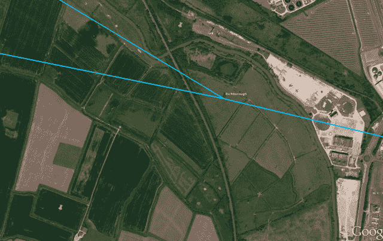](https://sniperinmahwah.wordpress.com/wp-content/uploads/2016/02/wcw-rich1.png)

I ended [Part II](https://sniperinmahwah.wordpress.com/2016/02/01/hft-in-the-banana-land-part-2/) with the picture above. The blue lines are the Vigilant Global paths from Richborough. The application for their mast came out in January 2016 but Ofcom (the radio regulator in the UK) granted new [licences](http://spectruminfo.ofcom.org.uk/spectrumInfo/licences?googloc=(51.31135470844741%2c+1.338486671447754)&code=301010&se=(51.30767941763878%2c+1.3443660736083984)&googoffset=0.4&nw=(51.315029704889824%2c+1.3326072692871094)&unit=GHz&ne=(51.315029704889824%2c+1.3443660736083984)&service=Fixed+Links&sw=(51.30767941763878%2c+1.3326072692871094)&submit=Submit+search&groupKey=2) for Vigilant Global in Richborough in April 2015\. Back at that time I was far from thinking that they would try to build a giant tower, but this was not the first time some HFT competitors were lurking in Richborough. This is what the two yellow pins tell, and this is a very interesting story. In order to fully understand what is going with these two yellow pins, let’s have a look again at the different microwave paths crossing the Channel:

[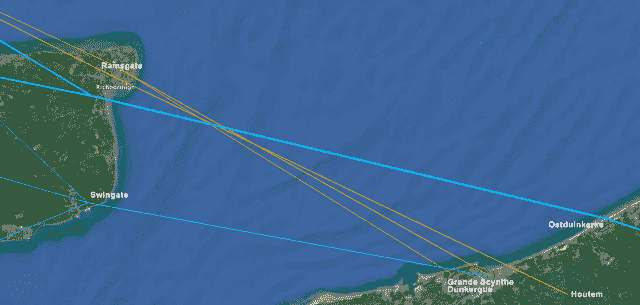](https://sniperinmahwah.wordpress.com/wp-content/uploads/2016/02/channel-20161.png)

Optiver and McKay Brothers goes from Grande-Scynthe/Dunkerque to Ramsgate. Vigilant (as far as I know) goes from Dunkerque to Swingate. And Jump sends the signal from their tower in Houtem to Ramsgate (more exactly, to a tower located near the Manston airport). The story the two yellow pins tells is this one. In June 2013, two years before Vigilant booked Ofcom licences for their (possible) mast in Richborough, Jump was already there and booked a licence in a field at 30 meters only from the (possible) Vigilant tower:

[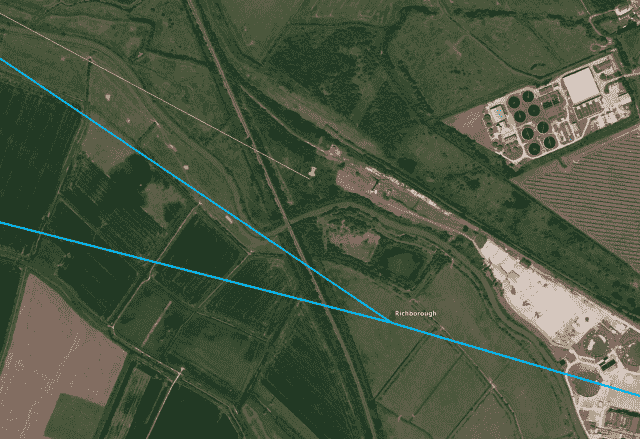](https://sniperinmahwah.wordpress.com/wp-content/uploads/2016/02/j11.png)

Jump in Richborough. June 2013

Vigilant was not the first HFT firm to think about the Banana Land. Thit is just the beginning. In 2014, Jump asked for more Ofcom licences there…

[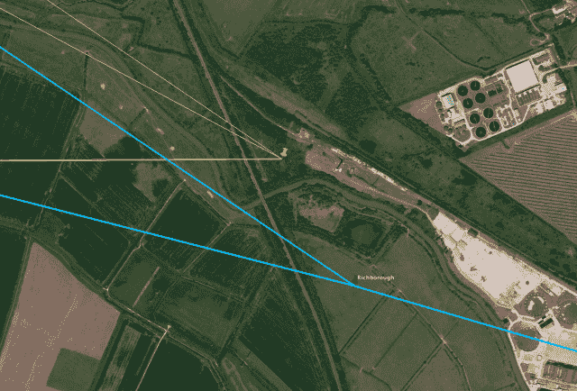](https://sniperinmahwah.wordpress.com/wp-content/uploads/2016/02/j2.png)

Jump in Richborough. 2014

… and more in 2015…

[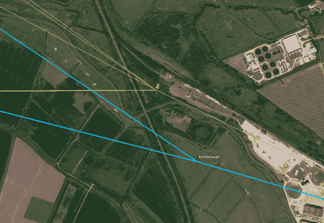](https://sniperinmahwah.wordpress.com/wp-content/uploads/2016/02/j3.png)

Jump in Richborough. 2015

… and one of these last licences granted in 2015 is for path between Richborough and the famous Houtem tower:

[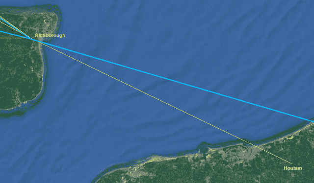](https://sniperinmahwah.wordpress.com/wp-content/uploads/2016/02/j4.png)

There is a (small) tower in the field where Jump has these licences. This is one of the two masts Mr. Resident shoot for me:

[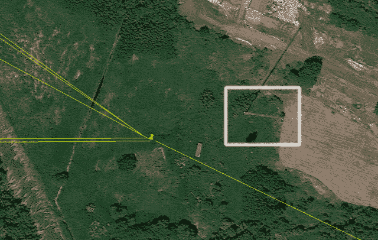](https://sniperinmahwah.wordpress.com/wp-content/uploads/2016/02/j6.png)

[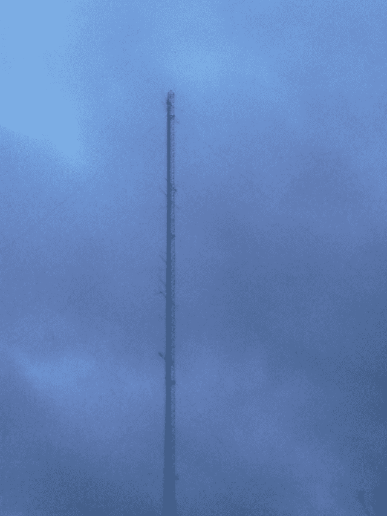](https://sniperinmahwah.wordpress.com/wp-content/uploads/2016/02/sunp0128.jpg)

Now, the question is: what are the plans of Jump in Richborough from 2013? If this tower would have been appropriate, Jump should have put dishes on it for a while, so that they could have their Houtem-Richborough path. But Jump didn’t. If the tower is not appropriate, why Jump continued to book Ofcom licences there in 2014 and 2015? Did they think about erecting a (giant) tower? Or is it a kind of “spectrum squatting” I talked about in “HFT in my backyard”, [episode 4](https://sniperinmahwah.wordpress.com/2014/11/03/htf-in-my-backyard-iv/)? Who knows. In any case, the most spectacular move that Jump recently made is involving another field, just one kilometer south of the area where Vigilant wants to build their tower:

[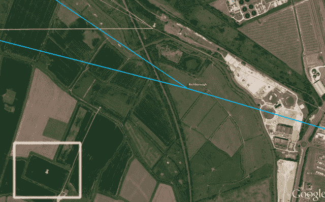](https://sniperinmahwah.wordpress.com/wp-content/uploads/2016/02/j5.png)

But let’s have a look at the other side of the Channel, in Ostduinkerke, the city of Belgium where Vigilant wants to install dishes to cross the Channel from Richborough.

###### *DALLAS* IN OSTDUINKERKE

Ostduinkerke is where “HFT in the Banana Land” goes crazy. A reader of “HFT in the Banana Land, Part 1” sent me these words: “*We own a flat on the last floor of the Ostduinkerk tower.” *What a coincidence. He added, maliciously: “*Now let’s figure out a way to cash in* 😀” (sounds a good idea – this is the social value of HFT). Let’s name this reader Mr. Resident 2\. Mr. Resident 2 sent me a few more words days after: “*Promise you won’t laugh”.* I will try to.* “My grandmother received 2000 euros to let people use the flat for a feasibility study. It is on the last floor of the building. I asked for additional information: when? who?”*Whoa. The answer came soon: the “who” is a firm named Nova Scotia. And who is behind Nova Scotia? Vigilant Global. Incredible. I almost fell off my chair. Vigilant paid the grandmother of one of my readers to test the roof of a building, in my backyard. Unbelievable. But it was just the beginning. You can imagine that, with such an informant like Mr. Resident 2, I’m now well aware of what happened in this building since early 2015. This is a delicate and very sensitive situation, and I decided to make it simple: I won’t reveal what I’m not supposed to know, but the story of Ostduinkerke is worth telling. This is huge. First, let’s have a look at the building.

[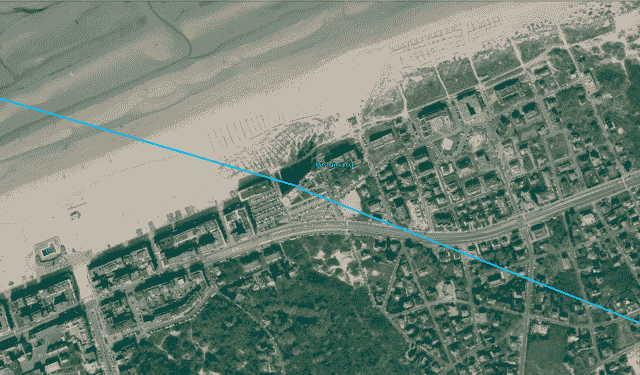](https://sniperinmahwah.wordpress.com/wp-content/uploads/2016/02/capture-d_c3a9cran-2016-02-11-c3a0-15-13-23.png)

It is the typical West Coast (of Belgium) building, where you can rent flats for holidays – the “backyard” I described in [S01E01](https://sniperinmahwah.wordpress.com/2014/09/22/hft-in-my-backyard-part-i/). The building is 60-year old and 54-meter high. It’s perhaps one of the highest buildings on the coast, and it’s well located, at 500 meters from the perfect straight line between Frankfurt and Slough.

[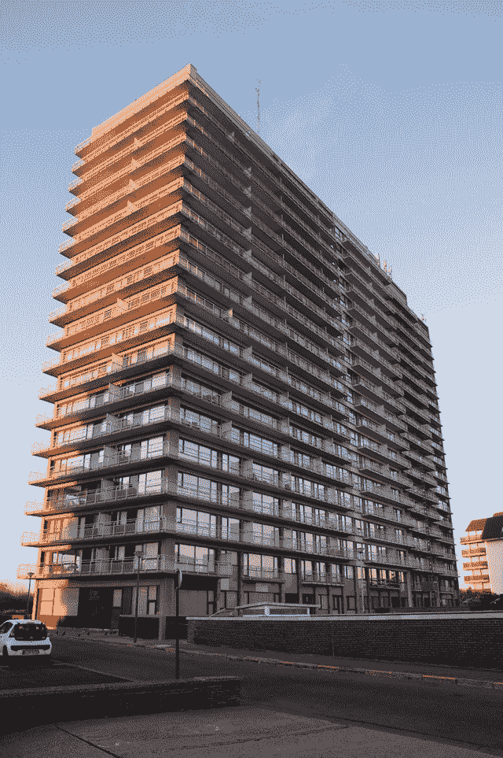](http://theantennasitearchive.com/belgium-koksijde-europaplein-pictures.html)

It’s important to note that the building has five sections. Each section is a different property, so each section has a manager, and each roof is independent. If a firm wants to install something, let’s say on Section 4, this firm has to deal with with the manager of Section 4 only. Here is a chart highlighting the different sections and the flat of the grandmother of my reader:

[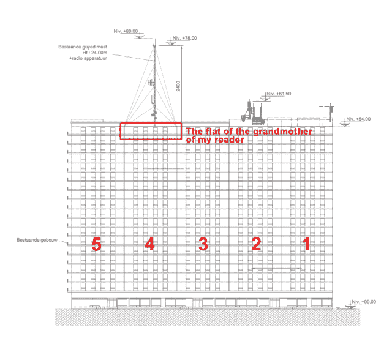](https://sniperinmahwah.wordpress.com/wp-content/uploads/2016/02/21-plan1.png)

I have been told relationships between the different sections may be a little bit tense (they may have divergent interests about the common areas of the building, etc.). Whatever. Early 2015, Vigilant got in touch with the manager of Section 4 through a Belgian law firm and asked to erect a 31-meter mast on the roof of Section 4 with dishes on it. Why Section 4? Because the roofs of Sections 1 and 2 are already full by telephone antennas (impossible to put a mast there), Section 3 does not want antennas (as seen in the drawing above), and there is a sauna on the roof of Section 5 (too bad: that would have been classy to put high-frequency trading dishes on a pool of liquidity). All that was left was Section 4, where a 18-meter mast is there, erected for the dishes of a local [radio](http://theantennasitearchive.com/belgium-koksijde-europaplein-pictures.html) years ago. Vigilant proposed to replace this mast by a higher (31-meter) tower where both the Vigilant dishes and the radio dishes could colocate – fair enough. The building being 54-meter high, that would put the Vigilant dishes at 85 meters (sounds good to cross the Channel). So, Vigilant rent the flat of the grandmother of my reader to test the stability of the roof (back at that time the flat was under work, it was the right time to break holes into the walls).

According to Mr. Resident 2, dealing with Vigilant was a long process – apparently the firm was quite discrete about the purposes of the dishes, “*tout est bien enrobé de mystère*”, Mr. Resident 2 wrote me. Vigilant proposed Section 4 [censured] euros per year as a rent for the mast *and* asked Section 4 if the other Sections would be interested to be paid [censured] euros per year, so that nobody could put the same kind of dish on the roof of the other Sections (the argument was: “*we may have problems with interferences*”, but one can assume that Vigilant was trying to prevent competitors to be on the same building). It seems that when the Vigilant proposal/documents were sent to the residents of Section 4, some of them were a little bit afraid by the 31-meter mast, but after all they already had a mast on this roof and, above all, the amount of money proposed by Vigilant was big enough, and Section 4 needed the money (a good price in the HFT world for such a rent). That’s how a contract between Section 4 and Vigilant was signed in November 2015\. So far, so good.

Let’s go directly to the craziest event of the story. Around the same time (November 2015), Section 4 met (or called) the managers of Sections 1, 2, 3 and 5 and said, “*Well, we have this firm who wants to build a mast on our roof, and they propose to pay you [censured] euros a year just because they don’t want the same kind of dishes on your roofs*”. According to Mr. Resident 2, Section 4 attended a meeting hosted by Section 1 (where it’s impossible to erect a mast) and told everybody about the Vigilant proposal. Again, stay seated in your chairs. Section 1 responded that they don’t need the [censured] euros because they were approached by a firm who is willing to pay 40,000 euros per year to put a dish on the roof of Section 1. Take that in your face, Section 4. Keep your pathetic [censured] euros, we will receive far far more. Crazy.

When Mr. Resident 2 told me about this meeting, I wondered: “Who the f*** is willing to pay 40,000 euros a year to put dishes on the roof of such a building? What’s going on here?” As far as I know, this is more than the usual rent for antennas. So I asked for data. And Mr. Resident 2 told me that Section 4 tried to know more about this mysterious firm, but Section 1 didn’t want to reveal details; they only told Section 4 that they have been contacted by a mysterious English man with an Irish, or Welsh, accent, working for a firm whose name is something like “Network Lines Incorp.” (here I told myself: “*no no no… that can’t be them… this is crazy…*”), and sent Section 4 a blacked-out page where the only visible thing is a big microwave [dish](http://www.commscope.com/catalog/andrew/product_details.aspx?id=29167&tab=3) (hum…); the only detail Section 1 shared with Section 4 is: this microwave dish will be used to send a signal to [Egem](https://sniperinmahwah.wordpress.com/2015/02/03/hft-in-my-backyard-the-last-tower/), and this is for a network going to Frankfurt.

My God. There is no doubt: the mysterious firm who contacted Section 1 is a high-frequency trading firm. This is a competitor of Vigilant, who has signed with Section 4\. We now have two HFT firms on the same building in Ostduinkerke, dealing secretly with two different Sections. I couldn’t believe it. This is a true soap-opera. Obviously, the questions here are: who is this second firm? What are they playing at? As it’s impossible to put a mast on Section 1, is it possible to cross the Channel with a dish at 54 meters above sea level? And where would be the other tower, or building, in the UK? I don’t know a firm named “Network Lines Incorp.”, but my first instinct was: that sounds like “New Line Networks” – I wrote [before](https://sniperinmahwah.wordpress.com/2015/02/19/hft-in-my-backyard-new-line-networks/) about New Line Networks, which is a joint-venture between two of the most powerful HFT firms in the world, Jump Trading and KCG (ex-Getco). Is it possible that Jump and KCG compete with Vigilant in Ostduinkerke? Is this mysterious guy with an Irish, or Welsh, accent, work for New Line Networks?

It would have been difficult to answer the question in November 2015, when Section 4 found out that a rival of Vigilant offered to pay 40,000 euros per year to Section 1 for the same kind of dish. But we may have an answer now. And it comes from Richborough. Let’s get back to the other side of the Channel, and to this field I talked above, one kilometer south of the possible future Vigilant tower:

It appears that New Line Networks has a bulk of Ofcom [licences](http://spectruminfo.ofcom.org.uk/spectrumInfo/licences?googloc=(51.30569410161817%2c+1.3248825073242188)&code=301010&se=(51.30386968144287%2c+1.3278007507324219)&googoffset=0.2&nw=(51.30751844926912%2c+1.3219642639160156)&unit=GHz&ne=(51.30751844926912%2c+1.3278007507324219)&service=Fixed+Links&sw=(51.30386968144287%2c+1.3219642639160156)&submit=Submit+search&groupKey=1) in this field. But that’s not the point. The point is: on January 14th, 2016 (a few days before Vigilant released the planning application for their mast in Richborough – interesting timing ;), Jump Trading, under their alias World Class Wireless, was granted a new Ofcom [licence](http://spectruminfo.ofcom.org.uk/spectrumInfo/licences?googloc=(51.30572093078552%2c+1.3250112533569336)&code=301010&se=(51.30341356506701%2c+1.3287019729614258)&googoffset=0.3&nw=(51.30802818050274%2c+1.3213205337524414)&unit=GHz&ne=(51.30802818050274%2c+1.3287019729614258)&service=Fixed+Links&sw=(51.30341356506701%2c+1.3213205337524414)&licenceNum=1066535&submit=Find%20licence). Only one, here in yellow:

[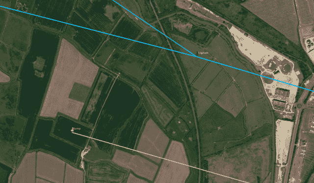](https://sniperinmahwah.wordpress.com/wp-content/uploads/2016/02/jump-2016.png)

And this is or a path between Richborough… and Ostduinkerke. Dear God. The same building where Vigilant wants to be. This is grandiose.

[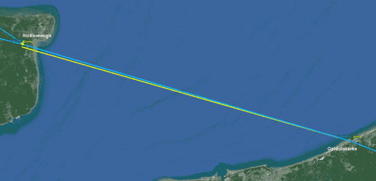](https://sniperinmahwah.wordpress.com/wp-content/uploads/2016/02/channel-2016-ost1.png)

[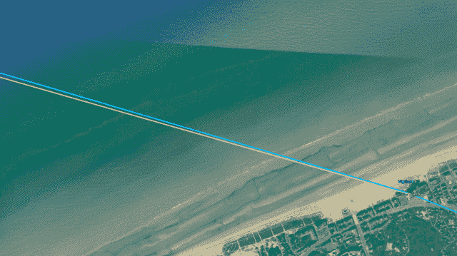](https://sniperinmahwah.wordpress.com/wp-content/uploads/2016/02/ost.png)

As one of my industry contact told me, when I realized that: “*Jump wants to piss on Vigilant’s plans, this is normal life!*”. Erf. The small world of high-frequency trading is incredible. We don’t know if the mysterious English man with an Irish accent who got in touch with Section 1 is working for Jump, or World Class Wireless, or New Line Networks – but given the last Ofcom licence asked by Jump, that’s highly probable. Even if Jump put dishes on the roof of Section 1 of the Ostduinkerke building, they have nothing in Richborough – no dishes, no tower, only a field. Just a field. So what they are trying to do in Ostduinkerke right now? Will Section 1 grant the dishes of Jump in Ostduinkerke? Will Vigilant be allowed to erect their mast in Richborough? Is this guy with an Irish accent a colleague of the guy who asked strange questions to Mr. Resident (1) in Ash? We don’t know – yet. “*Just chill, ’til the next episode…*”

###### THE CLIFFHANGER

Now, here is the craziest thing of the story. It was very unlikely that a reader of this blog would own a family flat in Ostduinkerke. And it was unlikely that *this* flat owned by the grandmother of Mr. Resident 2 would be used by Vigilant to test the roof of the flat/of Section 4\. But there is more, and this is, again, a soap-opera. You won’t believe it. Can you guess who Mr. Resident 2 is working for? Any idea? You will never find, so I will answer the question: Mr. Resident 2 is working for… for… for… Optiver APAC. Can you believe that? Optiver, my friends. A competitor of both Vigilant and Jump! Crazy. Vigilant paid 2,000 euros for a feasibility study to the grandmother of someone who is working for a rival – and I’m pretty sure Vigilant didn’t know that. Purely unbelievable. I love high-frequency trading. Really.