<!--yml
category: 未分类
date: 2024-05-18 14:11:50
-->

# HFT in the Jungle – Sniper In Mahwah & friends

> 来源：[https://sniperinmahwah.wordpress.com/2016/03/15/hft-in-the-jungle/#0001-01-01](https://sniperinmahwah.wordpress.com/2016/03/15/hft-in-the-jungle/#0001-01-01)

*What do people make of places? The question is as old as people and places themselves, as old as human attachments to portions of the earth. As old, perhaps, as the idea of home, of “our territory” as opposed to “their territory,” of entire regions and local landscapes where groups of men and women have invested themselves. […] In this convulsive age of uprooted populations and extensive diasporas, holding onto placesand sensing fully the goodness contained thereinhas become in**crea**singly difficult, and in years to come, I expect, it may everywhere be regarded as a privilege and a gift.* Keith Basso, *Wisdom sits in places*, 1982

I am not a fan of zombies, but in cases of insomnia TV series are a good way to relax. The first episode of *The Walking Dead*, season 6, did not disappoint (for those who do not know *The Walking Dead*, this is the story of human survivors who try to stay alive in a world full of *walkers* who look like zombies). In this episode the human “refugees” found out about a camp of zombies locked in an old stone quarry.

There was a risk the zombies could escape from the quarry and invade the relocation camp where the heroes have been “living” since season 5, so the human refugees decided to release the zombies by creating a long path (with, sometimes, fences) where they could guide the walkers. The idea (that turned bad – this is TV) was to evacuated the walking deads from the relocation camp area.

[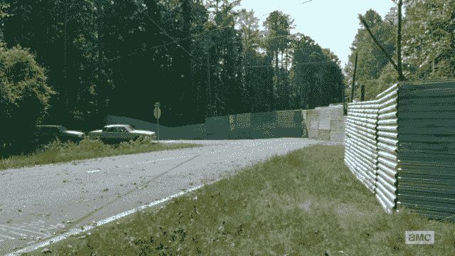](https://sniperinmahwah.wordpress.com/wp-content/uploads/2016/02/capture-d_c3a9cran-2016-02-16-c3a0-09-46-44.png)

We have this kind of shot, where the zombies are walking along the roads:

The first thing I thought of was: that really looks like the videos of the Middle East migrants made with drones in Eastern Europe, where long lines of refugees are walking in the country side:

[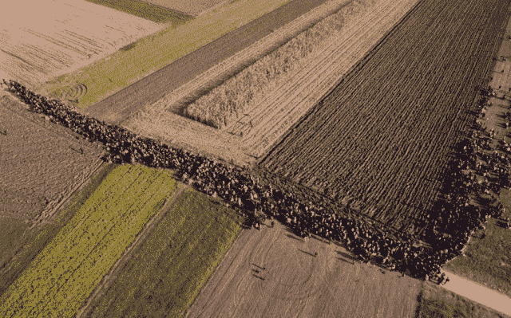](https://sniperinmahwah.wordpress.com/wp-content/uploads/2016/02/potd-drone-migrant_3482915k.jpg)

[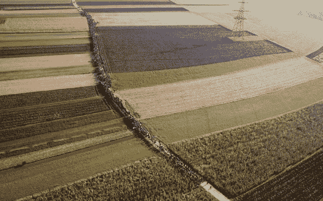](https://sniperinmahwah.wordpress.com/wp-content/uploads/2016/02/slovenia-migrants-_3482960k.jpg)

In *The* *Walking Dead, *one of the heroes is driving a motorbike and takes the zombies through a road…

[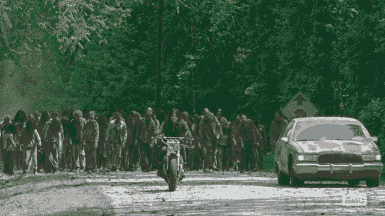](https://sniperinmahwah.wordpress.com/wp-content/uploads/2016/02/capture-d_c3a9cran-2016-02-16-c3a0-09-47-21.png)

… and in the real life, in Macedonia, police takes the human refugees through a pathway:

[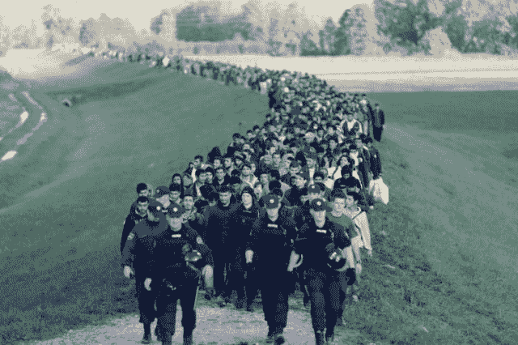](https://sniperinmahwah.wordpress.com/wp-content/uploads/2016/02/slovenia-asks-eu-police.jpg)

I don’t know if the *The Walking Dead* screenwriters had the migrants in mind, but I’m pretty sure they did. After all, a lot of people think the human beings fleeing wars or dictatorships are not “like us” – because they are predominantly Muslim, allegedly poor, and so on. They are “The Other” invading “our territory”. The way *The Walking Dead* heroes build fences and paths against the zombies and the way some countries in Eastern Europe build fences against the migrants are similar. I won’t share my political thoughts about how the European Union (the suit-and-tie guys working at 2,5 kilometers from me) is managing the refugees (in three words: this is shameful). I just want to focus on an area where the migrants “meet” high-frequency trading (HFT): the Channel.

###### FROM THE BANANA LAND TO THE JUNGLE

For a few microseconds, let’s quit the [Banana Land](https://sniperinmahwah.wordpress.com/2016/01/26/hft-in-the-banana-land/) of Richborough (the long Part IV will be released later this week) and let’s go to the Jungle, on the other side of the Channel. The Jungle is a location in Calais, France, where thousands of migrants “live” in a camp. It’s said to be the “worst” refugees camp in Europe, where 3,000 people (including a lot of children) survive in the mud – they were 6,000 two months ago.

[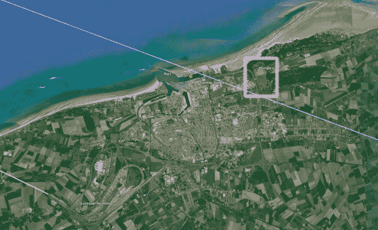](https://sniperinmahwah.wordpress.com/wp-content/uploads/2016/02/capture-d_c3a9cran-2016-02-16-c3a0-13-19-051.png)

The Jungle looks like a city now (the southern part was demolished last week):

[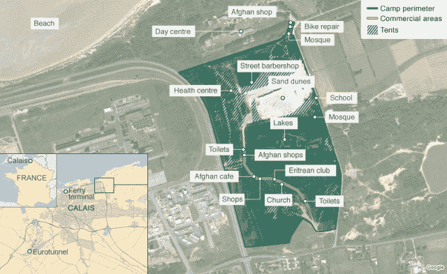](https://sniperinmahwah.wordpress.com/wp-content/uploads/2016/02/refugees-world.png)

Why this shanty town is located in Calais? Because the migrants want to do what high-frequency traders are doing: to cross the Channel. The Calais-Dover path is the shortest one between the continent and UK, that’s why the first microwave transmission test made *in the world* occurred between Calais and Dover, in 1931, and that’s why the refugees are there in 2016: because it’s the shortest path; because there is a port with ferries going to the kingdom; because the Eurostar terminal is full of trucks that offer the possibility of a new world (for what it’s worth). There are a lot of paths to cross the Channel around the Jungle – if you are lucky, because the French national authorities put a lot of fences around the critical areas, including heartbeat sensors used to check if the trucks carry human beings.

[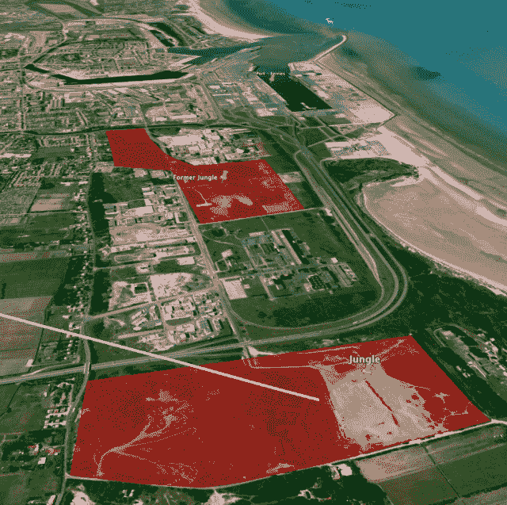](https://sniperinmahwah.wordpress.com/wp-content/uploads/2016/02/capture-d_c3a9cran-2016-02-16-c3a0-16-42-05.png)

Because of geography, Calais is an ending point for some of the Middle East migrants who want to go in England. That’s why the Jungle is there. Now let’s have a look to the refugee’s trajectories. In the high-frequency world, the best technology (at least for now) to carry information from an exchange to another is called “a microwave network”. As I detailed it before, different competitors (trading firms such as Optiver or Vigilant Global, or microwave providers such as McKay Brothers) have built their networks for the same purpose: being the faster between two points (here, around my backyard, the two points are three: Frankfurt, Slough and Basildon); and being the faster implies to build a network of dishes that is as close as possible to the straight line between the points. This is the [Banana Land](https://sniperinmahwah.wordpress.com/2016/01/26/hft-in-the-banana-land/) story, the reason why Vigilant Global wants to erect a 320-meter tower in Richborough: with this mast, the firm would get a full path very close to the straigth line between Frankfurt and Slough:

It seems that the refugees have the same problem: find the best straight path between where they come from to (let’s say) Calais. Here is chart detailing the trajectory of Khan, an Afghan young boy, who travelled from Kabul to Calais via Greece. I added the straight line (in black) between Athens and Calais (this straight line crosses the Eastern Europe countries, that’s the reason fences reappeared there):

Here is another [chart](http://www.martingrandjean.ch/data-visualization-map-refugees/) showing different refugees’ trajectories. Calais is the black dot, and we can see that the Jungle seems to be the ending point of a lot of lines:

[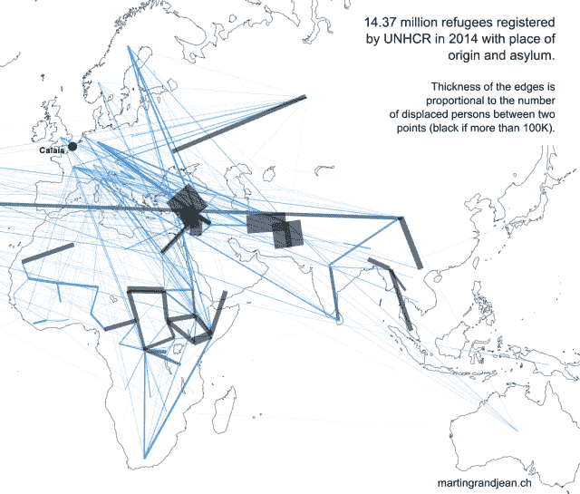](https://sniperinmahwah.wordpress.com/wp-content/uploads/2016/03/refugees-world.png)

Here are two more charts, from the *[New York Times](http://www.nytimes.com/interactive/2015/06/21/world/map-flow-desperate-migration-refugee-crisis.html?_r=1)*; again I added Calais, which is the penultimate step before what the refugees think to be “El Dorado” (the kingdom): 

[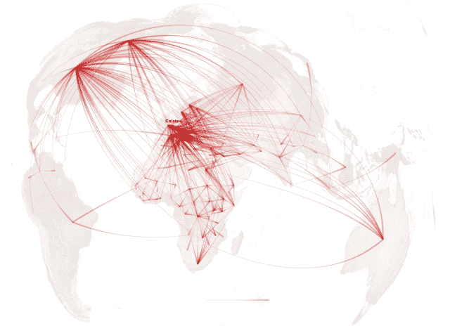](https://sniperinmahwah.wordpress.com/wp-content/uploads/2016/02/refugee_flow_map-africa1.jpg)

(On this one, I also added the very straight line between Damascus and London through Calais:)

[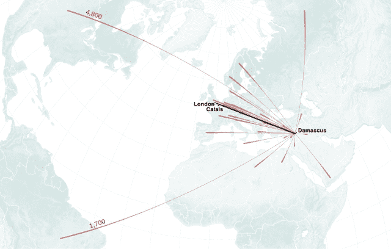](https://sniperinmahwah.wordpress.com/wp-content/uploads/2016/02/syria-syria-7203.jpg)

The only difference between a microwave network and the migrants’ trajectories is speed. Khan needed a full year to join Calais from Kabul, and most of the migrants from the Calais jungle wait for months before having the opportunity to join England. After this long wait, if they have the chance to break into a ferry or a truck, they will cross the Channel *in one hour and half*, while high-frequency traders data passes through the sea in *25* *microseconds*. Calais (and its surrounding region) is now the place where two extreme worlds meet: the extreme condition of the refugees and the extreme speed of high-frequency traders.

###### HFT IN THE JUNGLE

Early December 2015, I was contacted by an English activist, Richard, who is a volunteer with the [WorldWide Tribe](http://theworldwidetribe.com) organization – Richard is also a PhD researcher and a freelance economist specialising in spectrum and telecoms. Richard and other volunteers were trying to improve the lives of refugees in the Jungle of Calais by installing Wifi. They spent a week-end to put a mast in the Jungle (a very small mast compared to those needed by high-frequency traders) and connecting it up to the 4G mobile network. The mast was installed on a van (“*the miracle street trailer*”). You can read the full story on the WorldWide Tribe [website](http://theworldwidetribe.com).

[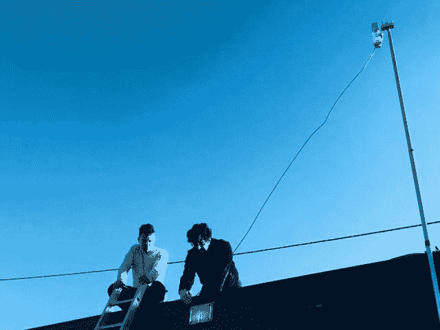](https://sniperinmahwah.wordpress.com/wp-content/uploads/2016/03/2015-12-07-002.jpg)

“*Everyone seemed over the moon at the prospect of the internet. Not only does this bring them communication with their families, but also information about their asylum options and equal opportunities with the rest of the connected world.*” Wifi was fine, but Richard tried to extend the operation by “*connecting the Jungle via microwave link to the fibre network”,* so that the refugees would get a better bandwidth.That’s why I have been contacted: because of my (presumed) knowledge of microwave connectivity in North of France. For once, working on HFT would have a real social value.

At that time, Richard and its friends had different options to improve the network: to deal with a local fibre operator (there are a lot of them in the industrial zones in Calais); to get a business fibre connection in Gravelines and attempt a microwave relay to Calais (Gravelines is another city on the French coast); or to build a microwave link between the Jungle and the top of one of the tower blocks of public housing in the west of the city (“*most of the towers here have excellent line-of-sight to the Jungle*”). The volunteer had found a “tall” building at 50.953476 N, 1.893397 E, two kilometers from the Jungle (the white line is the microwave link):

They wanted to use a Ubiquiti AirMax equipment because the “*performance/cost ratio is excellent*” and “*5Ghz is a sweet spot of capacity and performance*” – the same equipment is used by some HFTs for their networks. Richard came with these questions: “*How does one approach the managers of a building to arrange the use of roof space? What is the process for sharing towers in France? Would any of the HFT firms be willing to shared some tower space?*” Given my exploration of the HFT microwave world, this was the kind of questions I could answer. I gave some calls to my “industry contacts” about that and tried to help a bit (it seemed that the Ubiquiti AirMax dish was just perfect), but ultimately Richard and its friends did not use microwave. They made a deal with fibre operator Orange, which provided a fixed line offering 50Mbps for a low cost and a low monthly subscription. That was just perfect… until the activists discovered that “*to comply with French anti-terrorist laws* [voted after the Paris attacks last November], *details had to be collected and stored of every user*”, so they had to switch the network off until they found a solution. They finally figured out a way by using a cheap cloud storage and the network came back. That’s how about 1,500 migrants could connect to the Internet and get some news from their families. A very nice job.

###### HFT ABOVE THE JUNGLE

“*Would any of the HFT firms be willing to shared some tower space?*” Even if the WorldWide Tribe activists didn’t need a microwave path to bring the internet into the Jungle, the question was interesting – and certainly motivated by the fact some HFT firms may have had dishes around the Jungle at some point in the past:

[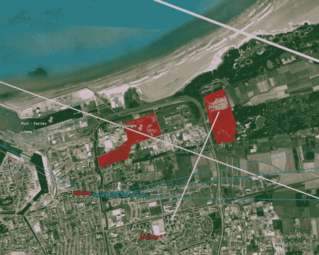](https://sniperinmahwah.wordpress.com/wp-content/uploads/2016/03/capture-d_c3a9cran-2016-03-14-c3a0-14-14-13.png)

As shown in the picture above, you have the former Jungle (destroyed in 2009) and the actual Jungle of Calais. At the bottom of the picture, very close from the building Richard had identified, we have McKay Brothers, and at the left we have Jump Trading, New Line Networks and the McKay bros again (the big white line at the top right of the picture is the straight line between Damascus and London – I thought it was interesting to see how the migrants trajectories meet the HFTs microwave paths here). I had found these names back in 2014 by exploring [Cartoradio](http://www.cartoradio.fr/cartoradio/web/#bbox/1.80563602386458/50.9220905783711/1.93061293282567/50.9825870280941/7893) (the public website of the French radio regulator), but most of the data are irrelevant now (and not available on Cartoradio anymore), as the high-frequency traders have better paths, as we will see. I’m pretty sure the McKay bros would have accepted to share a space, but they are not in Calais anymore. The only HFT microwave provider who may be in Calais is perhaps New Line Networks (that’s what I understand by comparing Cartoradio data and Ofcom [data](http://spectruminfo.ofcom.org.uk/spectrumInfo/licences?googloc=(50.95743491028871%2c+1.873244047164917)&code=301010&se=(50.95705978275052%2c+1.8736651539802551)&googoffset=0.0&nw=(50.957810034798605%2c+1.8728229403495789)&unit=GHz&ne=(50.957810034798605%2c+1.8736651539802551)&service=Fixed+Links&sw=(50.95705978275052%2c+1.8728229403495789)&submit=Submit+search&groupKey=2)), but it is likely that these HFT microwave paths in Calais are now are a part of history. They all moved elsewhere. Because, as the migrants, they want to find the perfect straight lines. The most interesting here is that the migrants are now moving north these days, until Belgium, exactly as some HFT microwave network did – but not for the same reasons.

Here is a picture showing the development of the HFT networks around the Channel over time:

[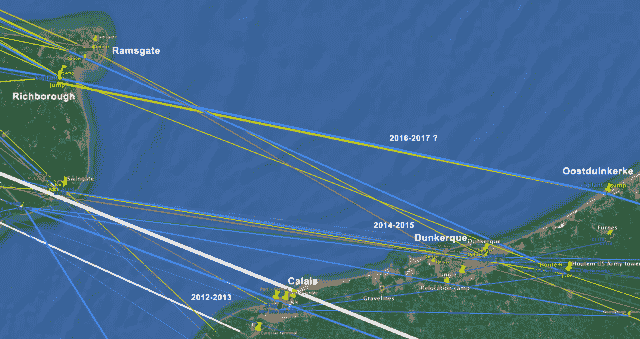](https://sniperinmahwah.wordpress.com/wp-content/uploads/2016/03/channel-2012-20161.png)

Back in 2012-2013, some of these networks crossed the Channel from Calais to Dover/Swingate (the old historical microwave route). In 2014-2015, some networks were updated and go from Dunkerque (or Grande-Scynthe) to Ramsgate (McKay Brothers, Optiver), or from Houtem to Ramsgate (Jump Trading/New Line Networks):

And now, in 2016, Vigilant Global, Jump Trading and New Line Networks (and others ;) are trying to cross the Channel between Oostduinkerke and Richborough (the Banana Land story):

They all moved North because they had (and/or still have) to find the best paths that are close to the perfect line between Frankfurt and the London area:

That’s really striking because this move, from Calais to Dunkerque and now Belgium (the white arrow just above), from 2012 to 2015, is exactly the same move some migrants are doing in 2016\. Some of them, as they failed to cross the Channel from Calais (because of the police checkpoints), are trying other spots where they can find trucks where they can hide. That’s the reason there is another Jungle, in Grande-Scynthe, the so-called Basroch jungle, which has been regarded as “worse” than the Calais Jungle (I just can’t imagine that), five kilometers from the place where HFT firms/microwave providers have dishes.  

[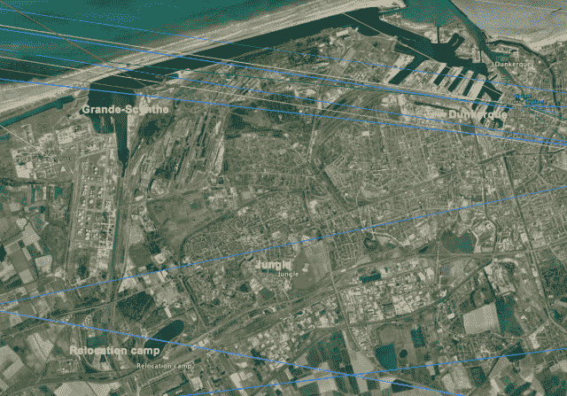](https://sniperinmahwah.wordpress.com/wp-content/uploads/2016/03/capture-d_c3a9cran-2016-03-14-c3a0-15-27-211.png)

This jungle was recently shot down and replaced by a [relocation camp](http://www.ville-grande-synthe.fr/userfiles/file/campGS.pdf). Why this jungle in Grande-Scynthe? Because it was located near a gas station where trucks stop. But it’s not over. Since some migrants from the Grande-Scynthe jungle fail to break into the trucks, they are trying to reach other areas, not in France anymore but in Belgium (obviously, the Belgian Prime Minister [wrote](http://uk.reuters.com/article/us-europe-migrants-belgium-france-idUKKCN0V51DJ) to the French Prime Minister and complained that France was not able to manage “their” refugees – poor Europe). Various newspaper articles testified that some refugees take the Belgian tram going from the France-Belgium border to Ostende, meaning that they are passing by the Oostduinkerke building where HFT firm Vigilant Global and microwave provider New Line Networks want to install dishes. But other migrants seem to walk through the country side to reach Veurne (also known as Furnes in Dutch), where there is an [industrial park](http://www.bbc.com/news/uk-england-31871532) with a lot of trucks going to England:

[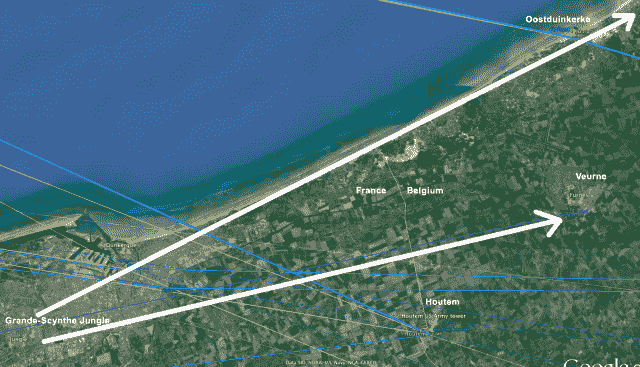](https://sniperinmahwah.wordpress.com/wp-content/uploads/2016/03/dunkerque-veurne4.png)

I know the Grande-Scynthe-Veurne path because between the two cities there is a small village named Houtem (part of the Veurne city), and Houtem is now famous because of the 243-meter tower Jump Trading purchased in 2013 for $5,000,000 to cross the Channel (the tower is very close to the France-Belgium border):

[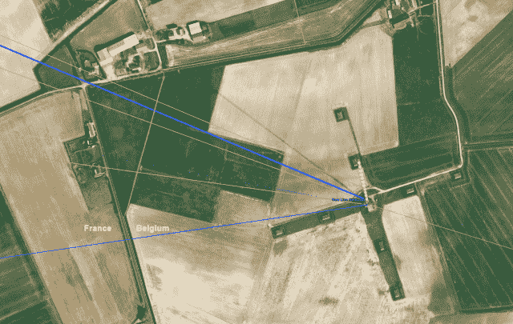](https://sniperinmahwah.wordpress.com/wp-content/uploads/2016/03/houtem.png)

I know this place quite well, and I can confirm that if you want to cross the France-Begium border, this is the perfect and discrete way to do it. You just have to walk in the silent fields, there is no fence there, no police – only this giant tower the Belgian State sold to Jump in 2013:

That’s how the migrants meet the high-frequency trading world – again. It’s quite probable some refugees crossed the border around the tower, and it’s obvious they never imagined that the eyes of the towers, the dishes pointing to England, allow a high-frequency trading firm to cross the Channel *in 25 microseconds*. The big difference, here, is that by going North the migrants move away from the shortest path between the continent and the kingdom (the Calais-Dover route), whereas Jump is in Belgium because the firm could achieve the best possible path. The refugees and the HFT dishes are lurking in the same area – same purpose, but different temporalities; two extreme worlds in my backyard. We live in fascinating times.