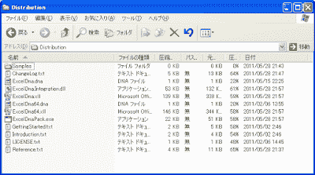
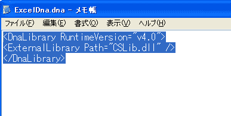
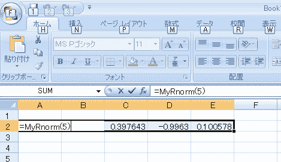

<!--yml
category: 未分类
date: 2024-05-18 06:48:58
-->

# HOXO-M - anonymous data analyst group in Japan - : Another way to use R in Excel for .NET programmer

> 来源：[http://mockquant.blogspot.com/2011/07/another-way-to-use-r-in-excel-for-net.html#0001-01-01](http://mockquant.blogspot.com/2011/07/another-way-to-use-r-in-excel-for-net.html#0001-01-01)

As you know, 

[RExcel](http://sunsite.univie.ac.at/rcom/)

 give us a way to combine R with Excel.

But, It just bothering to install some COMs and maybe not be programming but excel manipulation!

If you are a .NET programmer, there is another way to call R from Excel.

I would like to show you simple example.

We need to two libraries to do that.

1.  [Excel-DNA](http://exceldna.typepad.com/)
2.  [R.NET](http://rdotnet.codeplex.com/)

First, you download ExcelDNA from 

[here](http://exceldna.codeplex.com/releases/view/66405)

.

And, go to "Distribution" folder.

[](https://blogger.googleusercontent.com/img/b/R29vZ2xl/AVvXsEgkPZVZbyFUI-bGpjXvuS0sEecq4ULl7gk3Q1OhYcxnWKvFQNm41ojGt7UpSQ4m7ydVMLbEUeWy0aF5kHEBZ0NMDOkUWCQoNXueHn0ycHHUwBv1Rpj-nh18180QJL3WAWeYvvugrcj6a6c/s1600/20110704_1.PNG)

you just need only three files(ExcelDna.dna, ExcelDna.xll, ExcelDna.Integration.dll) in this folder.

(I assume that your OS is 32bit windows.)

Second, you download R.NET from 

[here](http://rdotnet.codeplex.com/releases/view/61617)

.

you can set(or copy) these files any folder as you like.

Next, you start up your IDE. I used VC# this time.

Of-course, you can use other .NET languages like a VB.NET.

Create new project, choice "Class library" as template and wrote program as below.

```
using System;
using System.Collections.Generic;
using System.Linq;
using System.Text;
using ExcelDna.Integration;
using RDotNet;

namespace CSLib
{
    public class CSLib
    {
        static REngine rengine = null;
        static CSLib()
        {
            // Set the folder in which R.dll locates.
            REngine.SetDllDirectory(@"C:\Program Files\R\R-2.13.0\bin\i386");
            rengine = REngine.CreateInstance("RDotNet", new[] { "-q" });
        }            
        [ExcelFunction(Description = "get random numbers obey to normal distribution")]
        public static double [] MyRnorm(int number)
        {
            return (rengine.EagerEvaluate("rnorm(" + number + ")").AsNumeric().ToArray());
        }
    }
} 
```

In this case, I defined the function which generates random numbers obey standard normal  distribution. If you use or install another version R, modify "SetDllDirectory" function call.

All source code and solution files are 

[here(github)](https://github.com/teramonagi/CS-EX_RDotNET_ExcelDNA)

.

Next, Add

R.NET.dll

and

ExcelDna.Integration.dll

to your project as reference.

Now, Everything is ready. Let's compile !

After compile, you have to modify your ExcelDna.dna file.

Edit this file with notepad like below.

[](https://blogger.googleusercontent.com/img/b/R29vZ2xl/AVvXsEgMdd12ZiGDdDvSQJY-xPp17hGR_dbaFi95yqJ5GzJUI6dthyphenhyphenkAGH6APz_ZuOTCGFWMogq8Wed6hlug0orHqHuwKe0kTyb6OSSuaDLGVMwJX5OHRVHA-J8KpHZOnprTLAHVhOYrVoEUbm0/s1600/201110704_3.PNG)

(v4.0 means your version of .NET framework. modify this number if you need)

(If your DLL's relative-path is not "CSLib.dll" from ExcelDNA.xll, you have to correct this name)

(I deployed CSLib.dll, ExcelDna.xll, ExcelDna.dna in the same folder)

After that, double-click your ExcelDna.xll and create new Excel sheet.

As you'll see below, you can use your own function defined in C# language !

[](https://blogger.googleusercontent.com/img/b/R29vZ2xl/AVvXsEgzO0hUb4IGw2le-eqv3AHoh17Z4agvMzua8rKd3Pg6adc0BdBB-_G3zPoYC_Osk2yMfrxbHg46mMSOGgosTRfZ5w1a5htyQ9vLKmJLKHZdqCcc8ZcUKQHCENB0ryO2DhtQyC5TgwkMK48/s1600/20110704_2.PNG)

Enjoy !