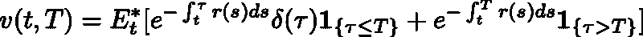

<!--yml
category: 未分类
date: 2024-05-18 06:48:35
-->

# HOXO-M - anonymous data analyst group in Japan - : Pricing defaultable discount bond with reduced form model

> 来源：[http://mockquant.blogspot.com/2012/02/pricing-defaultable-discount-bond-with.html#0001-01-01](http://mockquant.blogspot.com/2012/02/pricing-defaultable-discount-bond-with.html#0001-01-01)

I often use R language to write "prototype" program. As you know, It has very high productivity and smart grammar. In this article, I would like to show you how to write the program to evaluate the price of defaultable bond by "reduced-form model".

Before write a program, we need to understand how to price these bond.

Under risk neutral measure, we can evaluate the price of defaultable (discount) bond as below.

In this equation, I set variables as below.

*   v(t,T) : The price of defaultable bond  with maturity T at time t 
*   r(t) : Short rate at time t
*   delta_(t) : Recovery rate at time t
*   tau : default time
*   1{} : Indicator function

And the second term in this equation means usual pay back of principal, on the other hand, the first term means the value you can get when this bond will default.

For montecarlo simulation, we need to model short rate and default intensity process, I modeled default intensity process and short rate as CIR model.

CIR model assume that some stochastic process obey below Stochastic differential equation.

Each variables have following meaning.

*   x(t) : The value of stochastic variable obeying CIR process at time t.
*   kappa : The speed of adjustment
*   theta : The mean of  stochastic variable
*   sigma : The volatility of  stochastic variable
*   W_t : Standard Brownian motion

And next, I set the simulation condition as below.

-------------------------------- Simulation condition -------------------------------

*   The number of path : 500
*   The number of grid per year : 250
*   Recovery rate : 0.7
*   Maturity of bond : 2
*   The correlation between interest rate and default intensity : 0.3

-------------------------------- Interest rate parameter ----------------------------

*   kappa : 0.6
*   theta : 0.05
*   sigma : 0.05
*   initial value : 0.05

-------------------------------- Default intensity parameter -------------------------

*   kappa : 0.6
*   theta : 0.2
*   sigma : 0.5
*   initial value : 0.2

---------------------------------------------------------------------------------

After these settings, we can write simulation program. The entire of program is folloing that.

(Sorry for the comment written in Japanese, To tell the truth, this article is posted in other site in Japanese...)

(If you have any question, don't hesitate to ask me :))

The result of this program is about 0.830±0.005(It depends on the seed of random number generator).

Enjoy !