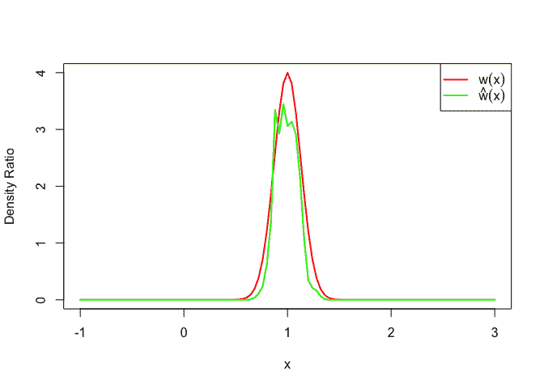
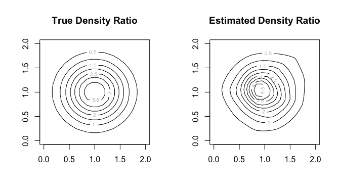

<!--yml
category: 未分类
date: 2024-05-18 06:47:49
-->

# HOXO-M - anonymous data analyst group in Japan - : densratio: New R Package for Density Ratio Estimation

> 来源：[http://mockquant.blogspot.com/2016/04/densratio-new-r-package-for-density.html#0001-01-01](http://mockquant.blogspot.com/2016/04/densratio-new-r-package-for-density.html#0001-01-01)

## 1\. Overview

**Density ratio estimation** is described as follows: for given two data samples $x$ and $y$ from unknown distributions $p(x)$ and $q(y)$ respectively, estimate $$ w(x) = \frac{p(x)}{q(x)} $$ where $x$ and $y$ are $d$-dimensional real numbers.

The estimated density ratio function $w(x)$ can be used in many applications such as the inlier-based outlier detection [1] and covariate shift adaptation [2]. Other useful applications about density ratio estimation were summarized by Sugiyama et al. (2012) [3].

The package **densratio** provides a function `densratio()` that returns a result has the function to estimate density ratio `compute_density_ratio()`.

For example,

```
set.seed(3)
x <- rnorm(200, mean = 1, sd = 1/8)
y <- rnorm(200, mean = 1, sd = 1/2)

library(densratio)
result <- densratio(x, y)
result
```

```
## 
## Call:
## densratio(x = x, y = y, method = "uLSIF")
## 
## Kernel Information:
##   Kernel type:  Gaussian RBF 
##   Number of kernels:  100 
##   Bandwidth(sigma):  0.1 
##   Centers:  num [1:100, 1] 1.007 0.752 0.917 0.824 0.7 ...
## 
## Kernel Weights(alpha):
##   num [1:100] 0.4044 0.0479 0.1736 0.125 0.0597 ...
## 
## The Function to Estimate Density Ratio:
##   compute_density_ratio()
```

In this case, the true density ratio $w(x)$ is known, so we can compare $w(x)$ with the estimated density ratio $\hat{w}(x)$.

```
true_density_ratio <- function(x) dnorm(x, 1, 1/8) / dnorm(x, 1, 1/2)
estimated_density_ratio <- result$compute_density_ratio

plot(true_density_ratio, xlim=c(-1, 3), lwd=2, col="red", xlab = "x", ylab = "Density Ratio")
plot(estimated_density_ratio, xlim=c(-1, 3), lwd=2, col="green", add=TRUE)
legend("topright", legend=c(expression(w(x)), expression(hat(w)(x))), col=2:3, lty=1, lwd=2, pch=NA)
```

[](https://blogger.googleusercontent.com/img/b/R29vZ2xl/AVvXsEhQdqp_r8q8fbiM4iVE7wNKdMaOKh65ZLg8hd-hsEOOA6IDjHgZvKxp-6mORmqPKN6FlzXQnAr78f6wyfuhnt8JE2EIlk0HBPi66E8jU8R56JBN70lFj3iat_P3N_U7jwrEna_IrZea9Sg/s1600/unnamed-chunk-1-1.png)

## 2\. How to Install

You can install the **densratio** package from [CRAN](https://cran.r-project.org/web/packages/densratio/).

```
install.packages("densratio")
```

You can also install the package from GitHub.

```
install.packages("devtools") # if you have not installed "devtools" package
devtools::install_github("hoxo-m/densratio")
```

The source code for **densratio** package is available on GitHub at

## 3\. Details

### 3.1\. Basics

The package provides `densratio()` that the result has the function to estimate density ratio.

For data samples `x` and `y`,

```
library(densratio)

x <- rnorm(200, mean = 1, sd = 1/8)
y <- rnorm(200, mean = 1, sd = 1/2)

result <- densratio(x, y)
```

In this case, `result$compute_density_ratio()` can compute estimated density ratio.

```
w_hat <- result$compute_density_ratio(y)
plot(y, w_hat)
```

### 3.2\. Methods

`densratio()` has `method` parameter that you can pass `"uLSIF"` or `"KLIEP"`.

*   **uLSIF** (unconstrained Least-Squares Importance Fitting) is the default method. This algorithm estimates density ratio by minimizing the squared loss. You can find more information in Hido et al. (2011) [1].

*   **KLIEP** (Kullback-Leibler Importance Estimation Procedure) is the anothor method. This algorithm estimates density ratio by minimizing Kullback-Leibler divergence. You can find more information in Sugiyama et al. (2007) [2].

The both methods assume that the denity ratio is represented by linear model: $$ w(x) = \alpha_1 K(x, c_1) + \alpha_2 K(x, c_2) + ... + \alpha_b K(x, c_b) $$ where $$ K(x, c) = \exp\left(\frac{-\|x - c\|^2}{2 \sigma ^ 2}\right) $$ is the Gaussian RBF.

`densratio()` performs the two main jobs:

*   First, deciding kernel parameter $\sigma$ by cross validation,
*   Second, optimizing kernel weights $\alpha$.

As the result, you can obtain `compute_density_ratio()`.

### 3.3\. Result and Paremeter Settings

`densratio()` outputs the result like as follows:

```
## 
## Call:
## densratio(x = x, y = y, method = "uLSIF")
## 
## Kernel Information:
##   Kernel type:  Gaussian RBF 
##   Number of kernels:  100 
##   Bandwidth(sigma):  0.1 
##   Centers:  num [1:100, 1] 1.007 0.752 0.917 0.824 0.7 ...
## 
## Kernel Weights(alpha):
##   num [1:100] 0.4044 0.0479 0.1736 0.125 0.0597 ...
## 
## Regularization Parameter(lambda):  
## 
## The Function to Estimate Density Ratio:
##   compute_density_ratio()
```

*   **Kernel type** is fixed by Gaussian RBF.
*   The **number of kernels** is the number of kernels in the linear model. You can change by setting `kernel_num` parameter. In default, `kernel_num = 100`.
*   **Bandwidth(sigma)** is the Gaussian kernel bandwidth. In default, `sigma = "auto"`, the algorithms automatically select the optimal value by cross validation. If you set `sigma` a number, that will be used. If you set a numeric vector, the algorithms select the optimal value in them by cross validation.
*   **Centers** are centers of Gaussian kernels in the linear model. These are selected at random from the data sample `x` underlying a numerator distribution `p_nu(x)`. You can find the whole values in `result$kernel_info$centers`.
*   **Kernel weights** are alpha parameters in the linear model. It is optimaized by the algorithms. You can find the whole values in `result$alpha`.
*   **The funtion to estimate density ratio** is named `compute_density_ratio()`.

## 4\. Multi Dimensional Data Samples

In the above, the input data samples `x` and `y` were one dimensional. `densratio()` allows to input multidimensional data samples as `matrix`.

For example,

```
library(densratio)
library(mvtnorm)

set.seed(71)
x <- rmvnorm(300, mean = c(1, 1), sigma = diag(1/8, 2))
y <- rmvnorm(300, mean = c(1, 1), sigma = diag(1/2, 2))

result <- densratio(x, y)
result
```

```
## 
## Call:
## densratio(x = x, y = y, method = "uLSIF")
## 
## Kernel Information:
##   Kernel type:  Gaussian RBF 
##   Number of kernels:  100 
##   Bandwidth(sigma):  0.316 
##   Centers:  num [1:100, 1:2] 1.178 0.863 1.453 0.961 0.831 ...
## 
## Kernel Weights(alpha):
##   num [1:100] 0.145 0.128 0.138 0.187 0.303 ...
## 
## Regularization Parameter(lambda):  0.1 
## 
## The Function to Estimate Density Ratio:
##   compute_density_ratio()
```

Also in this case, we can compare the true density ratio with the estimated density ratio.

```
true_density_ratio <- function(x) {
  dmvnorm(x, mean = c(1, 1), sigma = diag(1/8, 2)) /
    dmvnorm(x, mean = c(1, 1), sigma = diag(1/2, 2))
}
estimated_density_ratio <- result$compute_density_ratio

N <- 20
range <- seq(0, 2, length.out = N)
input <- expand.grid(range, range)
z_true <- matrix(true_density_ratio(input), nrow = N)
z_hat <- matrix(estimated_density_ratio(input), nrow = N)

par(mfrow = c(1, 2))
contour(range, range, z_true, main = "True Density Ratio")
contour(range, range, z_hat, main = "Estimated Density Ratio")
```

[](https://blogger.googleusercontent.com/img/b/R29vZ2xl/AVvXsEjkW1oxCEr4i3Z-Uk5ALQ70m1_sgd5_4oOwS5HQ0Jc2zg_qDHNs6HrzQbEsXmkIQo23lF7N89q-6VEWEx-1KK0-ohX6uRT9amNXqdc7CoMKhkMPzd9CUdwlQ9Ykl0RcqTjB_Wq6-7FA-nA/s1600/unnamed-chunk-6-1.png)

The dimensions of `x` and `y` must be same.

## 5\. References

[1] Hido, S., Tsuboi, Y., Kashima, H., Sugiyama, M., & Kanamori, T. **Statistical outlier detection using direct density ratio estimation.** Knowledge and Information Systems 2011.

[2] Sugiyama, M., Nakajima, S., Kashima, H., von Bünau, P. & Kawanabe, M. **Direct importance estimation with model selection and its application to covariate shift adaptation.** NIPS 2007.

[3] Sugiyama, M., Suzuki, T. & Kanamori, T. **Density Ratio Estimation in Machine Learning.** Cambridge University Press 2012.