<!--yml
category: 未分类
date: 2024-05-17 23:43:36
-->

# HPC-QuantLib

> 来源：[https://hpcquantlib.wordpress.com#0001-01-01](https://hpcquantlib.wordpress.com#0001-01-01)

Aim: Develop an exponentially-fitted Gauss-Laguerre quadrature rule to price European options under the Heston model, which outperforms given Gauss-Lobatto, Gauss-Laguerre and other pricing method implementations in QuantLib.

Status quo: Efficient pricing routines for the Heston model

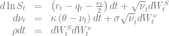

are based on the integration over the normalized characteristic function in the Gatheral formulation

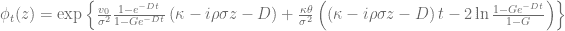

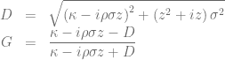

in combination with a Black-Scholes control variate to improve the numerical stability of Lewis’s formula [1][2][3]. The normalized characteristic function of the Black-Scholes model is given by

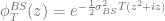

and the price of a vanilla call option can then be calculated based on

where  is the corresponding Black-Scholes price. Different choices for the volatility of the control variate are discussed in the literature. For the following examples the volatility will be defined by either

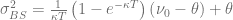

or

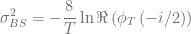.

The first one matches the overall variance for 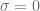 whereas the latter one matches the values of the characteristic functions at the starting point 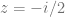 of the integration. Usually the latter choice gives better results. Looking at the integrand above one can directly spot a weak point in the algorithm for deep in the money/deep out of the money options. In this case the integrand becomes a highly oscillating function due to the term

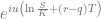.

Second, when using Gauss-Laguerre quadrature the overlap of the weight function 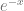 with the characteristic function becomes sub-optimal for very short maturities or small effective volatilities as can be seen with the Black-Scholes characteristic function already.

Third, for very small  the integrand becomes prone to subtractive cancellation errors.

The last issue is easy to overcome by using the second order Taylor expansion of the normalized characteristic for small . The corresponding mathematica script can be seen [here](https://github.com/klausspanderen/HestonExponentialFitting/blob/master/mathematica/heston_expansion.nb).

Rescaling the integrand improves the second issue by rewriting the integral in terms of 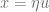 with

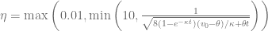

The first problem, the highly oscillating integrand, can be tackled with the exponentially fitted Gauss-Laguerre quadrature rule [4]. The numerical integration of two smooth functions 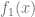 and 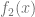 with

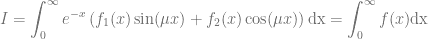

is approximated by a Gauss-Laguerre quadrature rule of the form

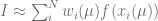.

In this use case the frequency 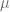 is

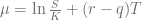,

and the weights 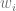 and nodes 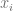 of the Gauss-Laguerre quadrature rule become functions of the frequency . The algorithm outlined in [4] is too slow to be used at runtime and in the original form only usable up to 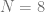. In order to use it for the Heston model we pre-calculate the weights and nodes for a defined set of frequencies 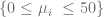. The closest pre-calculated value 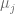 for a given frequency  is then used to evaluate the integral. Of course it would be optimal to use the weights and nodes for  instead of  but it is far, far better than assuming 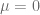 as it is done within the conventional Gauss-Laguerre quadrature rule.

Two techniques are key to get to larger N for the pre-calculated weights and nodes:

*   Start the algorithm with  to get the standard Gauss-Laguerre weights/nodes and gently increase  afterwards. Use the old weights and nodes from the previous up to 20 steps to generate the next starting vector for the Newton solver based on the Lagrange interpolating polynomials.
*   Increase “numerical head room” by using the [boost multi-precision](https://www.boost.org/doc/libs/1_73_0/libs/multiprecision/doc/html/index.html) package instead of double precision. This is only relevant for the pre-calculation. The resulting weights and nodes are stored as normal double precision values.

The source code to generate the weights and nodes for the exponential fitted Gauss-Laguerre quadrature rule is available [here](https://github.com/klausspanderen/HestonExponentialFitting/blob/master/exponential_fitting/ef_laguerre.cpp).

The reference results for the comparison with the other Heston pricing methods are generated using a [boost multi-precision version](https://github.com/klausspanderen/HestonExponentialFitting/tree/master/ql/pricingengines/vanilla) of the Gauss-Laguerre pricing algorithm of order *N=2000*. Comparison with the results for *N=1500* and *N=2500* ensures the correctness of the results. The exponentially fitted Gauss-Laguerre quadrature rule is always carried out using *N=48* nodes, corresponding to only 48 valuations of the characteristic function. First example model is

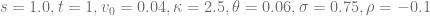

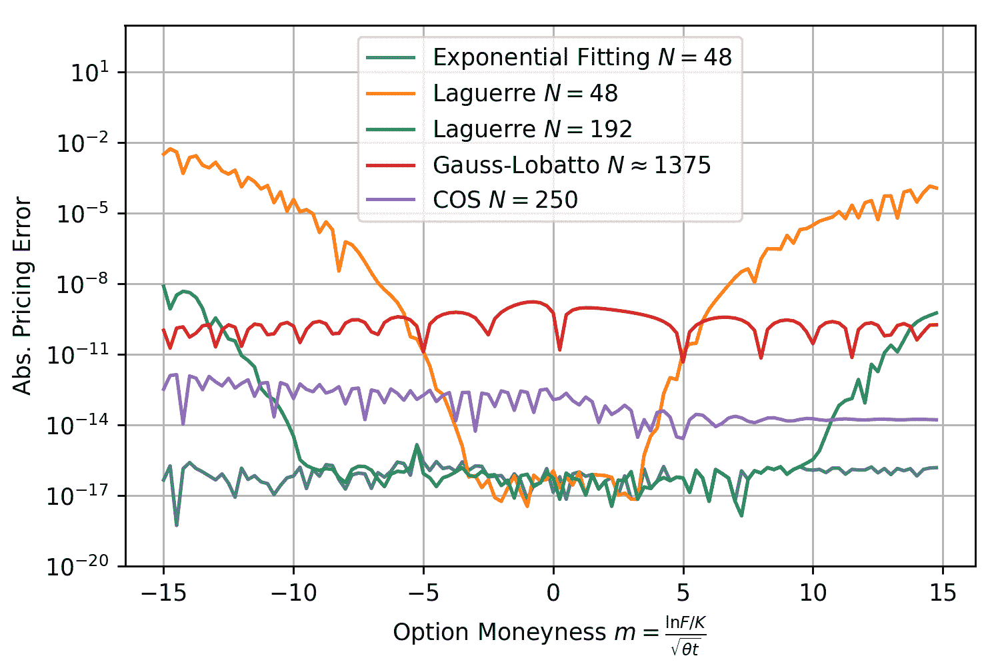

Exponential fitting outperforms the other methods especially when taking the total number of characteristic function valuations into consideration. As expected the method works remarkable well for deep OTM/ITM options and ensures that the absolute pricing error stays below 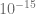 for an extremely large range of option strikes. Next round, same model but 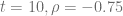.

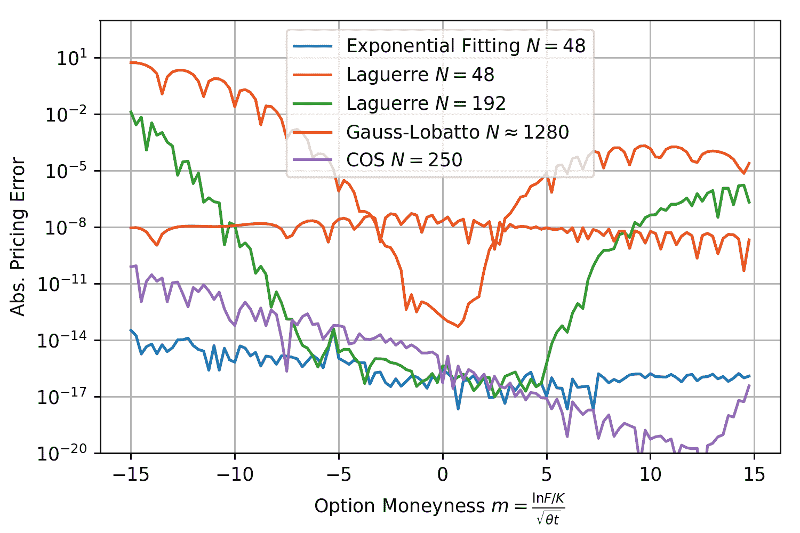

Again the pricing error for exponential fitting stays below 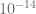 for all moneynesses between -15 and 15 and well below the other methods. Next test, same model but very short maturity with 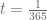. The COS-method with 250 calls of the characteristic function and exponential fitting with *N=48* are close together and outperform all other methods.

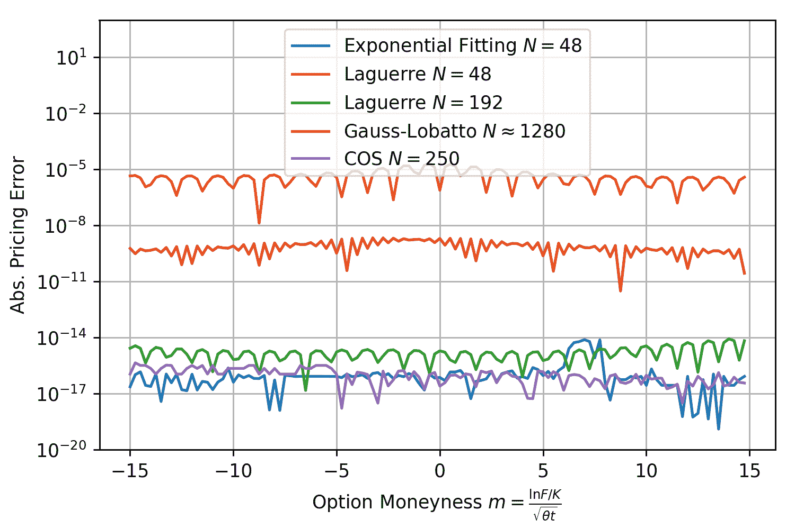

The same graphs are shown for a variety of different Heston parameters being used in the literature in the following [document](https://hpcquantlib.wordpress.com/wp-content/uploads/2020/05/heston_catalog-3.pdf). The exponentially fitted Gauss-Laguerre quadrature rule with only 64 nodes solves the problem almost always with 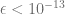 for moneynesses between -20 and 20 and maturities between one day and 10 years and outperforms the other methods, especially when taking the number of characteristic function calls needed into consideration. This method can also be extend to larger number of nodes.

The QuantLib implementation of the algorithm is part of the [PR#812](https://github.com/lballabio/QuantLib/pull/812).

[1] Lewis, A. [A simple option formula for general jump-diffusion and other exponential Lévy processes](https://papers.ssrn.com/sol3/papers.cfm?abstract_id=282110)

[2] F. Le Floc’h, [Fourier Integration and Stochastic Volatility Calibration.](https://papers.ssrn.com/sol3/papers.cfm?abstract_id=2362968)

[3] L. Andersen, and V. Piterbarg, 2010,  Interest Rate Modeling, Volume I: Foundations and Vanilla Models,  Atlantic Financial Press London.

[4] D. Conte, L. Ixaru, B. Paternoster, G. Santomauro, [Exponentially-fitted Gauss–Laguerre quadrature rule for integrals over an unbounded interval.](https://www.sciencedirect.com/science/article/pii/S0377042713003385)