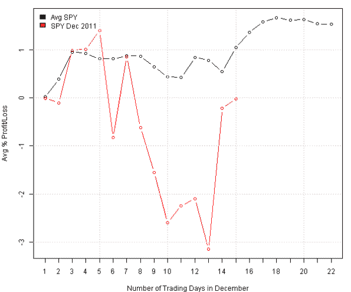

<!--yml
category: 未分类
date: 2024-05-18 14:44:20
-->

# Happy Holidays and Best Wishes for 2012 | Systematic Investor

> 来源：[https://systematicinvestor.wordpress.com/2011/12/23/happy-holidays-and-best-wishes-for-2012/#0001-01-01](https://systematicinvestor.wordpress.com/2011/12/23/happy-holidays-and-best-wishes-for-2012/#0001-01-01)

This is just a quick note to wish you and your family a very healthy and happy holidays and wonderful New Year! I hope you enjoyed reading my blog and thank you for your comments and emails.

Here is a short R code that implements an interesting idea from the [Charting the Santa Claus Rally](http://ibankcoin.com/woodshedderblog/2011/12/15/charting-the-santa-claus-rally/) post by Woodshedder. I will plot and compare the SPY performance this December versus average performance in previous Decembers.

```

# Load Systematic Investor Toolbox (SIT)
setInternet2(TRUE)
con = gzcon(url('https://github.com/systematicinvestor/SIT/raw/master/sit.gz', 'rb'))
	source(con)
close(con)

	#*****************************************************************
	# Load historical data
	#****************************************************************** 
	load.packages('quantmod')	
	tickers = spl('SPY')

	data <- new.env()
	getSymbols(tickers, src = 'yahoo', from = '1970-01-01', env = data, auto.assign = T)
		for(i in ls(data)) data[[i]] = adjustOHLC(data[[i]], use.Adjusted=T)		
	bt.prep(data, align='remove.na', dates='1970::2011')

	#*****************************************************************
	# Prepare Data for the plot
	#****************************************************************** 
	prices = data$prices  
	n = len(tickers)  
	ret = prices / mlag(prices) - 1

	# find prices in December
	dates = index(prices)
	years = date.year(dates)	
	index = which(date.month(dates) == 12)

	# rearrange data in trading days
	trading.days = sapply(tapply(ret[index,], years[index], function(x) coredata(x)), function(x) x[1:22])

	# average return each trading days, excluding current year
	avg.trading.days = apply(trading.days[, -ncol(trading.days)], 1, mean, na.rm=T)
	current.year = trading.days[, ncol(trading.days)]

	# cumulative
	avg.trading.days = 100 * ( cumprod(1 + avg.trading.days) - 1 )
	current.year = 100 * ( cumprod(1 + current.year) - 1 )

	#*****************************************************************
	# Create Plot
	#****************************************************************** 	
	par(mar=c(4,4,1,1))
	plot(avg.trading.days, type='b', col=1,
		ylim=range(avg.trading.days,current.year,na.rm=T),
		xlab = 'Number of Trading Days in December',
		ylab = 'Avg % Profit/Loss'
		)
		lines(current.year, type='b', col=2)
	grid()
	plota.legend('Avg SPY,SPY Dec 2011', 1:2)

```

[](https://systematicinvestor.wordpress.com/wp-content/uploads/2011/12/plot1-small5.png)

Hope this year will not disappoint and we will see the rally towards the year end.

If you want to find average performance in the other months, I recommend reading [Trading Calendar](http://www.cxoadvisory.com/trading-calendar/) article by CXO Advisory.

To view the complete source code for this example, please have a look at the [bt.december.trading.test() function in bt.test.r at github](https://github.com/systematicinvestor/SIT/blob/master/R/bt.test.r).