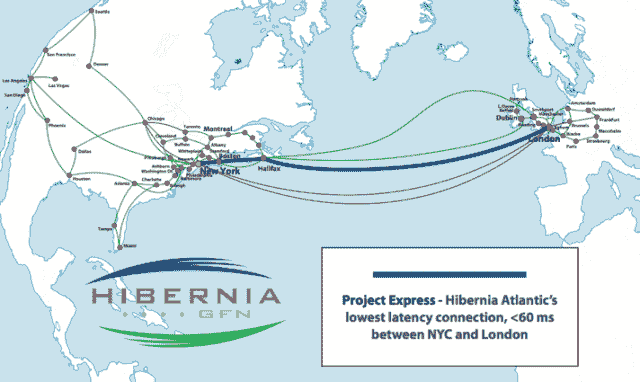

<!--yml
category: 未分类
date: 2024-05-18 14:28:25
-->

# Haute fréquence, géopolitique et cyberespionnage – Sniper In Mahwah & friends

> 来源：[https://sniperinmahwah.wordpress.com/2013/02/22/haute-frequence-geopolitique-et-cyberespionnage/#0001-01-01](https://sniperinmahwah.wordpress.com/2013/02/22/haute-frequence-geopolitique-et-cyberespionnage/#0001-01-01)

A la fin de mon ouvrage sur les transactions à haute fréquence, je parle des moyens de communication grâce auxquels les ordres sont passés et transmis entre les diverses plateformes de l’archipel mondial des marchés. J’évoque notamment un nouveau câble trans-atlantique du nom de Project Express, qui devait relier la City à Wall Street et dont mon éditeur attendait la mise en service fin 2012 afin de pouvoir sortie mon livre au même moment. Mais voilà…

J’écris “devait” car depuis quelques semaines déjà cette mise en service semblait compromise. Project Express est un nouveau projet d’[Hibernia Atlantic](http://www.hiberniaatlantic.com), ou plutôt de sa division Global Finance Network ([GFN](http://www.hiberniagfn.com)) qui travaille pour les opérateurs de marchés disséminés dans le monde. GFN gère pas de moins de 24 000 kilomètres de fibres optiques reliant entre eux plus de 120 marchés. Project Express aurait été le dernier né des câbles transatlantiques gérés par GFN, et était annoncé depuis fin 2010\. Il s’agit (comme souvent dans les marchés financiers) de ce que l’on appelle une « fibre noire », c’est à dire un câble dont la bande passante est entièrement dédiée aux activités du client pour qui le câble est construit (comme si un automobiliste construisait sa propre autoroute pour éviter tout embouteillage), à la différence d’autres câbles que doivent se partager Facebook, Google et d’autres opérateurs de télécommunication. En l’occurrence, Project Express est une fibre noire spécialement construite pour faire passer des transactions financières entre la City et Wall Street… et aurait dû parcourir la distance entre Londres et New York en 58 millisecondes, soit 6 millisecondes de moins que les quatre câbles que possède déjà GFN (ce gain de temps vient du fait que le trajet est raccourci de 500 kilomètres). 6 millisecondes de moins en temps de latence représentent au bas mot 100 millions de dollars de transactions supplémentaires (les 350 millions de dollars que coûtent le câble seront donc vite amortis).  Project Express est ici en bleu :

Comme GFN ne communique que très peu (on comprend pourquoi), il est toujours difficile d’obtenir des informations sur l’état d’avancée de la construction de ces câbles. Reporté de fin 2012 à 2013, Project Express semblait connaître quelques difficultés… dont on vient d’apprendre la teneur : elle est géopolitique.

Hibernia, qui est domiciliée dans le New Jersey, avait engagé en novembre 2011 un sous-traitant chinois, Huawei, pour travailler sur certaines parties du câble (Huawei est un mastodonte de la télécommunication). Or l’administration américaine, devenue très frileuse suite à des cyber-attaques en provenance de Chine, craint que les dirigeants chinois ne puissent, via Huawei, surveiller ou intercepter les informations transitions à la vitesse de la lumière dans le câble Project Express – ce qui revient à dire que les transactions à haute fréquence pourraient être espionnées par la Chine, et lorsqu’on sait le poids que ces transactions représentent aujourd’hui au sein des marchés transatlantiques, la menace fut prise très au sérieux. La Maison Blanche a donc fait du chantage : si Hibernia (comme d’autres sociétés) engage des sous-traitants chinois, alors elle perdra automatiquement tout contrat avec l’administration américaine. Hibernia a donc fait machine arrière, et a repoussé la mise en service du câble à fin 2014 (Hibernia serait désormais en contact avec Alcatel-Lucent, une société franco-américaine domicilée à Paris, un autre équipementier en télécommunication, autre mastodonte du secteur).

Les algorithmes comme moi qui permettent aux transactions financières de s’opérer en quatre fois moins de temps qu’il n’en faut à un être humain pour cligner de l’œil (ce qui demande 350 millisecondes, à comparer avec les 64 millisecondes de temps de parcours entre la City et Wall Street) vont donc devoir attendre encore un peu pour s’entretuer plus rapidement encore. Autre souci, rarement mis en avant : les fibres optiques dernier cri comme celle de Project Express sont gourmandes en terre rares, cette petite vingtaine de minéraux désormais indispensables aux nouvelles technologies (qu’il s’agisse d’éolienne, de tablettes tactiles, d’écrans de télévision… ou d’aimants). Or la Chine est de très loin le principal fournisseurs de terres rares – ce qui est devenu un véritable problème géopolitique –, et comme elle a imposé des quotas à l’exportation de ces terres, il n’est pas interdit de supposer qu’Hibernia avait choisi Huawei pour éviter tout problème d’accès aux matières premières nécessaires aux transactions à haute fréquence.

Il n’est pas impossible que l’accès aux ressources premières que sont les terres rares puissent freiner la construction de ces fibres noires dédiées aux transactions financières, mais là aussi : impossible d’en savoir davantage puisque les divers opérateurs impliqués ne communiquent que très peu sur ce genre d’affaire. Les marchés financiers sont bel et bien très obscurs…