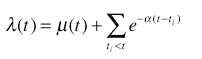

<!--yml
category: 未分类
date: 2024-05-18 15:39:27
-->

# Hawkes Process & Strategies | Tr8dr

> 来源：[https://tr8dr.wordpress.com/2009/10/29/hawkes-process-strategies/#0001-01-01](https://tr8dr.wordpress.com/2009/10/29/hawkes-process-strategies/#0001-01-01)

October 29, 2009 · 10:33 pm

Call me unread, but I had not encountered the Hawkes process before today. The Hawkes process is a “point process” modeling event intensity incorporating empirical event occurrence.

The discrete form of the process is:

where t[i] is the i^(th) occurrence at time t[i] < t for some t. The form of the function is typically an exponential, but can be any function that models decay as a counting process:

Ok, that’s great but what are the applications in strategies research?

Intra-day Stochastic Volatility Prediction The recent theme in the literature has been to replace the quadratic-variance approach with a time-based approach. The degree of movement within an interval of time is equivalent in measure to the amount of time required for a given movement, and can be interchanged easily as Andersen, Dobrev, and Schaumburg have shown in “Duration-Based Volatility Estimation”.

Cai, Kim, and Leduc in “A model for intraday volatility” approached the problem by combining an Autoregressive Conditional Duration process and a Hawkes process to model decay, showing that:

and then equivalently expressed in terms of intensity (where N represents the number of events of size dY):

relating back to volatility measure as:

The intensity process is comprised of an ACD part and a Hawkes part:

They claim to model the intra-day volatility closely and propose a long/short straddle strategy to take advantage of the predictive ability.

High Frequency Order Prediction Strategy The literature suggests the use of Hawkes processes to model the buying and selling processes of market participants.

John Carlsson in “Modeling Stock Orders Using Hawkes’s Self-Exciting Process”, suggests a strategy where if the Hawkes predicted ratio of buy/sell intensity exceeds a threshold (say 5) buy (sell) and exit position within N seconds (he used 10).

This plays on the significant autocorrelation (ie non-zero decay time) of the intensity back to the mean. A skewed ratio of buy vs sell orders will surely influence the market in the direction of order skew.

The strategy can be enhanced to include information about volume, trade size, etc. We can also look at the buy/sell intensity of highly correlated assets and use to enhance the signal.