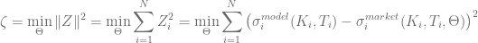
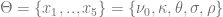
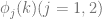
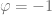
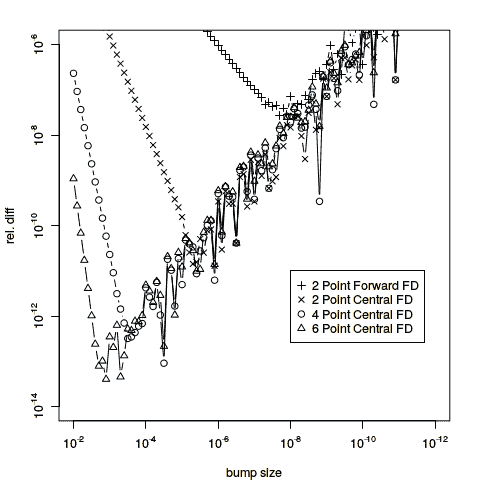
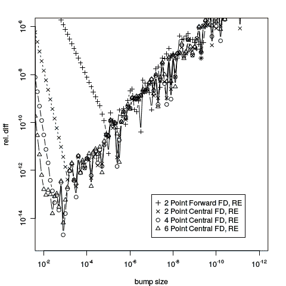

<!--yml
category: 未分类
date: 2024-05-17 23:30:30
-->

# Heston Model Calibration using Adjoint Algorithmic Differentiation – HPC-QuantLib

> 来源：[https://hpcquantlib.wordpress.com/2015/04/01/heston-model-calibration-using-adjoint-algorithmic-differentiation/#0001-01-01](https://hpcquantlib.wordpress.com/2015/04/01/heston-model-calibration-using-adjoint-algorithmic-differentiation/#0001-01-01)

Algorithmic Differentiation becomes more and more popular in financial engineering since the method was first brought to the attention of a wider audience in [1]. Key factors for the popularity are

*   Adjoint Algorithmic Differentiation (AAD): computational cost to calculate all first order partial derivatives of a function (or a computer program) with this method is loosely speaking three to six times larger than the cost of evaluating the function itself.  If the function has a large number of first order partial derivatives then this method clearly overtakes the finite difference method, for which the computational cost is proportional to the number of partial derivatives.
*   Easy to use C++ libraries, among others e.g. [CppAD](http://www.coin-or.org/CppAD/) or [ADOL-C](http://www.coin-or.org/projects/ADOL-C.xml)
*   Accuracy: The partial derivatives are the direct result of a function evaluation and do not depend on an arbitrary bumping parameter.

Adjoint Algorithmic Differentiation was first mentioned in conjunction with QuantLib in Sebastian and Jan’s talk at the 2013 User Group Meeting [2]. The topic has gain further momentum with Peter’s initial blog on [Adjoint Greeks](https://quantlib.wordpress.com/2014/12/20/adjoint-greeks/%20) and with Alexander’s [announcement](http://permalink.gmane.org/gmane.comp.finance.quantlib.devel/5438) that [CompatibL](http://compatibl.com) is working on an AAD port of QuantLib. Alexander will give a [talk](http://compatibl.com/research/events/global-derivatives-2015/) at this years Global Derivatives Conference on the techniques involved to port QuantLib.

Almost all efficient local optimisation algorithms used for model calibration like the Levenberg-Marquardt algorithm are based on gradient methods and therefore need to calculate the Jacobian matrix of the target function *Z*. The target function for the Heston model calibration is defined by the goodness of fit measure



for the model parameters



The model prices of the calibration options are evaluated using Gauss-Laguerre integration of the characteristic functions :

![\begin{array}{rcl} \displaystyle \Pi_j &=& \displaystyle \frac{1}{2} + \frac{1}{\pi} \int_0^\infty\Re\left[\frac{\phi_j(u)\mathrm{e}^{-iu \ln K}}{iu}\right]\mathrm{d}u \\[0.9em] \nonumber \displaystyle P_j(\varphi) &=& \displaystyle \frac{1-\varphi}{2} + \varphi \Pi_j \\[0.9em] \nonumber \displaystyle \mathrm{NPV} &=& \varphi\left[\mathrm{e}^{-qT}SP_1(\varphi) - \mathrm{e}^{-rT}KP_2(\varphi)\right] \end{array} ](img/8793ffda7fcbd7f2d51074b449cdcc64.png)

with the binary variable  for a call and  for a put. The first step in order to use AAD for the model calibration is an implementation of the Gauss-Laquerre integration based on the CppAD library. The only change needed is to replace the data type Real by CppAD::AD<Real> in

```

template <class F>
CppAD::AD<Real> GaussianADQuadrature::operator()(const F& f) 
    const {
    CppAD::AD<Real> sum = 0.0;
    for (Integer i = order()-1; i >= 0; --i) {
        sum += w_[i] * f(x_[i]);
    }
    return sum;
}

```

Using this AAD version of the Gauss-Laguerre integration the method

```

CppAD::AD<Real>; 
AnalyticHestonADEngine::Fj_Helper::operator()(Real phi) const;

```

can be ported in a similar manner and the AnalyticHestonADEngine::doCalculation method now reads

```

std::vector<CppAD::AD<Real> > params;
params += spotPrice, v0, kappa, theta, sigma, rho;
CppAD::Independent(params);

std::vector<CppAD::AD<Real> > y(1);

// untouched code ...

const std::vector<Real> moreResults 
    = CppAD::ADFun<Real>(params, y)
          .Reverse(1, std::vector<Real>(1, 1.0));

results.value = CppAD::Value(y[0]);
results.additionalResults["v0"]    = moreResults[1];
results.additionalResults["kappa"] = moreResults[2];
results.additionalResults["theta"] = moreResults[3];
results.additionalResults["sigma"] = moreResults[4];
results.additionalResults["rho"]   = moreResults[5];

```

All first order Greeks for the calibration instruments can now be calculated using AAD. The Jacobian of the target function *Z* w.r.t. the first order Greeks is given by

![\begin{array}{rcl} \displaystyle\frac{\partial Z_i}{\partial x_j} &=& \displaystyle \frac{\partial \sigma_i^{model}(\Theta)}{\partial x_j} = \displaystyle \frac{1}{\frac{\partial NPV_i}{\partial \sigma_i}}\frac{\partial NPV_i}{\partial x_j} \\[0.9em] \nonumber &=& \displaystyle \frac{1}{\nu_{BS}}\frac{\partial NPV_i}{\partial x_j} \end{array}](img/fb96909fc18e9f123b4767200768a46c.png)

The advantage of using AAD for the Heston model is not calculation speed but precision. In fact the AAD version of the Heston model calibration is slower than the finite difference based method but the AAD method does not need an arbitrary, fine-tuned bumping parameter or any higher order finite difference schemes to come up with high precision first order derivatives. The diagram below shows the relative difference between the AAD value and several finite difference approximations for  of an ATM option with two years to maturity and


Only the six point central finite difference scheme with optimal bumping size gives the AAD value within/close to machine precision. The two point forward scheme, which is used by default in the MINPACK implementation of the Levenberg-Marquardt algorithm, reproduces only the first eight digits. A more detailed analysis for the forward scheme can be found in [3] or [4]. Especially the latter paper calculates the values for the optimal choice of the bumping size for the different schemes. Please find the source code for the AAD pricing engine [here](http://hpc-quantlib.de/src/hestonad.zip).[](https://hpcquantlib.wordpress.com/wp-content/uploads/2015/03/plot2.png)

The rate of convergence can be improved by using the [Richardson extrapolation](https://hpcquantlib.wordpress.com/2012/06/10/richardson-extrapolation-for-american-options/). For the diagram below the same analysis was repeated including a Richardson extrapolation step.

[](https://hpcquantlib.wordpress.com/wp-content/uploads/2015/04/plotre.png)

[1] Giles, M. and Glasserman, P., (2006) [Smoking adjoints: fast Monte Carlo Greeks.](http://people.maths.ox.ac.uk/gilesm/files/risk_gg06.pdf) Risk, 19:88–92\. 1

[2] Schlenkrich, S. and Riehme J., (2013) [Design Patterns for Algorithmic Differentiation](http://quantlib.org/slides/qlws13/schlenkrich.pdf)

[3] Kopecky, K. (2007) [Numerical Differentiation](http://www.karenkopecky.net/Teaching/eco613614/Notes_NumericalDifferentiation.pdf), Lecture Notes

[4] [Numerical Differentiation in Integration](http://www.uio.no/studier/emner/matnat/math/MAT-INF1100/h08/kompendiet/diffint.pdf), Lecture Notes