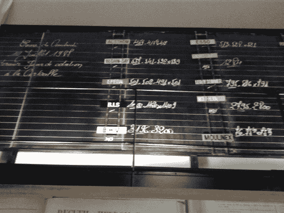
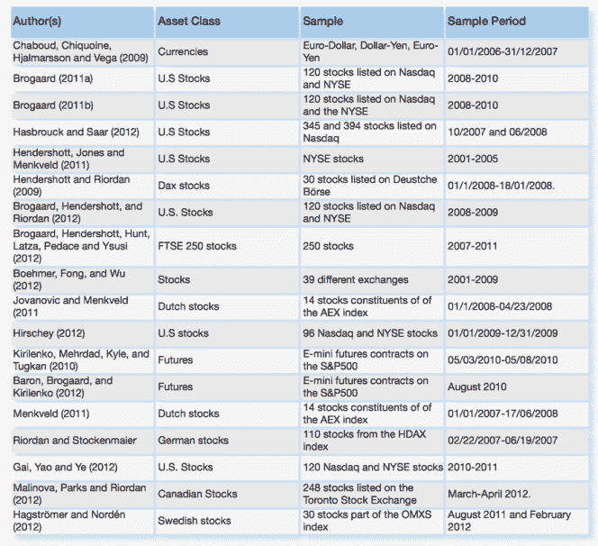

<!--yml
category: 未分类
date: 2024-05-18 14:24:05
-->

# High frequency trading, liquidity and stability – Sniper In Mahwah & friends

> 来源：[https://sniperinmahwah.wordpress.com/2013/12/23/high-frequency-trading-liquidity-and-stability/#0001-01-01](https://sniperinmahwah.wordpress.com/2013/12/23/high-frequency-trading-liquidity-and-stability/#0001-01-01)

Last week in Paris, the [Institut Louis Bachelier](http://www.labexlouisbachelier.org) (an European think tank based in Paris and devoted to researches on finance and economy) organized a scientific morning conference about high frequency trading (HFT). The context was the publication of the [second issue](http://www.labexlouisbachelier.org/wp-content/uploads/2013/10/OPINIONS-ET-DEBATS-N-2-BD.pdf) of *Opinions & débats* (a paper review published by the Institut), untitled *High frequency trading, liquidity and stability*. The issue is written by five French academics, Bruno Biais (Toulouse School of Economics), Thierry Foucault (HEC), Frédéric Abergel (École centrale), Charles-Albert Lehalle (Capital Fund Management) and Mathieu Rosenbaum (University Pierre et Marie Curie), and consists of two long articles: “High Frequency Trading and Market Quality” and “Understanding the Stakes of High Frequency Trading”.

First of all, the conference took place in the old Bourse de Paris (the new one is in Basildon, UK), and that was the very first time I had the possibility to enter the building. The place was sold to an event organizer but there still are some *souvenirs* of the old Bourse:

One of the old *corbeille* of Paris Bourse where traders met until 1986 (more or less the equivalent of old US pits)

The old chalkboard where prices were reported

Secondly, it is important to mention that this issue of *Opinions & Débats* about HFT is probably the first French synthesis document available for the French audience, and that is a good point because French people (including journalists) sometimes have the reading comprehension of 3rd graders regarding HFT. The articles were written in English but the document is both in English and French, and even if this report is not exhaustive (and some issues may be discussed), we hope this report will help French readers to have a better view on HFT.

Since the document is [online](http://www.labexlouisbachelier.org/wp-content/uploads/2013/10/OPINIONS-ET-DEBATS-N-2-BD.pdf) I won’t look at it in more detail, but here is the list of some empirical studies discussed in the report (the seventh article, Brogaard/Hendershott/ Riordan (2012) was recently put [online](http://www.ecb.europa.eu/pub/pdf/scpwps/ecbwp1602.pdf) by the ECB as a white paper proving HFT provide liquidity, but this publication appeared [controversial](http://blog.themistrading.com/themis-trading-debunks-latest-pro-hft-academic-paper/)):

Empirical studies discussed in the report

Three of the academics who wrote the two articles were in the panel at the conference, along with Philippe Guillot (from the Autorité des marché financiers, the French SEC) and Stéphane Tyc (co-founder of micro wave provider McKay Brothers, who gave me the opportunity to write this long [post](https://sniperinmahwah.wordpress.com/2013/12/04/the-fed-robbery-new-evidence/) about the Great Fed Robbery). Speakers talked about intermediaries, high frequency arbitrage, dark trading, asymmetric information, rebates, taxes (the Italian FTT on dark pools), tick sizes (how some [dark] venues bypass the 1-cent tick size rule by using complex order types), circuit breakers(the AMF executive explained that MiFID II decided to abandon the idea of synchronized circuit breakers between venues in the EU) and the lack of universal metric for measuring liquidity (defining liquidity seems to be a very very sensitive issue these days, as shown in recent Twitter discussions between FIA TGP chairman Renco Lenterman, Direct Edge CEO William O’Brien, Nanex CEO Eric Hunsader, Themis Trading and others, cf. [here](http://www.nanex.net/aqck2/4501.html)). 

Another interesting discussion (but too short) was about the fact that exchanges/venues make money by selling technology and (above all) data to participants, and not only by taking trading fees (in 2012, transaction fees represented only 57% of Euronext revenues, sales of market data & technologies represented 34%). Selling more data is probably one of the reasons of the Direct Edge/Bats future merger: “*If you look in the area of market data, there’s products we can offer when you cover a broader percentage of daily activity that suddenly become interesting to your customers*,” Bats CEO Joe Ratterman [said](http://www.bloomberg.com/news/2013-08-27/bats-ceo-sees-value-of-stock-data-rising-from-merger.html). “*And when your larger competitors have products like that, now we can compete with them and bring even more innovation and better pricing*.” Selling data to participants is not new, but that raises an epistemological question in a market world driven by computers: without participants, there is no market; markets exists because participants create data by selling and buying; exchanges take possession of the data created by participants and sell it to (other) participants; so, we may conclude that participants are buying the fruit of their own activities?

Various recommandations are made in the *Opinions & Débats* report about possible regulations regarding HFT (improve circuit breakers, create a European market-maker status, certification of trading algorithms, promote academic studies on HFT strategies, etc.), but one seems very unlikely: “*Random latency addition to all orders*“: “*Adding a random delay (of a few milliseconds) to any order at the entry of the matching engine of the trading venue could prevent the creation of two layers of informed participants: the ultra fast ones, having access to a full accurate view of the liquidity supply and demand, and the slower ones, only accessing the flows which are not matched by the former. This idea should be investigated*.” Both exchanges and (HF) traders won’t like the idea: I don’t think exchanges will agree to modify their own matching engine, and I don’t think HF traders will agree to slow the matching of their orders because that would mark the demise of colocation (a colocated HF trader would lost the benefit of a low latency, and exchanges would lost revenues of rents).

At the end of the discussion, McKay Brothers’ Stéphane Tyc exposed a provocative solution to the “*problem of best execution*” (and to other problems discussed by the panel). Here is a summary:

*Exchanges produce timestamps at the most important times of the matching cycle. They also identify every matched trade with a unique number. The regulators could define standards for this information and impose the end of day publication of the raw data from the exchanges. Every matched trade should have attached :*
*– the timestamp of the order that triggered the trade at the time of entry in the matching engine.*
*– the timestamp of the publication of trade in the publicly available data stream*
*– the anonymous trade id number.* *All timestamps should be accurate to 1µs of the atomic time, which is readily available with PTP (Precision Time Protocol). This way, all the issues of synchronicity could be studied very precisely.* *This should be made available in the raw market format at the end of each day. A simple code to read this data should be provided under an open source license.* *Based on this information, any client of a broker could receive the collection of trade id numbers that constituted his execution and could go and find for himself if the execution was to his standards.* *Open data, open formats, open source code, those would help further the debate *[my emphasizing]* and enable research to shed light on this very challenging problem.*

As a former programmer, I applaud the open source/format call – I would dream to have a simple Python script to parse market data (earlier this year, Andrei A. Kirilenko and Andrew W. Lo, in the conclusion of their article [Moore’s Law vs. Murphy’s Law: Algorithmic Trading and Its Discontents](http://papers.ssrn.com/sol3/papers.cfm?abstract_id=2235963), had similar ideas). Unfortunately, even if the incremental costs imposed on the industry would be limited, I doubt that exchanges, broker crossing networks and other non public execution venues would agree to be so transparent.

One of the recommandations proposed by the French academics who produced the *Opinions & Débats* report is about the “*technological investment on the **buy-side*“: “*the buy-side firms should invest in modern technology and state-of-the-art best-execution algorithms in order to curb predatory behavior of high frequency traders*“. What a good idea – needless to say! – but this is probably not enough, that’s why some US buy-side investors decided not only to invest in algorithms but in a new venue which could offer more transparency and simplicity. It is called [IEX](http://www.iextrading.com), and my next post will be a deep investigation on this attempt to level the playing field.