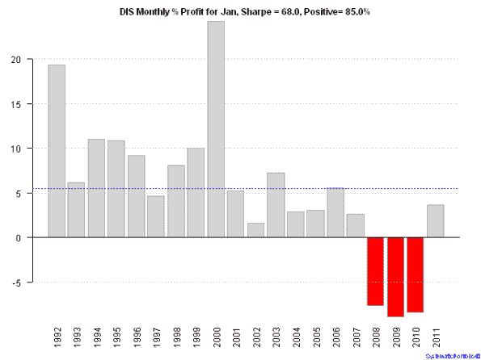

<!--yml
category: 未分类
date: 2024-05-18 14:44:12
-->

# Historical Seasonality Analysis: What company in DOW 30 is likely to do well in January? | Systematic Investor

> 来源：[https://systematicinvestor.wordpress.com/2011/12/30/historical-seasonality-analysis-what-company-in-dow-30-is-likely-to-do-well-in-january/#0001-01-01](https://systematicinvestor.wordpress.com/2011/12/30/historical-seasonality-analysis-what-company-in-dow-30-is-likely-to-do-well-in-january/#0001-01-01)

THIS IS NOT INVESTMENT ADVICE. The information is provided for informational purposes only.

Stock Market Seasonality is easy to understand, but hard to justify if you subscribe to [Efficient-market hypothesis](http://en.wikipedia.org/wiki/Efficient-market_hypothesis). For a good summary of seasonality, have a look at [Capitalizing On Seasonal Effects](http://www.investopedia.com/articles/05/seasonaltrends.asp#axzz1hxtr1mbl) article at Investopedia. Another interesting discussion was started by Douglas R Terry in his post [Efficient Market Hypothesis and Seasonality](http://www.alhambrapartners.com/2011/12/11/efficient-market-hypothesis-and-apple-seasonality/) that goes into detail analysis how these two ideas can co-exist.

To study Seasonality, I want to introduce the new tool I developed. The [Seasonality Tool](http://www.systematicportfolio.com/tools) is a user-friendly, point and click, application to create seasonality statistics and reports.

To demonstrate the [Seasonality Tool](http://www.systematicportfolio.com/tools), I want to show how it can be used to evaluate an investment idea. I want find which company in [DOW 30](http://en.wikipedia.org/wiki/Dow_Jones_Industrial_Average) is likely to do well in January and evaluate it using [Seasonality Tool](http://www.systematicportfolio.com/tools).

Following code loads historical prices from Yahoo Fiance for all companies in the [DOW 30](http://en.wikipedia.org/wiki/Dow_Jones_Industrial_Average) index and computes their average performance in January. I will use the [Systematic Investor Toolbox](https://systematicinvestor.wordpress.com/systematic-investor-toolbox/) to load and analyze the data:

```

###############################################################################
# Load Systematic Investor Toolbox (SIT)
###############################################################################
con = gzcon(url('http://www.systematicportfolio.com/sit.gz', 'rb'))
    source(con)
close(con)

    #*****************************************************************
    # Load historical data
    #****************************************************************** 
    load.packages('quantmod')        
    tickers = dow.jones.components()

    data <- new.env()
    getSymbols(tickers, src = 'yahoo', from = '1970-01-01', env = data, auto.assign = T)
        for(i in ls(data)) data[[i]] = adjustOHLC(data[[i]], use.Adjusted=T)    
    bt.prep(data, align='keep.all', dates='1970::2011')

    #*****************************************************************
    # Compute monthly returns
    #****************************************************************** 
    prices = data$prices   
    n = ncol(prices)    

    # find month ends
    month.ends = endpoints(prices, 'months')

    prices = prices[month.ends,]
    ret = prices / mlag(prices) - 1

    # keep only January    
    ret = ret[date.month(index(ret)) == 1, ]

    # keep last 20 years
    ret = last(ret,20)

    #*****************************************************************
    # Compute stats
    #****************************************************************** 
    stats = matrix(rep(NA,2*n), nc=n)
        colnames(stats) = colnames(prices)
        rownames(stats) = spl('N,Positive')

    for(i in 1:n) {
        stats['N',i] = sum(!is.na(ret[,i]))
        stats['Positive',i] = sum(ret[,i]>0, na.rm=T)    
    }
    sort(stats['Positive',])

```

[](https://systematicinvestor.wordpress.com/wp-content/uploads/2011/12/plot1-small6.png)

The [Walt Disney Co. (DIS)](http://finance.yahoo.com/q?s=dis) was positive 17 times in January in the last 20 years.
Let’s investigate the [Walt Disney Co. (DIS)](http://finance.yahoo.com/q?s=dis) record using the [Seasonality Tool](http://www.systematicportfolio.com/tools).

[](https://systematicinvestor.wordpress.com/wp-content/uploads/2011/12/plot2-small5.png)

The Seasonality Analysis Report confirms [Walt Disney Co. (DIS)](http://finance.yahoo.com/q?s=dis) outstanding track record in January. Next let’s see the details for January.

[](https://systematicinvestor.wordpress.com/wp-content/uploads/2011/12/plot3-small5.png)

The Detail Seasonality Analysis Report shows that the [Walt Disney Co. (DIS)](http://finance.yahoo.com/q?s=dis) had an amazing returns in January till 2008\. Following by a 3 consecutive negative Januaries which most likely indicates a change in trend (regime) for this company.

So do I expect the [Walt Disney Co. (DIS)](http://finance.yahoo.com/q?s=dis) be positive in the upcoming January? I’m not so sure anymore.

To view the complete source code for this example, please have a look at the [bt.seasonality.test() function in bt.test.r at github](https://github.com/systematicinvestor/SIT/blob/master/R/bt.test.r).