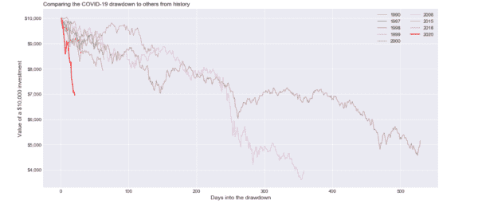
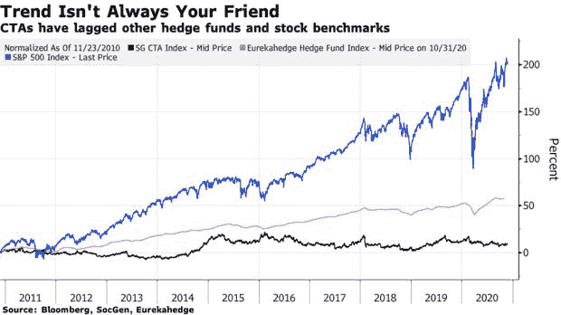
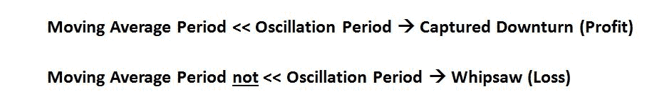
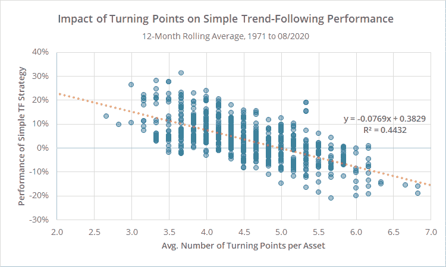
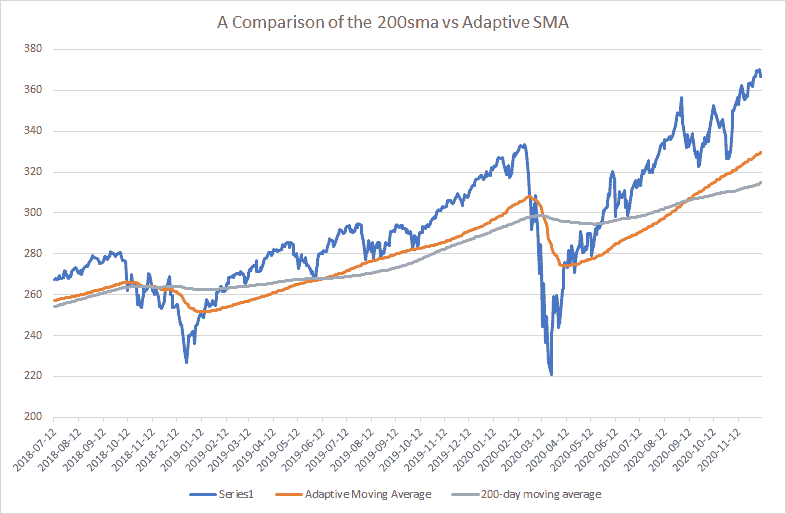
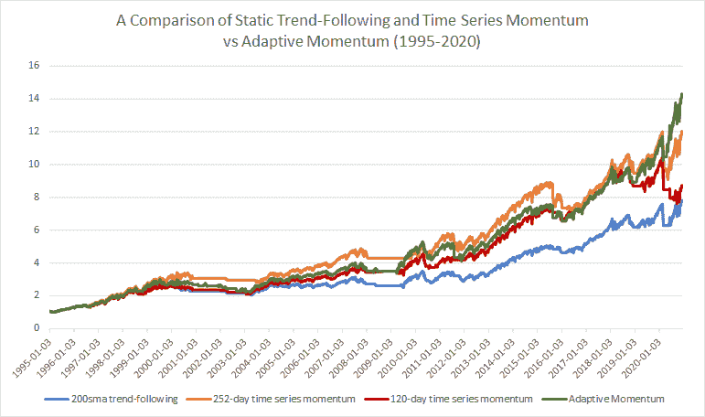
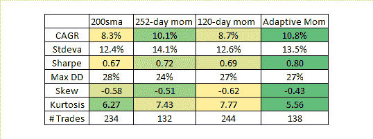

<!--yml
category: 未分类
date: 2024-05-12 17:38:24
-->

# How Should Trend-Followers Adjust to the Modern Environment?: Enter Adaptive Momentum | CSSA

> 来源：[https://cssanalytics.wordpress.com/2020/12/23/how-should-trend-followers-adjust-to-the-modern-environment-enter-adaptive-momentum/#0001-01-01](https://cssanalytics.wordpress.com/2020/12/23/how-should-trend-followers-adjust-to-the-modern-environment-enter-adaptive-momentum/#0001-01-01)

The premise of using either time-series momentum or “trend-following” using moving averages is the same only the math differs very slightly (see [Which Trend Is Your Friend? by AQR](https://www.aqr.com/Insights/Research/Journal-Article/Which-Trend-Is-Your-Friend)): using some fixed lookback you can time market cycles and capture more upside than downside and therefore improve performance vs buy and hold OR at the very least improve return versus downside risk. The problem lies in the “fixed” portion of the description: markets as we know are non-stationary and business cycles can vary widely.

In 2020, the COVID-19 selloff was unprecedented in its speed and ferocity relative to past corrections. The chart below from [“Towards Data Science”](https://towardsdatascience.com/understanding-the-2020-us-stock-market-drop-using-data-visualizations-bccd2d91bf9f) shows a comparison of the drawdown depth and number of days it took to get near the bottom.

What you can also gather from the chart above is that corrections in 2015 and 2018 were also relatively fast selloffs and that ***this may be a defining feature of the modern environment***. One can speculate rationally as to the cause of this situation; monetary policy driven asset bubbles via low interest rates that artificially inflate assets like balloons that expel quickly when the air is removed, and/or computerized trading that take advantage of sellers by moving prices rapidly away as pressure increases. Regardless of the reason, the reality is that markets seem to take the escalator up and the elevator down in today’s day and age. Traditional methods that rely on linear and static time-based lookbacks have been doing quite poorly which is not surprising. An article chronicling the struggles of trend-followers was posted on Bloomberg

As you can see CTA’s have not been having an easy ride as of late and their struggles seemed to start around 2015\. I know what some of you are thinking: tactical long-only trend-following with ETFs is not the same as long/short hedge funds that trade futures. You are right and wrong: right in the sense that long only ETF has a tendency to profit from asset class positive drift, whereas long/short has no such favorable tailwinds especially with low interest rates. But wrong in the sense that this doesn’t discount the timing component of returns which has been unfavorable for equity indices. The problem is more straightforward when you consider how trend-following generates excess returns. In a fantastic [post by Philosophical Economics](http://www.philosophicaleconomics.com/2016/01/gtt/) he illustrates exactly what is responsible for trend-following P/L:

The bottom line is that if markets are moving faster than the moving average oscillation period (roughly half the lookback) then you will lose money via whipsaw. This is made worse if the oscillation period is asymmetric such as when it takes longer to go up than down. Most trend-followers or tactical managers employ a 1-year or 6-month lookback. These can be too long if the drawdown materializes within less than a quarter. Furthermore using holding periods that are monthly rather than daily inspection also introduces more luck into the equation since drawdowns can happen at any time rather than on someone’s desired rebalancing period. Savvy portfolio managers use multiple lookbacks and holding periods in order to reduce the variance associated with not knowing what the oscillation period will look like. ***However this does not address the core problem which requires a more dynamic or nonlinear approach***.

In a [recent paper by Garg et. al called “Momentum Turning Points”](https://papers.ssrn.com/sol3/papers.cfm?abstract_id=3489539) they explore the nature of dynamic trend-following or time-series momentum strategies. They call situations where short-term trends and long-term trends disagree to be “turning points” and the number of these turning points determine trend-following performance. [AllocateSmartly provides a fantastic post](https://allocatesmartly.com/momentum-turning-points/?aff=634) reviewing the paper and shows the following chart:

***A greater frequency of turning points is consistent with a faster oscillation as described by Philosophical Economics.*** As you can see when the number of turning points increases performance tends to decrease for traditional trend-following strategies which tend to rely on longer term and static lookbacks.

Garg. et al in the paper classify different market states that result from short-term versus long-term trend-following signals:

Bull: ST UP, LT UP

Correction: ST DOWN, LT UP

Bear: ST DOWN, LT DOWN

Rebound: ST UP, LT DOWN

In reviewing optimal trend-following lookbacks as a function of market state the paper came up with an interesting conclusion:

“The conclusion from our state-dependent speed analysis: **elect slower-speed momentum after Correction months and faster-speed momentum after Rebound months**“

Unfortunately their solution to make such adjustments relies on longer-term optimization based on previous data. Even if this is walk-forward there is a considerable lag in the adjustment period. There is a simple way to account for oscillations that may occur more rapidly and potentially in a non-linear fashion. ***To state the obvious the concept of a “drawdown” is itself a nonlinear variable that is independent of time and is the most directly tied to investor profits*** which makes it a good candidate for making adjustments. Furthermore small drawdowns (corrections) based on the analysis presented in the paper above require longer lookbacks, while large drawdowns (that precede rebounds) require shorter/faster lookbacks. ***If we can use a relative measure of historical drawdowns within an adaptive framework this should more directly solve the problem.*** In this case we don’t care about how many turning points there are (which is the assumption made by choosing a static lookback) but rather how to adjust to them in a logical way.

**The Simple Solution**

The first step is to create a series of drawdowns from all-time highs (it isn’t critical to choose all-time, 1-year highs work well too). Then find the empirical distribution of such drawdowns using some lookback using a percentile ranking over the past 6 months (again not critical can use longer or shorter or a combination). I use the square of this value for the simple reason that we want to ignore small drawdowns and focus on larger drawdowns to make lookback length adjustments (remember corrections require long-term lookbacks and rebounds after large drawdowns require short-term lookbacks). Next choose a short-term trend-following lookback and a long-term lookback. In this case I chose 50 and 200 which are often followed by market participants via their respective moving averages but again the parameter choice is not critical. One practical point is that it is inefficient to use a really short-term lookback for tactical trading such as 20 days. We can calculate the optimal alpha of a moving average using the exponential moving average framework as follows:

Percentile Ranking of Drawdowns ^ 2 (squared) = P

Short- Term Alpha= ST

Long-Term Alpha= LT

Optimal Alpha= P*ST+(1-P)*LT

We then calculate an adaptive moving average using the optimal alpha which looks like this:

Notice that the adaptive moving average gets slower as the market makes new highs and faster after large drawdowns exactly as we would expect. The result is that it permits both earlier exits and entries into the market. The latter is far more important given the tendency for the market to make “V-shaped” recoveries. But to test this theory we need to backtest over a long time period and compare to traditional static lookbacks. Instead of using fixed holding periods we will do daily signal generation at the close. Since an adaptive moving average is not as effective as a simple moving average as a low pass filter it is important to filter the price when using a traditional price vs moving average strategy. To filter price I take the 10-day moving average of price (could be 3 could be 15 doesn’t matter that much). Note that the price (or filtered price) vs moving average in an exponential moving average framework is mathematically equivalent to momentum. **Therefore using a price vs ema in this context is basically an adaptive momentum calculation.** Here is what Adaptive Momentum looks like vs typical static lookbacks:

And for the quants out there here is the performance table:

Adaptive Momentum is the best performer in terms of CAGR, but most the biggest difference is in risk-adjusted returns (sharpe) and higher moments (skew and kurtosis). Adaptive Momentum has more positive skew and lower kurtosis indicating higher upside/downside capture and lower tail risk. What is most impressive is that it does so with nearly the same number of trades as 12-month time series momentum. If you look carefully at the line chart you can see that Adaptive Momentum does much better in recent years than the static lookbacks which we would expect. Overall performance is impressive and this can be considered as a practical approach for tactical asset allocation. An interesting note is that if you dispense with the percentile ranking in the calculation and simply increase the lookback to the maximum when the market is making new highs, and decrease the lookback to the minimum when the market is not making new highs you get pretty similar performance. Overall, the strategy doesn’t exhibit much parameter sensitivity at all.

While this simple solution is not a perfect approach, it certainly does make intuitive sense and produces worthwhile results. Given a choice between static and adaptive/dynamic I would personally take this type of approach for real-life trading.