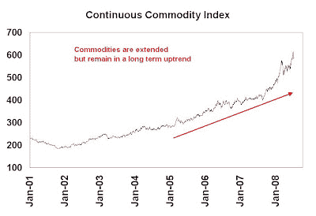

<!--yml
category: 未分类
date: 2024-05-18 01:07:43
-->

# Humble Student of the Markets: $100 oil before $150, but $200 before $50

> 来源：[https://humblestudentofthemarkets.blogspot.com/2008/07/100-oil-before-150-but-200-before-50.html#0001-01-01](https://humblestudentofthemarkets.blogspot.com/2008/07/100-oil-before-150-but-200-before-50.html#0001-01-01)

I

[previously](http://humblestudentofthemarkets.blogspot.com/2008/06/stay-long-inflation-trade.html)

pointed out that the Bank Credit Analyst, or BCA,

[wrote](http://www.bcaresearch.com/public/story.asp?pre=PRE-20080613.GIF)

that “emerging markets will be key to timing a slowdown in oil [and other commodity] demand”. Today, we see signs of slowdown in many emerging markets. Vietnam is a disaster. India is slowing down and problems are becoming more evident (see comments

[here](http://www.atimes.com/atimes/South_Asia/JG01Df03.html)

and

[here](http://www.businessweek.com/globalbiz/content/jul2008/gb2008071_743900.htm)

).

**China slowing?** 

Risks are also increasing in China. BCA also summarized the risks the China well

[here](http://www.bcaresearch.com/public/story.asp?pre=PRE-20080625.GIF)

and the Economist wrote about China’s macro risks

[here](http://www.economist.com/finance/displayStory.cfm?source=hptextfeature&story_id=11639442)

. Recently Stratfor summarized the risks to the Chinese economy well in the following commentary (emphasis mine):

> Ruling China has always been a difficult prospect, as the country is riven with urban-rural and coastal-interior splits. But while the Olympics were supposed to have been a celebration of China's "arrival" as a modern state, they are instead serving as a showcase for all the ways in which China falls short. But dealing with these issues — entrenched corruption, financial dysfunction, (unapproved) regional autonomy, unaffordable energy subsidies — is difficult for Beijing in the weeks leading up to the Olympics because, under the glare of international spotlights, it can no longer use the tried-and-true tools of an authoritarian state. ***The result is a string of patchwork fixes that highlight China's weaknesses, making the Asian giant vulnerable to any foreign power with an interest in demonstrating that the emperor is less than fully clothed. Not exactly the global celebration that Beijing intended when it bid for the
> Olympics all those years ago.***

In China, the chickens may be coming home to roost. Recently we

[saw](http://finance.sympatico.msn.ca/investing/news/businessnews/article.aspx?cp-documentid=8536259)

that China’s June trade surplus declined $21.3b, compared to an expected $22.0b. While one data point does not make a slowdown, it does point to a trend of slowing growth, which would be negative for commodity prices.

**Emerging market slowdown is commodity bearish** 

Some commodity prices are starting to

[show the strain](http://traderfeed.blogspot.com/2008/07/message-from-materials-sector.html)

and may be starting an intermediate term correction. Demand destruction is already being

[seen](http://www.nytimes.com/2008/06/19/business/19gas.html)

in oil and petroleum products.

**Be prepared for volatility** 

Is it all over for the commodity bulls? I was asked that question recently and my answer was “

***expect $100 oil before $150 oil, but expect oil to hit $200 before $50.”***

We remain in a hard asset cycle and the long-term fundamentals for commodity remain intact. However, investors need to be prepared for commodity corrections, which can be nasty and violent. The chart below shows the price action of the Continuous Commodity Index, which the old equal weighted CRB index before CRB went to a liquidity weighting. The index has moved up tremendously in the last few years and the bull trend can still remain intact should we see a 20% correction.

