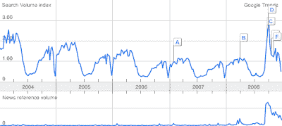

<!--yml
category: 未分类
date: 2024-05-18 01:00:30
-->

# Humble Student of the Markets: “Double Dip” call sets up market bottom

> 来源：[https://humblestudentofthemarkets.blogspot.com/2009/01/double-dip-call-sets-up-market-bottom.html#0001-01-01](https://humblestudentofthemarkets.blogspot.com/2009/01/double-dip-call-sets-up-market-bottom.html#0001-01-01)

Further to my recent post

[10 contrarian reasons for a bottom](http://humblestudentofthemarkets.blogspot.com/2008/12/10-contrarian-reasons-for-bottom.html)

the long-term investor psychology continues to deteriorate, which is contrarian bullish. First, there is widespread acceptance that the U.S. is in recession. Moreover, fears of a repeat of the Great Depression seem to have peaked and are subsiding. As the chart below shows, a

[Google Trend](//www.google.com/trends?q=great+depression)

analysis shows that searches of the term “Great Depression” reached its zenith at the start of 4Q.

Google Trend Search: Great Depression

I have said [before](http://humblestudentofthemarkets.blogspot.com/2008/09/relief-rally-but-no-convincing-bottom.html) that the stock market will not put in a convincing bottom until there are widespread calls for a double-dip recession. Well, we are now seeing the first call from Niall Ferguson in a FT article entitled [An imaginary retrospective of 2009](http://www.ft.com/cms/s/0/1be84cc4-cc0d-11dd-9c43-000077b07658.html):

> 2009 proved to be an annus horribilis. Japan was plunged back into the deflationary nightmare of the 1990s by yen appreciation and a collapse of consumer confidence. Things were little better in Europe. There had been much anti-American finger-pointing by European leaders in 2008\. The French president Nicolas Sarkozy had talked at the G-20 summit in Washington as if he alone could save the world economy. The British prime minister Gordon Brown had sought to give a similar impression, claiming authorship of the policy of bank recapitalisation. The German chancellor Angela Merkel, meanwhile, voiced stern disapproval of the excessively large American deficit.

While Ferguson doesn’t actually come out and use the “double-dip” term in the article, a rose by any other name smells just as desperate and despondent.

**Still a little too soon to buy**

While this is the first call of a double-dip recession from a leading bear, I would like to see the double-dip term creep more into the consensus. A

[Google search](//www.google.com/search?q=double+dip+recession&rls=com.microsoft:en-us&ie=UTF-8&oe=UTF-8&startIndex&startPage=1)

of “double-dip” recession still shows entries dating from 2002 and 2003 on the first page.

I would like to see other doomsters and leading bears like David Rosenberg, Nouriel Roubini and Stephen Roach call for a double-dip before I can believe that a bottom is in convincingly for equities.